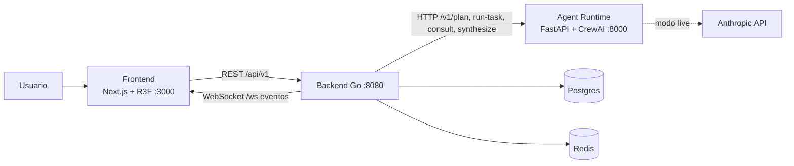

# AI Workforce OS

Oficina virtual 3D donde los empleados son agentes de IA persistentes. Le dices a tu empresa qué necesitas ("prepara una propuesta de $50,000") y ves a Ventas, Legal, Contabilidad, Análisis, Operaciones y la Asistente colaborar en tiempo real, pedir tu aprobación en acciones sensibles y entregar un reporte consolidado.

Fase 1 (lo tangible): sin auth, organización fija `demo`. Contrato completo en [docs/SPEC.md](docs/SPEC.md).

## Arquitectura

- **Backend (Go)**: fuente de verdad. Dominio, API REST, WebSocket, orquestador/scheduler, aprobaciones, auditoría y presupuesto.
- **Agent runtime (Python, FastAPI + CrewAI)**: recibe tarea + contexto y devuelve resultado estructurado y `tool_requests`. No llama sistemas externos; Go decide qué ejecutar.
- **Frontend (Next.js + React Three Fiber)**: oficina 3D y modo dashboard; toda animación deriva de eventos reales del WebSocket.
- **Postgres** (datos) y **Redis**.



Documentación adicional de arquitectura: [docs/architecture/](docs/architecture/).

## Cómo levantar

Requisitos: Docker con Compose.

```bash
cp .env.example .env      # opcional; sin cambios corre en simulación
docker compose up --build
```

O con Make: `make up` (segundo plano), `make logs`, `make down`.

| Servicio | URL |
|---|---|
| Frontend (oficina / dashboard) | http://localhost:3000 |
| Backend API | http://localhost:8080/api/v1 (health: `/healthz`) |
| Backend WebSocket | ws://localhost:8080/ws |
| Agent runtime | http://localhost:8000 (health: `/healthz`) |

## Modo simulación vs live

- **Simulación** (por defecto): si no hay `ANTHROPIC_API_KEY` o `SIMULATION=true`, el runtime devuelve resultados guionados y realistas con latencias simuladas. El demo completo funciona sin clave y sin costo.
- **Live**: define `ANTHROPIC_API_KEY` en `.env` (y opcionalmente `MODEL`) y deja `SIMULATION` vacío. El backend aplica `BUDGET_USD` (por defecto 25) y profundidad máxima de delegación 5.

`GET http://localhost:8000/healthz` informa el modo (`simulation` o `live`).

## Pruebas

```bash
make test       # unit tests backend (Go) y runtime (pytest) + build del frontend
make smoke      # con el stack arriba: escenario de $50,000 de punta a punta (scripts/smoke.sh | scripts/smoke.ps1)
make test-e2e   # Playwright, con el stack arriba (ver e2e/README.md)
make reset      # POST /demo/reset
```

En Windows: `.\scripts\smoke.ps1`.

## Estructura del repo

```
backend/          Go (chi): dominio, API, WS, orquestador, aprobaciones, auditoría
agent-runtime/    Python FastAPI + CrewAI (reemplazable; modo simulación)
frontend/         Next.js + React Three Fiber
e2e/              Playwright (UI + contrato WebSocket); convención data-testid en e2e/README.md
scripts/          smoke.sh / smoke.ps1
docs/             SPEC.md y architecture/
docker-compose.yml, Makefile, .env.example
```

## Desarrollo por servicio

`make dev-infra` (postgres + redis), `make dev-backend`, `make dev-runtime`, `make dev-frontend`.
