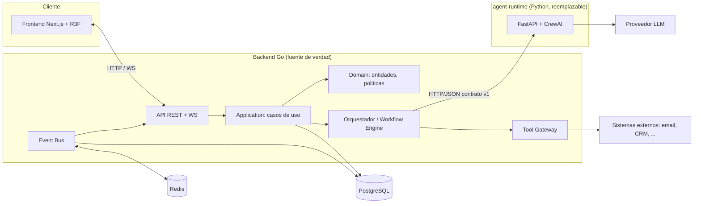
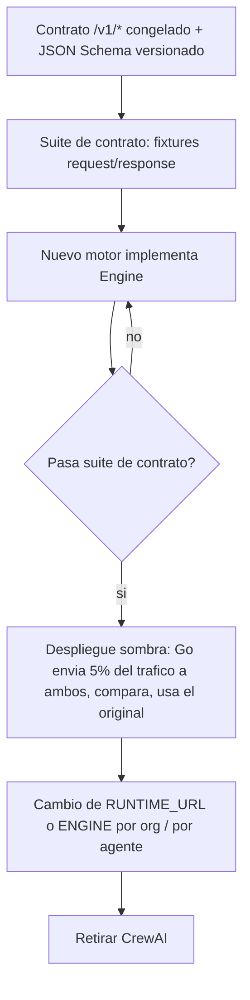
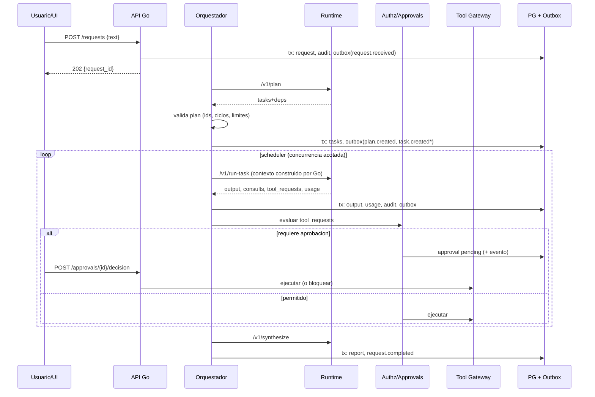

# 01 - Arquitectura

Complementa `docs/SPEC.md`. Si algo aqui contradice el SPEC, esta marcado como **[CAMBIO]** y listado en `09-roadmap-fases.md` (seccion "Cambios propuestos al SPEC").

## 1. Vista general



Regla de oro: **el runtime Python nunca habla con PG, Redis ni sistemas externos**. Solo recibe `(tarea + contexto)` y devuelve `(output + consults + tool_requests + usage)`. Solo llama al LLM.

## 2. Capas del backend Go

Dependencias apuntan hacia adentro: `api -> application -> domain`; `infrastructure` y `persistence` implementan puertos definidos en `domain`/`application`.

```
/backend
  cmd/server/main.go            composition root (unico lugar que conoce todo)
  internal/
    domain/                     SIN imports de infra. Puro Go.
      agent/ task/ request/ workflow/ approval/ memory/ policy/ event/ money/
    application/                casos de uso + puertos
      command/                  SubmitRequest, DecideApproval, PostMessage ...
      query/                    ListAgents, GetRequest ...
      port/                     interfaces: AgentRuntime, ToolExecutor, EventBus, Repos, Clock, IDGen, SecretStore
      orchestrator/             planificacion, scheduler, consult loop
      workflow/                 motor de maquina de estados (05)
      authz/                    decision de permisos/autonomia (06)
    runtime/                    "Agent Runtime" cliente (adaptadores del puerto AgentRuntime)
      crewai/                   HTTP client al contrato /v1/*
      sim/                      runtime simulado in-process (tests, demo sin Python)
    infrastructure/
      tools/                    adaptadores de herramientas (email, calendar...) - Fase 3+
      bus/                      redis pubsub / in-memory
      secrets/ clock/ llm-meter/
    persistence/
      pg/                       repos (pgx), migraciones, RLS helpers
      migrations/
    events/                     envelope, tipos, outbox publisher, WS hub
    api/
      rest/ (chi)  ws/  middleware/ (auth, org, ratelimit, requestid)
```

| Capa | Responsabilidad | Prohibido |
|---|---|---|
| **Domain** | Invariantes: transiciones validas de `Task`, `Approval`, `Agent.state`; politica de autonomia; `Money`; profundidad de delegacion; aislamiento de memoria como tipos (`MemoryKey`). | I/O, `database/sql`, `net/http`, JSON tags de transporte. |
| **Application** | Casos de uso transaccionales; define puertos; orquesta dominio + puertos; emite eventos de dominio. | SQL, HTTP concreto. |
| **Agent Runtime** (adaptador) | Traduce `Task+Context` a `/v1/*` y la respuesta a tipos de dominio. Aplica timeout, retry, circuit breaker, medicion de uso. | Decidir permisos o ejecutar herramientas. |
| **Infrastructure** | Herramientas reales, bus, secretos, reloj. | Logica de negocio. |
| **API** | Authn, parseo, DTOs, mapeo de errores, WS. | Reglas de negocio. Un handler = 1 comando/consulta. |
| **Persistence** | Repos pgx, `SET LOCAL app.org_id`, migraciones, outbox. | Devolver filas sin `org_id` filtrado (lo garantiza RLS ademas del WHERE). |
| **Events** | Envelope del SPEC, outbox transaccional, fan-out a WS/Redis, replay. | Contener logica; los consumidores reaccionan, no deciden. |

### Puertos clave (firmas orientativas)

```go
type AgentRuntime interface {
    Plan(ctx context.Context, in PlanInput) (PlanOutput, error)
    RunTask(ctx context.Context, in RunTaskInput) (RunTaskOutput, error)
    Consult(ctx context.Context, in ConsultInput) (ConsultOutput, error)
    Synthesize(ctx context.Context, in SynthInput) (SynthOutput, error)
    Health(ctx context.Context) (RuntimeHealth, error) // mode: simulation|live
}
type ToolExecutor interface {
    Execute(ctx context.Context, call ToolCall) (ToolResult, error) // solo tras authz+approval
}
type EventBus interface {
    Publish(ctx context.Context, ev Event) error     // via outbox dentro de la tx
    Subscribe(ctx context.Context, orgID uuid.UUID, filter Filter) (<-chan Event, error)
}
```

Los tipos `PlanInput`, `RunTaskInput`... son **tipos de dominio de Go**, no los del wire. El adaptador `runtime/crewai` los mapea al JSON del SPEC.

## 3. Limites Go vs CrewAI

| Decision / dato | Dueno | Notas |
|---|---|---|
| Identidad, org, permisos, autonomia, presupuesto | **Go** | Python recibe solo lo necesario para el prompt (persona, responsabilidades, nombres de herramientas permitidas). |
| Estado de agentes/tareas/aprobaciones | **Go** | Python es sin estado entre llamadas. |
| Plan (descomposicion) | **Runtime propone, Go valida** | Go rechaza `agent_id` inexistentes, ciclos en `depends_on`, mas de N tareas, tareas a agentes sin permiso. |
| Ejecucion de herramientas | **Go** | Python devuelve `tool_requests`; Go autoriza, pide aprobacion y ejecuta. |
| Memoria (lectura/escritura) | **Go** | Go selecciona `memory[]` (04) y lo inyecta. Python puede sugerir `memory_writes` (extension); Go decide persistir. |
| Razonamiento LLM, prompts, roles, "backstory" | **Python/CrewAI** | Los prompts/personas viven en `agent-runtime`, versionados con `runtime_version`. |
| Metering de tokens | **Python reporta, Go registra y aplica limites** | Go no confia en el reporte para *enforcement previo*: estima y reserva presupuesto antes de llamar (07). |
| Contenido externo | Go lo marca y delimita; Python lo trata como dato | Ver 07 (prompt injection). |

### Que significa "CrewAI reemplazable"

CrewAI aparece **solo** dentro de `/agent-runtime/app/engines/crewai_engine.py`. El resto del runtime depende de una interfaz propia:

```python
class Engine(Protocol):
    def plan(self, req: PlanRequest) -> PlanResponse: ...
    def run_task(self, req: RunTaskRequest) -> RunTaskResponse: ...
    def consult(self, req: ConsultRequest) -> ConsultResponse: ...
    def synthesize(self, req: SynthRequest) -> SynthResponse: ...
```

Motores: `SimulationEngine` (SPEC), `CrewAIEngine`, y mañana `DirectAnthropicEngine`, `LangGraphEngine`, etc. Se elige por env `ENGINE=simulation|crewai|...`.

## 4. Como reemplazar CrewAI (procedimiento)



Pasos concretos:

1. **Contrato como artefacto**: `agent-runtime/contract/v1/*.schema.json` (generado desde Pydantic) y copiado a `backend/internal/runtime/crewai/testdata/`. Go tiene tests de contrato contra esos schemas; Python tiene tests de respuesta contra ellos.
2. **Versionado**: header `X-Runtime-Contract: 1`; el health devuelve `{status, mode, engine, contract_versions:[1]}` (**[CAMBIO]** menor: ampliar `/healthz`). Go se niega a usar un runtime que no soporte su version.
3. **Sin fugas**: ningun tipo de CrewAI (`Task`, `Crew`, `Agent`) cruza el borde HTTP; nada en Go referencia "crew".
4. **Enrutado por agente**: tabla `agents.runtime_profile` (jsonb: `{ "engine_url": ..., "model": ..., "max_tokens": ... }`) permite migrar agente por agente.
5. **Sombra/A-B**: el adaptador `runtime/` soporta `ShadowRuntime{primary, shadow}`; la salida shadow se guarda en `agent_interactions` con `shadow=true` y no afecta tareas.
6. **Criterios de aceptacion** del nuevo motor: 100% de fixtures de contrato; latencia p95 <= la actual; `usage` siempre presente; nunca emite `tool_requests` con herramientas fuera de `agent.tools`.
7. **Salida de Go ante fallo**: circuit breaker abre tras 5 fallos/30s; tareas quedan `pending` con reintento (05) y se emite `error`. Fallback opcional a `sim` solo si `SIMULATION=true`.

## 5. Flujo de una peticion (secuencia)



## 6. Consistencia y concurrencia

- **Transaccionalidad**: cada cambio de estado + `audit_logs` + `events` (outbox) en una sola tx PG. Un publisher lee `events WHERE published_at IS NULL` con `FOR UPDATE SKIP LOCKED`, publica a Redis/WS y marca. Garantia at-least-once; los consumidores dedupean por `event.id`.
- **Scheduler**: pool de workers (`MAX_CONCURRENCY`, default 4) + semaforo por agente (un agente ejecuta 1 tarea a la vez, coherente con su `state`). Reclamo de tareas con `UPDATE ... SET status='running' WHERE id=$1 AND status='pending'` (CAS) para soportar varias instancias de Go.
- **Idempotencia**: `POST /requests` acepta `Idempotency-Key`; las llamadas a herramientas llevan `idempotency_key = task_id + tool_request_index`.
- **Recuperacion al reiniciar**: tareas `running` con `lease_expires_at < now()` vuelven a `pending` (con `attempt+1`).

## 7. Despliegue (docker-compose, Fase 1) y evolucion

`postgres, redis, backend, agent-runtime, frontend` (SPEC). Evolucion: backend stateless horizontal (WS via Redis pubsub), runtime escalable independiente (sin estado), PG con PgBouncer en modo transaccion (compatible con `SET LOCAL`). gRPC opcional entre Go y runtime sin cambiar el contrato logico.

## 8. Decisiones arquitectonicas (ADR resumidos)

| # | Decision | Motivo | Alternativa descartada |
|---|---|---|---|
| 1 | Monolito modular en Go | Un equipo, Fase 1; limites por paquete | Microservicios prematuros |
| 2 | Outbox en PG + Redis para fan-out | Atomicidad estado+evento sin 2PC | Publicar a Redis directo (pierde eventos) |
| 3 | Runtime sin estado y sin I/O externo | Reemplazable, seguro, testeable | Dejar que CrewAI llame herramientas |
| 4 | RLS ademas de `WHERE org_id` | Defensa en profundidad multi-tenant | Solo filtros en repos |
| 5 | Contrato JSON versionado | Intercambio de motor | Acoplar a objetos CrewAI |
