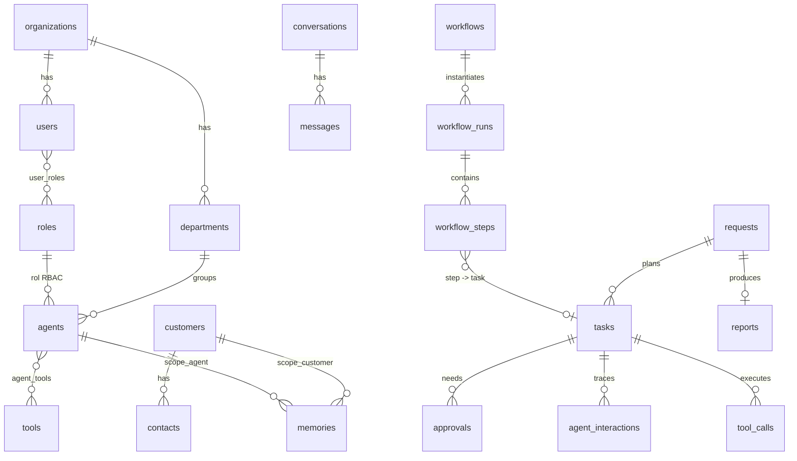

# 02 - Modelo de datos (PostgreSQL 16)

## 1. Convenciones (aplican a TODAS las tablas)

1. **`org_id uuid NOT NULL`** en cada tabla (SPEC). Fase 1: org fija `00000000-0000-0000-0000-000000000001`.
2. **PK `id uuid`** (generado en Go con UUIDv7 para localidad de indices; `gen_random_uuid()` como default).
3. **Integridad entre tenants por construccion**: cada tabla padre expone `UNIQUE (org_id, id)` y las FK son **compuestas** `(org_id, x_id) -> padre(org_id, id)`. Es imposible que una fila de la org A apunte a una fila de la org B, aunque haya un bug en la aplicacion.
4. **RLS** habilitada y **forzada** en todas las tablas con `org_id`; el rol de la app no es owner y no tiene `BYPASSRLS`.
5. `created_at timestamptz NOT NULL DEFAULT now()`; `updated_at` mantenido por trigger donde aplica.
6. Enums como `text + CHECK` (migrar un CHECK es mas barato que `ALTER TYPE`).
7. Dinero: `numeric(12,6)` en USD (costos por token son fracciones de centavo). Nunca `float`.
8. **Slug de agente**: `agents.id` es uuid, pero la API de Fase 1 expone `agents.slug` como `Agent.id` ("sales", "hr"...). **[CAMBIO]** menor/compatible: el JSON no cambia, solo se aclara que `id` = slug.
9. Tablas de **solo-anexar**: `events`, `audit_logs`, `agent_interactions` (sin UPDATE/DELETE para el rol de la app).



## 2. Preambulo: extensiones, roles, helpers RLS

```sql
CREATE EXTENSION IF NOT EXISTS pgcrypto;     -- gen_random_uuid()
CREATE EXTENSION IF NOT EXISTS pg_trgm;      -- busqueda difusa de clientes/documentos
-- CREATE EXTENSION IF NOT EXISTS vector;    -- Fase 2+, ver 04-memoria.md

-- Rol de aplicacion: NO owner, NO bypassrls. Las migraciones corren con otro rol (owner).
CREATE ROLE aiw_app LOGIN NOINHERIT NOBYPASSRLS;
CREATE ROLE aiw_migrator LOGIN;              -- owner del esquema

-- Org actual de la transaccion. NULL/ausente => ninguna fila visible (falla cerrado).
CREATE FUNCTION app_org_id() RETURNS uuid
LANGUAGE sql STABLE AS $$
  SELECT NULLIF(current_setting('app.org_id', true), '')::uuid
$$;

CREATE FUNCTION set_updated_at() RETURNS trigger LANGUAGE plpgsql AS $$
BEGIN NEW.updated_at := now(); RETURN NEW; END $$;
```

## 3. DDL

### 3.1 Identidad y estructura

```sql
CREATE TABLE organizations (
  id            uuid PRIMARY KEY DEFAULT gen_random_uuid(),
  org_id        uuid GENERATED ALWAYS AS (id) STORED,      -- permite RLS uniforme (org_id = app_org_id())
  slug          text NOT NULL UNIQUE,
  name          text NOT NULL,
  plan          text NOT NULL DEFAULT 'free' CHECK (plan IN ('free','team','business','enterprise')),
  budget_usd    numeric(12,2) NOT NULL DEFAULT 100,        -- limite del periodo (SPEC /metrics.budget_usd)
  budget_period text NOT NULL DEFAULT 'month' CHECK (budget_period IN ('day','week','month')),
  max_delegation_depth smallint NOT NULL DEFAULT 5 CHECK (max_delegation_depth BETWEEN 1 AND 10),
  settings      jsonb NOT NULL DEFAULT '{}'::jsonb,        -- aprobaciones por defecto, horario laboral, idioma
  status        text NOT NULL DEFAULT 'active' CHECK (status IN ('active','suspended','deleted')),
  created_at    timestamptz NOT NULL DEFAULT now(),
  updated_at    timestamptz NOT NULL DEFAULT now(),
  UNIQUE (org_id, id)
);

CREATE TABLE users (
  id            uuid PRIMARY KEY DEFAULT gen_random_uuid(),
  org_id        uuid NOT NULL REFERENCES organizations(id),
  email         text NOT NULL,                             -- unicidad case-insensitive via indice sobre lower(email)
  display_name  text NOT NULL,
  auth_subject  text,                                      -- sub del IdP (Fase 2)
  status        text NOT NULL DEFAULT 'active' CHECK (status IN ('invited','active','disabled')),
  last_login_at timestamptz,
  created_at    timestamptz NOT NULL DEFAULT now(),
  updated_at    timestamptz NOT NULL DEFAULT now(),
  UNIQUE (org_id, id)
);
-- email unico por org (un mismo email puede existir en dos orgs)
CREATE UNIQUE INDEX users_org_email_uq ON users (org_id, lower(email));
CREATE UNIQUE INDEX users_auth_subject_uq ON users (auth_subject) WHERE auth_subject IS NOT NULL;

-- Roles RBAC (de usuarios Y de agentes). permissions: lista de "recurso:accion" (ver 06).
CREATE TABLE roles (
  id          uuid PRIMARY KEY DEFAULT gen_random_uuid(),
  org_id      uuid NOT NULL REFERENCES organizations(id),
  key         text NOT NULL,                               -- 'owner','admin','approver','viewer','agent.sales',...
  kind        text NOT NULL CHECK (kind IN ('user','agent')),
  name        text NOT NULL,
  permissions text[] NOT NULL DEFAULT '{}',
  is_system   boolean NOT NULL DEFAULT false,              -- no editable desde UI
  created_at  timestamptz NOT NULL DEFAULT now(),
  UNIQUE (org_id, id),
  UNIQUE (org_id, key)
);

CREATE TABLE user_roles (
  org_id  uuid NOT NULL,
  user_id uuid NOT NULL,
  role_id uuid NOT NULL,
  PRIMARY KEY (org_id, user_id, role_id),
  FOREIGN KEY (org_id, user_id) REFERENCES users(org_id, id) ON DELETE CASCADE,
  FOREIGN KEY (org_id, role_id) REFERENCES roles(org_id, id) ON DELETE CASCADE
);

CREATE TABLE departments (
  id         uuid PRIMARY KEY DEFAULT gen_random_uuid(),
  org_id     uuid NOT NULL REFERENCES organizations(id),
  key        text NOT NULL,                                -- 'sales','legal'...
  name       text NOT NULL,
  parent_id  uuid,
  head_agent_id uuid,                                      -- FK diferida (ver ALTER al final)
  created_at timestamptz NOT NULL DEFAULT now(),
  UNIQUE (org_id, id),
  UNIQUE (org_id, key),
  FOREIGN KEY (org_id, parent_id) REFERENCES departments(org_id, id)
);
```

### 3.2 Agentes y herramientas

```sql
CREATE TABLE tools (
  id            uuid PRIMARY KEY DEFAULT gen_random_uuid(),
  org_id        uuid NOT NULL REFERENCES organizations(id),
  key           text NOT NULL,                             -- 'email.send','crm.lookup','calendar.create_event'
  name          text NOT NULL,
  description   text NOT NULL DEFAULT '',
  integration   text,                                      -- 'gmail','slack','hubspot'... NULL = interna
  default_risk  text NOT NULL DEFAULT 'low' CHECK (default_risk IN ('low','medium','high')),
  side_effects  boolean NOT NULL DEFAULT false,            -- true => nunca "autonomous" sin regla explicita
  requires_approval boolean NOT NULL DEFAULT false,        -- ej. send_proposal, send_contract
  args_schema   jsonb NOT NULL DEFAULT '{}'::jsonb,        -- JSON Schema de args (validado en Go)
  enabled       boolean NOT NULL DEFAULT true,
  created_at    timestamptz NOT NULL DEFAULT now(),
  UNIQUE (org_id, id),
  UNIQUE (org_id, key)
);

CREATE TABLE agents (
  id            uuid PRIMARY KEY DEFAULT gen_random_uuid(),
  org_id        uuid NOT NULL REFERENCES organizations(id),
  slug          text NOT NULL,                             -- = Agent.id en la API Fase 1
  name          text NOT NULL,
  role          text NOT NULL,                             -- 'sales','hr',... (SPEC)
  title         text NOT NULL,
  description   text NOT NULL DEFAULT '',
  persona       text NOT NULL DEFAULT '',
  responsibilities text[] NOT NULL DEFAULT '{}',
  department_id uuid,
  role_id       uuid,                                      -- rol RBAC kind='agent'
  state         text NOT NULL DEFAULT 'idle' CHECK (state IN
                 ('idle','thinking','working','waiting','talking','reviewing','blocked','awaiting_approval','completed','error')),
  activity      text NOT NULL DEFAULT '',
  current_task_id uuid,                                    -- FK diferida
  progress      smallint NOT NULL DEFAULT 0 CHECK (progress BETWEEN 0 AND 100),
  autonomy      text NOT NULL DEFAULT 'approve_each' CHECK (autonomy IN ('suggest','approve_each','rules','autonomous')),
  autonomy_rules jsonb NOT NULL DEFAULT '[]'::jsonb,       -- usado si autonomy='rules' (ver 06)
  monthly_budget_usd numeric(12,2),                        -- NULL = solo limite de org
  runtime_profile jsonb NOT NULL DEFAULT '{}'::jsonb,      -- modelo, engine_url, max_tokens (01 sec. 4)
  active        boolean NOT NULL DEFAULT true,
  created_at    timestamptz NOT NULL DEFAULT now(),
  updated_at    timestamptz NOT NULL DEFAULT now(),
  UNIQUE (org_id, id),
  UNIQUE (org_id, slug),
  FOREIGN KEY (org_id, department_id) REFERENCES departments(org_id, id),
  FOREIGN KEY (org_id, role_id)       REFERENCES roles(org_id, id)
);

ALTER TABLE departments
  ADD FOREIGN KEY (org_id, head_agent_id) REFERENCES agents(org_id, id);

-- Que herramientas puede pedir cada agente, con su tope de riesgo y override de autonomia.
CREATE TABLE agent_tools (
  org_id    uuid NOT NULL,
  agent_id  uuid NOT NULL,
  tool_id   uuid NOT NULL,
  max_risk  text NOT NULL DEFAULT 'medium' CHECK (max_risk IN ('low','medium','high')),
  autonomy_override text CHECK (autonomy_override IN ('suggest','approve_each','rules','autonomous')),
  constraints jsonb NOT NULL DEFAULT '{}'::jsonb,          -- ej. {"allowed_domains":["acme.com"],"max_per_day":20}
  granted_by uuid,                                         -- user id
  granted_at timestamptz NOT NULL DEFAULT now(),
  PRIMARY KEY (org_id, agent_id, tool_id),
  FOREIGN KEY (org_id, agent_id) REFERENCES agents(org_id, id) ON DELETE CASCADE,
  FOREIGN KEY (org_id, tool_id)  REFERENCES tools(org_id, id)  ON DELETE CASCADE,
  FOREIGN KEY (org_id, granted_by) REFERENCES users(org_id, id)
);
```

### 3.3 Clientes

```sql
CREATE TABLE customers (
  id          uuid PRIMARY KEY DEFAULT gen_random_uuid(),
  org_id      uuid NOT NULL REFERENCES organizations(id),
  name        text NOT NULL,
  legal_name  text,
  tax_id      text,
  industry    text,
  status      text NOT NULL DEFAULT 'prospect' CHECK (status IN ('prospect','onboarding','active','paused','churned')),
  owner_agent_id uuid,                                     -- agente responsable
  external_refs jsonb NOT NULL DEFAULT '{}'::jsonb,        -- {"hubspot":"123","erp":"C-009"}
  attributes  jsonb NOT NULL DEFAULT '{}'::jsonb,
  created_at  timestamptz NOT NULL DEFAULT now(),
  updated_at  timestamptz NOT NULL DEFAULT now(),
  UNIQUE (org_id, id),
  FOREIGN KEY (org_id, owner_agent_id) REFERENCES agents(org_id, id)
);

CREATE TABLE contacts (
  id          uuid PRIMARY KEY DEFAULT gen_random_uuid(),
  org_id      uuid NOT NULL REFERENCES organizations(id),
  customer_id uuid NOT NULL,
  full_name   text NOT NULL,
  email       text,
  phone       text,
  job_title   text,
  is_primary  boolean NOT NULL DEFAULT false,
  channels    jsonb NOT NULL DEFAULT '{}'::jsonb,          -- {"whatsapp":"+52...","slack":"U123"}
  consent     jsonb NOT NULL DEFAULT '{}'::jsonb,          -- {"marketing":false,"updated_at":...} (privacidad)
  created_at  timestamptz NOT NULL DEFAULT now(),
  updated_at  timestamptz NOT NULL DEFAULT now(),
  UNIQUE (org_id, id),
  FOREIGN KEY (org_id, customer_id) REFERENCES customers(org_id, id) ON DELETE CASCADE
);
```

### 3.4 Peticiones, workflows y tareas

```sql
CREATE TABLE requests (                                    -- SPEC: Request
  id          uuid PRIMARY KEY DEFAULT gen_random_uuid(),
  org_id      uuid NOT NULL REFERENCES organizations(id),
  text        text NOT NULL,
  status      text NOT NULL DEFAULT 'planning' CHECK (status IN ('planning','running','awaiting_approval','done','failed')),
  requested_by uuid,                                       -- user (NULL en Fase 1)
  customer_id uuid,                                        -- cliente de contexto, si aplica (04)
  plan        jsonb,                                       -- objetivos + preguntas aclaratorias
  cost_usd    numeric(12,6) NOT NULL DEFAULT 0,
  budget_cap_usd numeric(12,6),                            -- tope por peticion (07)
  idempotency_key text,
  report_id   uuid,                                        -- FK diferida
  created_at  timestamptz NOT NULL DEFAULT now(),
  finished_at timestamptz,
  UNIQUE (org_id, id),
  FOREIGN KEY (org_id, requested_by) REFERENCES users(org_id, id),
  FOREIGN KEY (org_id, customer_id)  REFERENCES customers(org_id, id)
);
CREATE UNIQUE INDEX requests_idem_uq ON requests (org_id, idempotency_key) WHERE idempotency_key IS NOT NULL;

-- Definicion versionada de workflow (DSL JSON, ver 05).
CREATE TABLE workflows (
  id          uuid PRIMARY KEY DEFAULT gen_random_uuid(),
  org_id      uuid NOT NULL REFERENCES organizations(id),
  key         text NOT NULL,                               -- 'new_customer_onboarding'
  version     integer NOT NULL DEFAULT 1,
  name        text NOT NULL,
  description text NOT NULL DEFAULT '',
  definition  jsonb NOT NULL,                              -- DSL
  triggers    jsonb NOT NULL DEFAULT '[]'::jsonb,          -- copia indexable de definition.triggers
  status      text NOT NULL DEFAULT 'draft' CHECK (status IN ('draft','active','archived')),
  created_by  uuid,
  created_at  timestamptz NOT NULL DEFAULT now(),
  UNIQUE (org_id, id),
  UNIQUE (org_id, key, version),
  FOREIGN KEY (org_id, created_by) REFERENCES users(org_id, id)
);

CREATE TABLE workflow_runs (
  id            uuid PRIMARY KEY DEFAULT gen_random_uuid(),
  org_id        uuid NOT NULL REFERENCES organizations(id),
  workflow_id   uuid,                                      -- version exacta usada; NULL solo en runs efimeros de plan dinamico (05 sec. 8)
  request_id    uuid,
  customer_id   uuid,
  status        text NOT NULL DEFAULT 'running' CHECK (status IN ('running','waiting','done','failed','cancelled','timed_out')),
  context       jsonb NOT NULL DEFAULT '{}'::jsonb,        -- variables del run (inputs + outputs de pasos)
  trigger       jsonb NOT NULL DEFAULT '{}'::jsonb,        -- que lo disparo
  current_steps text[] NOT NULL DEFAULT '{}',
  deadline_at   timestamptz,
  version       integer NOT NULL DEFAULT 0,                -- optimistic locking del motor
  started_at    timestamptz NOT NULL DEFAULT now(),
  finished_at   timestamptz,
  UNIQUE (org_id, id),
  FOREIGN KEY (org_id, workflow_id) REFERENCES workflows(org_id, id),
  FOREIGN KEY (org_id, request_id)  REFERENCES requests(org_id, id),
  FOREIGN KEY (org_id, customer_id) REFERENCES customers(org_id, id)
);

CREATE TABLE tasks (                                       -- SPEC: Task
  id            uuid PRIMARY KEY DEFAULT gen_random_uuid(),
  org_id        uuid NOT NULL REFERENCES organizations(id),
  request_id    uuid NOT NULL,
  workflow_run_id uuid,                                    -- SPEC Task.workflow_id|null (se expone el workflow_id del run)
  parent_task_id uuid,
  title         text NOT NULL,
  description   text NOT NULL DEFAULT '',
  agent_id      uuid NOT NULL,
  status        text NOT NULL DEFAULT 'pending' CHECK (status IN ('pending','running','blocked','awaiting_approval','done','failed')),
  depends_on    uuid[] NOT NULL DEFAULT '{}',
  delegation_depth smallint NOT NULL DEFAULT 0,            -- tope = organizations.max_delegation_depth
  delegation_chain uuid[] NOT NULL DEFAULT '{}',           -- agent ids de la cadena (06)
  customer_id   uuid,                                      -- fija el scope de memoria (04)
  attempt       smallint NOT NULL DEFAULT 0,
  max_attempts  smallint NOT NULL DEFAULT 3,
  next_attempt_at timestamptz,
  lease_expires_at timestamptz,                            -- reclamo por worker
  deadline_at   timestamptz,
  output        jsonb,                                     -- StructuredOutput
  error         text,
  cost_usd      numeric(12,6) NOT NULL DEFAULT 0,
  created_at    timestamptz NOT NULL DEFAULT now(),
  started_at    timestamptz,
  finished_at   timestamptz,
  UNIQUE (org_id, id),
  FOREIGN KEY (org_id, request_id)      REFERENCES requests(org_id, id) ON DELETE CASCADE,
  FOREIGN KEY (org_id, workflow_run_id) REFERENCES workflow_runs(org_id, id),
  FOREIGN KEY (org_id, parent_task_id)  REFERENCES tasks(org_id, id),
  FOREIGN KEY (org_id, agent_id)        REFERENCES agents(org_id, id),
  FOREIGN KEY (org_id, customer_id)     REFERENCES customers(org_id, id)
);

ALTER TABLE agents ADD FOREIGN KEY (org_id, current_task_id) REFERENCES tasks(org_id, id);
-- (depends_on es uuid[]: el scheduler valida pertenencia a la misma request en Go + trigger opcional.)

CREATE TABLE workflow_steps (
  id            uuid PRIMARY KEY DEFAULT gen_random_uuid(),
  org_id        uuid NOT NULL REFERENCES organizations(id),
  run_id        uuid NOT NULL,
  step_key      text NOT NULL,                             -- id del paso en el DSL
  type          text NOT NULL CHECK (type IN ('task','approval','wait','condition','parallel','join','tool','end')),
  status        text NOT NULL DEFAULT 'pending' CHECK (status IN
                 ('pending','ready','running','waiting','done','failed','skipped','timed_out','cancelled')),
  attempt       smallint NOT NULL DEFAULT 0,
  task_id       uuid,
  approval_id   uuid,                                      -- FK diferida
  input         jsonb NOT NULL DEFAULT '{}'::jsonb,
  output        jsonb,
  error         text,
  due_at        timestamptz,                               -- deadline del paso
  next_attempt_at timestamptz,                             -- backoff de reintento / wait timer
  started_at    timestamptz,
  finished_at   timestamptz,
  UNIQUE (org_id, id),
  UNIQUE (org_id, run_id, step_key),
  FOREIGN KEY (org_id, run_id)  REFERENCES workflow_runs(org_id, id) ON DELETE CASCADE,
  FOREIGN KEY (org_id, task_id) REFERENCES tasks(org_id, id)
);
```

### 3.5 Aprobaciones, conversaciones, mensajes

```sql
CREATE TABLE approvals (                                   -- SPEC: Approval
  id          uuid PRIMARY KEY DEFAULT gen_random_uuid(),
  org_id      uuid NOT NULL REFERENCES organizations(id),
  task_id     uuid,
  agent_id    uuid NOT NULL,
  workflow_step_id uuid,
  action      text NOT NULL,                               -- 'send_proposal'
  tool_key    text,
  title       text NOT NULL,
  details     jsonb NOT NULL DEFAULT '{}'::jsonb,          -- SPEC: details; args EXACTOS a ejecutar (hash abajo)
  args_hash   text NOT NULL,                               -- sha256 de args canonicos: aprobar != poder modificar
  risk        text NOT NULL CHECK (risk IN ('low','medium','high')),
  status      text NOT NULL DEFAULT 'pending' CHECK (status IN ('pending','approved','rejected','expired','cancelled')),
  required_role text,                                      -- rol que puede decidir (06)
  decided_by  uuid,
  decision_note text,
  expires_at  timestamptz,
  created_at  timestamptz NOT NULL DEFAULT now(),
  resolved_at timestamptz,
  UNIQUE (org_id, id),
  FOREIGN KEY (org_id, task_id)    REFERENCES tasks(org_id, id),
  FOREIGN KEY (org_id, agent_id)   REFERENCES agents(org_id, id),
  FOREIGN KEY (org_id, decided_by) REFERENCES users(org_id, id),
  CHECK ((status = 'pending') = (resolved_at IS NULL))
);
ALTER TABLE workflow_steps ADD FOREIGN KEY (org_id, approval_id) REFERENCES approvals(org_id, id);
ALTER TABLE approvals ADD FOREIGN KEY (org_id, workflow_step_id) REFERENCES workflow_steps(org_id, id);

CREATE TABLE conversations (
  id          uuid PRIMARY KEY DEFAULT gen_random_uuid(),
  org_id      uuid NOT NULL REFERENCES organizations(id),
  title       text NOT NULL,
  participants text[] NOT NULL DEFAULT '{}',               -- slugs de agente / 'user'
  request_id  uuid,
  customer_id uuid,
  kind        text NOT NULL DEFAULT 'internal' CHECK (kind IN ('internal','customer','user_agent')),
  channel     text,                                        -- 'email','whatsapp','slack' (Fase 4+)
  external_thread_id text,
  last_message_at timestamptz NOT NULL DEFAULT now(),
  created_at  timestamptz NOT NULL DEFAULT now(),
  UNIQUE (org_id, id),
  FOREIGN KEY (org_id, request_id)  REFERENCES requests(org_id, id),
  FOREIGN KEY (org_id, customer_id) REFERENCES customers(org_id, id)
);

CREATE TABLE messages (                                    -- SPEC: Message
  id          uuid PRIMARY KEY DEFAULT gen_random_uuid(),
  org_id      uuid NOT NULL REFERENCES organizations(id),
  conversation_id uuid NOT NULL,
  from_ref    text NOT NULL,                               -- slug de agente | 'user' | 'system' (SPEC "from")
  to_ref      text NOT NULL,                               -- slug | 'user' | 'all'         (SPEC "to")
  kind        text NOT NULL CHECK (kind IN ('chat','delegation','consult','answer')),
  text        text NOT NULL,
  task_id     uuid,
  trust       text NOT NULL DEFAULT 'internal' CHECK (trust IN ('internal','user','external_untrusted')),
  ts          timestamptz NOT NULL DEFAULT now(),
  UNIQUE (org_id, id),
  FOREIGN KEY (org_id, conversation_id) REFERENCES conversations(org_id, id) ON DELETE CASCADE,
  FOREIGN KEY (org_id, task_id)         REFERENCES tasks(org_id, id)
);
```

### 3.6 Memoria, documentos, reportes

```sql
CREATE TABLE memories (
  id          uuid PRIMARY KEY DEFAULT gen_random_uuid(),
  org_id      uuid NOT NULL REFERENCES organizations(id),
  scope       text NOT NULL CHECK (scope IN ('agent','customer','task','conversation','company')),
  -- exactamente UNA referencia de scope, segun el scope (CHECK abajo). Ver 04-memoria.md.
  agent_id        uuid,
  customer_id     uuid,
  task_id         uuid,
  conversation_id uuid,
  key         text NOT NULL,
  value       text NOT NULL,
  kind        text NOT NULL DEFAULT 'fact' CHECK (kind IN ('fact','preference','decision','summary','lesson')),
  source      text NOT NULL DEFAULT 'agent' CHECK (source IN ('agent','user','system','import')),
  source_task_id uuid,
  confidence  real NOT NULL DEFAULT 1 CHECK (confidence BETWEEN 0 AND 1),
  pinned      boolean NOT NULL DEFAULT false,
  expires_at  timestamptz,
  superseded_by uuid,                                      -- versionado: nunca se pisa, se reemplaza
  created_at  timestamptz NOT NULL DEFAULT now(),
  updated_at  timestamptz NOT NULL DEFAULT now(),
  -- embedding vector(1536),                               -- Fase 2+ (04)
  UNIQUE (org_id, id),
  FOREIGN KEY (org_id, agent_id)        REFERENCES agents(org_id, id)        ON DELETE CASCADE,
  FOREIGN KEY (org_id, customer_id)     REFERENCES customers(org_id, id)     ON DELETE CASCADE,
  FOREIGN KEY (org_id, task_id)         REFERENCES tasks(org_id, id)         ON DELETE CASCADE,
  FOREIGN KEY (org_id, conversation_id) REFERENCES conversations(org_id, id) ON DELETE CASCADE,
  FOREIGN KEY (org_id, superseded_by)   REFERENCES memories(org_id, id),
  CONSTRAINT memories_scope_ref_ck CHECK (
    (scope = 'agent'        AND agent_id        IS NOT NULL AND customer_id IS NULL AND task_id IS NULL AND conversation_id IS NULL) OR
    (scope = 'customer'     AND customer_id     IS NOT NULL AND agent_id IS NULL    AND task_id IS NULL AND conversation_id IS NULL) OR
    (scope = 'task'         AND task_id         IS NOT NULL AND agent_id IS NULL    AND customer_id IS NULL AND conversation_id IS NULL) OR
    (scope = 'conversation' AND conversation_id IS NOT NULL AND agent_id IS NULL    AND customer_id IS NULL AND task_id IS NULL) OR
    (scope = 'company'      AND agent_id IS NULL AND customer_id IS NULL AND task_id IS NULL AND conversation_id IS NULL)
  )
);

CREATE TABLE documents (
  id          uuid PRIMARY KEY DEFAULT gen_random_uuid(),
  org_id      uuid NOT NULL REFERENCES organizations(id),
  customer_id uuid,
  task_id     uuid,
  title       text NOT NULL,
  kind        text NOT NULL DEFAULT 'other' CHECK (kind IN ('proposal','contract','invoice','email','report','note','other')),
  mime_type   text,
  storage_uri text,                                        -- s3://, drive://, local:// (el blob NO va en PG)
  content_text text,                                       -- texto extraido (busqueda / contexto)
  sha256      text,
  trust       text NOT NULL DEFAULT 'external_untrusted' CHECK (trust IN ('internal','user','external_untrusted')),
  source      text,                                        -- 'upload','gmail','drive'...
  created_by_agent uuid,
  created_by_user  uuid,
  created_at  timestamptz NOT NULL DEFAULT now(),
  UNIQUE (org_id, id),
  FOREIGN KEY (org_id, customer_id) REFERENCES customers(org_id, id),
  FOREIGN KEY (org_id, task_id)     REFERENCES tasks(org_id, id),
  FOREIGN KEY (org_id, created_by_agent) REFERENCES agents(org_id, id),
  FOREIGN KEY (org_id, created_by_user)  REFERENCES users(org_id, id)
);

CREATE TABLE reports (                                     -- SPEC: Report
  id          uuid PRIMARY KEY DEFAULT gen_random_uuid(),
  org_id      uuid NOT NULL REFERENCES organizations(id),
  request_id  uuid,
  title       text NOT NULL,
  summary     text NOT NULL,
  sections    jsonb NOT NULL DEFAULT '[]'::jsonb,          -- [{heading, body}]
  contributors text[] NOT NULL DEFAULT '{}',
  cost_usd    numeric(12,6) NOT NULL DEFAULT 0,
  created_at  timestamptz NOT NULL DEFAULT now(),
  UNIQUE (org_id, id),
  FOREIGN KEY (org_id, request_id) REFERENCES requests(org_id, id)
);
ALTER TABLE requests ADD FOREIGN KEY (org_id, report_id) REFERENCES reports(org_id, id);
```

### 3.7 Eventos, auditoria, trazas, notificaciones

```sql
CREATE TABLE events (                                      -- bus + outbox + replay (03)
  id          uuid NOT NULL DEFAULT gen_random_uuid(),
  org_id      uuid NOT NULL REFERENCES organizations(id),
  seq         bigint GENERATED ALWAYS AS IDENTITY,         -- orden total para replay (Last-Event-ID)
  type        text NOT NULL,                               -- 'task.completed'
  agent_id    text,                                        -- slug (envelope SPEC)
  request_id  uuid,
  payload     jsonb NOT NULL,
  ts          timestamptz NOT NULL DEFAULT now(),
  published_at timestamptz,                                -- NULL = pendiente en outbox
  PRIMARY KEY (org_id, id)
);

CREATE TABLE audit_logs (
  id          uuid NOT NULL DEFAULT gen_random_uuid(),
  org_id      uuid NOT NULL REFERENCES organizations(id),
  seq         bigint GENERATED ALWAYS AS IDENTITY,
  ts          timestamptz NOT NULL DEFAULT now(),
  actor_type  text NOT NULL CHECK (actor_type IN ('user','agent','system','integration')),
  actor_id    text NOT NULL,                               -- uuid de user, slug de agente, 'orchestrator'
  on_behalf_of text,                                       -- autoridad delegante (06)
  delegation_chain text[] NOT NULL DEFAULT '{}',
  action      text NOT NULL,                               -- 'approval.approve','tool.execute','task.create'
  entity_type text NOT NULL,
  entity_id   text,
  decision    text CHECK (decision IN ('allow','deny','needs_approval')),
  reason      text,                                        -- por que (regla/politica aplicada)
  before      jsonb,
  after       jsonb,
  request_id  uuid,
  ip          inet,
  prev_hash   text,                                        -- cadena de hash por org (tamper-evident), 07
  hash        text,
  PRIMARY KEY (org_id, id)
);

CREATE TABLE agent_interactions (                          -- traza de cada llamada al runtime y agente->agente
  id          uuid NOT NULL DEFAULT gen_random_uuid(),
  org_id      uuid NOT NULL REFERENCES organizations(id),
  request_id  uuid,
  task_id     uuid,
  kind        text NOT NULL CHECK (kind IN ('plan','run_task','consult','synthesize','delegation','tool_request')),
  from_agent_id uuid,
  to_agent_id   uuid,
  depth       smallint NOT NULL DEFAULT 0,
  chain       uuid[] NOT NULL DEFAULT '{}',
  model       text,
  input_tokens  integer NOT NULL DEFAULT 0,
  output_tokens integer NOT NULL DEFAULT 0,
  cost_usd    numeric(12,6) NOT NULL DEFAULT 0,
  duration_ms integer,
  status      text NOT NULL DEFAULT 'ok' CHECK (status IN ('ok','error','timeout','blocked_budget','blocked_depth')),
  shadow      boolean NOT NULL DEFAULT false,
  request_body  jsonb,                                     -- redactado; retencion corta (30d)
  response_body jsonb,
  error       text,
  ts          timestamptz NOT NULL DEFAULT now(),
  PRIMARY KEY (org_id, id),
  FOREIGN KEY (org_id, request_id) REFERENCES requests(org_id, id),
  FOREIGN KEY (org_id, task_id)    REFERENCES tasks(org_id, id),
  FOREIGN KEY (org_id, from_agent_id) REFERENCES agents(org_id, id),
  FOREIGN KEY (org_id, to_agent_id)   REFERENCES agents(org_id, id)
);

CREATE TABLE tool_calls (                                  -- ejecucion real de herramientas por Go
  id          uuid PRIMARY KEY DEFAULT gen_random_uuid(),
  org_id      uuid NOT NULL REFERENCES organizations(id),
  task_id     uuid NOT NULL,
  agent_id    uuid NOT NULL,
  tool_id     uuid NOT NULL,
  action      text NOT NULL,
  args        jsonb NOT NULL,
  args_hash   text NOT NULL,
  risk        text NOT NULL,
  decision    text NOT NULL CHECK (decision IN ('allowed','needs_approval','denied')),
  approval_id uuid,
  status      text NOT NULL DEFAULT 'pending' CHECK (status IN ('pending','running','succeeded','failed','skipped')),
  idempotency_key text NOT NULL,
  result      jsonb,
  error       text,
  created_at  timestamptz NOT NULL DEFAULT now(),
  finished_at timestamptz,
  UNIQUE (org_id, id),
  UNIQUE (org_id, idempotency_key),
  FOREIGN KEY (org_id, task_id)     REFERENCES tasks(org_id, id),
  FOREIGN KEY (org_id, agent_id)    REFERENCES agents(org_id, id),
  FOREIGN KEY (org_id, tool_id)     REFERENCES tools(org_id, id),
  FOREIGN KEY (org_id, approval_id) REFERENCES approvals(org_id, id)
);

CREATE TABLE notifications (
  id          uuid PRIMARY KEY DEFAULT gen_random_uuid(),
  org_id      uuid NOT NULL REFERENCES organizations(id),
  user_id     uuid NOT NULL,
  kind        text NOT NULL,                               -- 'approval.requested','request.completed','budget.warning'
  title       text NOT NULL,
  body        text NOT NULL DEFAULT '',
  entity_type text,
  entity_id   text,
  channel     text NOT NULL DEFAULT 'in_app' CHECK (channel IN ('in_app','email','slack','whatsapp')),
  status      text NOT NULL DEFAULT 'unread' CHECK (status IN ('unread','read','sent','failed')),
  created_at  timestamptz NOT NULL DEFAULT now(),
  read_at     timestamptz,
  UNIQUE (org_id, id),
  FOREIGN KEY (org_id, user_id) REFERENCES users(org_id, id) ON DELETE CASCADE
);
```

## 4. Row-Level Security

### 4.1 Politica uniforme (aplicar a TODAS las tablas con `org_id`)

```sql
DO $$
DECLARE t text;
BEGIN
  FOREACH t IN ARRAY ARRAY[
    'organizations','users','roles','user_roles','departments','agents','tools','agent_tools',
    'customers','contacts','requests','workflows','workflow_runs','tasks','workflow_steps',
    'approvals','conversations','messages','memories','documents','reports',
    'events','audit_logs','agent_interactions','tool_calls','notifications'
  ] LOOP
    EXECUTE format('ALTER TABLE %I ENABLE ROW LEVEL SECURITY', t);
    EXECUTE format('ALTER TABLE %I FORCE ROW LEVEL SECURITY', t);   -- aplica tambien al owner
    EXECUTE format($p$
      CREATE POLICY tenant_isolation ON %I
        USING      (org_id = app_org_id())
        WITH CHECK (org_id = app_org_id())
    $p$, t);
    EXECUTE format('GRANT SELECT, INSERT, UPDATE, DELETE ON %I TO aiw_app', t);
  END LOOP;
END $$;

-- Tablas de solo-anexar: sin UPDATE/DELETE para la app.
REVOKE UPDATE, DELETE ON audit_logs, agent_interactions FROM aiw_app;
-- events: la app solo actualiza published_at
REVOKE UPDATE, DELETE ON events FROM aiw_app;
GRANT  UPDATE (published_at) ON events TO aiw_app;
```

### 4.2 Como lo usa Go (por transaccion, compatible con PgBouncer)

```go
func (s *Store) WithOrg(ctx context.Context, orgID uuid.UUID, fn func(pgx.Tx) error) error {
    tx, err := s.pool.BeginTx(ctx, pgx.TxOptions{})
    if err != nil { return err }
    defer tx.Rollback(ctx)
    // set_config(..., is_local=true) == SET LOCAL: se limpia al terminar la tx
    if _, err := tx.Exec(ctx, "SELECT set_config('app.org_id', $1, true)", orgID.String()); err != nil {
        return err
    }
    if err := fn(tx); err != nil { return err }
    return tx.Commit(ctx)
}
```

El `orgID` sale **solo** del contexto autenticado (JWT/sesion; en Fase 1 la constante `demo`), nunca del body ni de query params.

### 4.3 Ejemplo y prueba de aislamiento

```sql
BEGIN;
SELECT set_config('app.org_id', '00000000-0000-0000-0000-000000000001', true);
SELECT count(*) FROM customers;                       -- solo clientes de la org demo
INSERT INTO customers (org_id, name) VALUES ('00000000-0000-0000-0000-0000000000AA', 'x');
-- ERROR: new row violates row-level security policy for table "customers"
COMMIT;

-- Sin set_config => app_org_id() es NULL => 0 filas (falla cerrado).
```

Test obligatorio de CI (`persistence/pg/rls_test.go`): para **cada** tabla del catalogo, con 2 orgs sembradas, verificar (a) SELECT de la org B no ve filas de A, (b) INSERT con `org_id` ajeno falla, (c) UPDATE/DELETE cross-org afectan 0 filas, (d) el rol de la app no es superuser ni bypassrls. Otro test falla si existe una tabla con columna `org_id` sin politica (consulta a `pg_policies`).

### 4.4 Trabajos de sistema (cross-org)

El publicador de outbox y los timers del motor de workflows necesitan leer todas las orgs. Usan un rol separado `aiw_system` con politicas `USING (true)` **solo** `FOR SELECT` + `UPDATE (published_at)` en `events` y las columnas de timer en `workflow_steps`/`tasks`; todo lo demas lo hacen entrando a la org con `WithOrg`.

## 5. Indices

```sql
-- Tareas: scheduler y vistas
CREATE INDEX tasks_org_status_idx      ON tasks (org_id, status, next_attempt_at) WHERE status IN ('pending','blocked');
CREATE INDEX tasks_org_request_idx     ON tasks (org_id, request_id);
CREATE INDEX tasks_org_agent_status_idx ON tasks (org_id, agent_id, status);
CREATE INDEX tasks_lease_idx           ON tasks (lease_expires_at) WHERE status = 'running';
CREATE INDEX tasks_org_customer_idx    ON tasks (org_id, customer_id) WHERE customer_id IS NOT NULL;

-- Mensajes / conversaciones
CREATE INDEX messages_conv_ts_idx      ON messages (org_id, conversation_id, ts);
CREATE INDEX conversations_last_idx    ON conversations (org_id, last_message_at DESC);

-- Aprobaciones: bandeja
CREATE INDEX approvals_pending_idx     ON approvals (org_id, created_at DESC) WHERE status = 'pending';
CREATE INDEX approvals_task_idx        ON approvals (org_id, task_id);
CREATE INDEX approvals_expiry_idx      ON approvals (expires_at) WHERE status = 'pending' AND expires_at IS NOT NULL;

-- Workflows: timers y reanudacion
CREATE INDEX wsteps_due_idx            ON workflow_steps (due_at) WHERE status IN ('waiting','running') AND due_at IS NOT NULL;
CREATE INDEX wsteps_retry_idx          ON workflow_steps (next_attempt_at) WHERE status = 'ready' AND next_attempt_at IS NOT NULL;
CREATE INDEX wruns_org_status_idx      ON workflow_runs (org_id, status, started_at DESC);
CREATE INDEX workflows_triggers_gin    ON workflows USING gin (triggers jsonb_path_ops) WHERE status = 'active';

-- Memoria: la clave de aislamiento. Un indice parcial por scope (acceso siempre con la clave compuesta).
CREATE INDEX mem_agent_idx        ON memories (org_id, agent_id, key)        WHERE scope = 'agent'        AND superseded_by IS NULL;
CREATE INDEX mem_customer_idx     ON memories (org_id, customer_id, key)     WHERE scope = 'customer'     AND superseded_by IS NULL;
CREATE INDEX mem_task_idx         ON memories (org_id, task_id, key)         WHERE scope = 'task'         AND superseded_by IS NULL;
CREATE INDEX mem_conversation_idx ON memories (org_id, conversation_id, key) WHERE scope = 'conversation' AND superseded_by IS NULL;
CREATE INDEX mem_company_idx      ON memories (org_id, key)                  WHERE scope = 'company'      AND superseded_by IS NULL;
-- Una clave "viva" por (scope-ref, key): evita duplicados
CREATE UNIQUE INDEX mem_customer_key_uq ON memories (org_id, customer_id, key) WHERE scope='customer' AND superseded_by IS NULL;
CREATE UNIQUE INDEX mem_agent_key_uq    ON memories (org_id, agent_id, key)    WHERE scope='agent'    AND superseded_by IS NULL;
CREATE UNIQUE INDEX mem_company_key_uq  ON memories (org_id, key)              WHERE scope='company'  AND superseded_by IS NULL;
-- (analogos para task y conversation)

-- Eventos / replay / outbox
CREATE UNIQUE INDEX events_org_seq_uq  ON events (org_id, seq);
CREATE INDEX events_unpublished_idx    ON events (seq) WHERE published_at IS NULL;
CREATE INDEX events_org_type_ts_idx    ON events (org_id, type, ts DESC);
CREATE INDEX events_ts_brin            ON events USING brin (ts);

-- Auditoria
CREATE UNIQUE INDEX audit_org_seq_uq   ON audit_logs (org_id, seq);
CREATE INDEX audit_entity_idx          ON audit_logs (org_id, entity_type, entity_id, ts DESC);
CREATE INDEX audit_actor_idx           ON audit_logs (org_id, actor_type, actor_id, ts DESC);
CREATE INDEX audit_request_idx         ON audit_logs (org_id, request_id) WHERE request_id IS NOT NULL;

-- Costos (reportes y limites)
CREATE INDEX ai_org_ts_idx             ON agent_interactions (org_id, ts DESC);
CREATE INDEX ai_task_idx               ON agent_interactions (org_id, task_id);
CREATE INDEX ai_request_idx            ON agent_interactions (org_id, request_id);
CREATE INDEX ai_cost_idx               ON agent_interactions (org_id, from_agent_id, ts) INCLUDE (cost_usd);

-- Clientes y busqueda
CREATE INDEX customers_org_status_idx  ON customers (org_id, status);
CREATE INDEX customers_name_trgm       ON customers USING gin (name gin_trgm_ops);
CREATE INDEX contacts_customer_idx     ON contacts (org_id, customer_id);
CREATE INDEX contacts_email_idx        ON contacts (org_id, lower(email));
CREATE INDEX documents_customer_idx    ON documents (org_id, customer_id, created_at DESC);
CREATE INDEX documents_fts_idx         ON documents USING gin (to_tsvector('spanish', coalesce(content_text,'')));

-- Notificaciones
CREATE INDEX notif_user_unread_idx     ON notifications (org_id, user_id, created_at DESC) WHERE status = 'unread';

-- Tool calls
CREATE INDEX toolcalls_task_idx        ON tool_calls (org_id, task_id);
CREATE INDEX toolcalls_agent_day_idx   ON tool_calls (org_id, agent_id, created_at); -- rate limit por dia
```

Notas de diseno de indices:
- **`org_id` siempre primero**: el patron de acceso es siempre intra-tenant, y RLS inyecta `org_id = ...` en cada plan.
- Los indices **parciales** (`WHERE status = 'pending'`, `superseded_by IS NULL`) mantienen pequenos los caminos calientes.
- `events` y `audit_logs` crecen sin limite: particionar por `RANGE (ts)` mensual cuando superen ~50M filas (la PK pasaria a `(org_id, id, ts)`); retencion: `agent_interactions.request_body/response_body` 30 dias, `events` 90 dias (la fuente larga es `audit_logs`), `audit_logs` segun politica (min. 1 año).

## 6. Triggers y reglas de dominio en la BD

```sql
CREATE TRIGGER agents_updated BEFORE UPDATE ON agents    FOR EACH ROW EXECUTE FUNCTION set_updated_at();
CREATE TRIGGER customers_updated BEFORE UPDATE ON customers FOR EACH ROW EXECUTE FUNCTION set_updated_at();
-- (idem users, contacts, memories, organizations)

-- Limite duro de profundidad de delegacion, defensa extra a la validacion en Go.
CREATE FUNCTION enforce_delegation_depth() RETURNS trigger LANGUAGE plpgsql AS $$
DECLARE maxd smallint;
BEGIN
  SELECT max_delegation_depth INTO maxd FROM organizations WHERE id = NEW.org_id;
  IF NEW.delegation_depth > maxd THEN
    RAISE EXCEPTION 'delegation depth % exceeds org limit %', NEW.delegation_depth, maxd USING ERRCODE = '23514';
  END IF;
  RETURN NEW;
END $$;
CREATE TRIGGER tasks_depth BEFORE INSERT ON tasks FOR EACH ROW EXECUTE FUNCTION enforce_delegation_depth();

-- Audit append-only incluso para owner
CREATE FUNCTION forbid_mutation() RETURNS trigger LANGUAGE plpgsql AS $$
BEGIN RAISE EXCEPTION '% is append-only', TG_TABLE_NAME; END $$;
CREATE TRIGGER audit_logs_ro BEFORE UPDATE OR DELETE ON audit_logs FOR EACH ROW EXECUTE FUNCTION forbid_mutation();
```

## 7. Mapeo SPEC -> tablas

| Modelo SPEC | Tabla / columnas |
|---|---|
| `Agent` | `agents` + `agent_tools` (tools) + `roles.permissions` (permissions) + metricas calculadas desde `tasks`/`agent_interactions` |
| `Task` | `tasks` (`workflow_id` = `workflow_runs.workflow_id` via `workflow_run_id`) |
| `Message`, `Conversation` | `messages` (`from_ref`/`to_ref` evitan palabras reservadas), `conversations` |
| `Approval`, `Report`, `Request` | `approvals`, `reports`, `requests` |
| `ActivityItem` | Vista sobre `events` (`kind`=type, `text` renderizado en Go) |
| `GET /metrics` | `SUM(agent_interactions.cost_usd)` por periodo vs `organizations.budget_usd` |
| `memory:{key,value,scope}` | `memories` |
| `POST /demo/reset` | `TRUNCATE` de tablas de ejecucion de la org demo + reseed (agents/tools/roles se conservan) |

Seed Fase 1: 1 org `demo`, 7 agentes (slugs del SPEC), roles `agent.<role>`, rol `owner`, tools internas, `agent_tools`.
