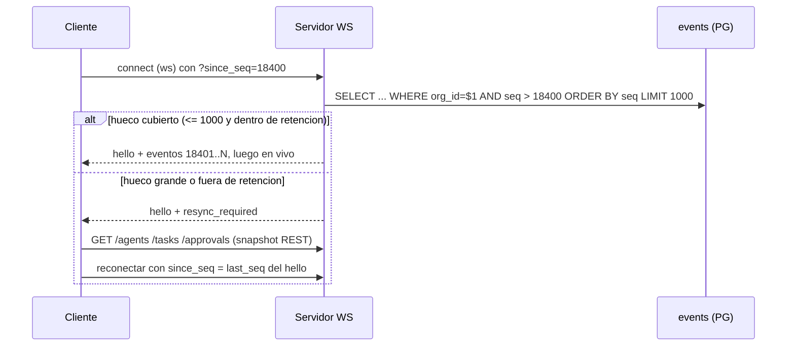

# 03 - Eventos y tiempo real

Extiende la seccion WebSocket del SPEC. Todo lo del SPEC se conserva; aqui se anade catalogo ampliado, entrega fiable, replay, suscripciones y backpressure.

## 1. Principios

1. **Los eventos son hechos ya persistidos**, nunca intenciones. Se escriben en la misma transaccion que el cambio de estado (outbox, ver `01`/`02`).
2. **La UI solo anima lo que llega por eventos** (SPEC: "toda animacion deriva de eventos reales").
3. At-least-once + `id` unico => los consumidores son idempotentes.
4. Orden: total por org via `events.seq`; el cliente aplica en orden de `seq`.

## 2. Envelope

SPEC: `{ id, type, ts, org_id, agent_id?, payload }`. **[CAMBIO] aditivo y compatible**: se anaden campos opcionales.

```json
{
  "id": "0190f3c2-...",            
  "seq": 18422,                     
  "type": "task.completed",
  "ts": "2026-10-06T14:03:22.114Z",
  "org_id": "0000...0001",
  "agent_id": "sales",
  "request_id": "…",                
  "causation_id": "…",              
  "correlation_id": "…",            
  "v": 1,
  "payload": { "task": { } }
}
```

- `seq` (nuevo): monotonico por org, habilita replay.
- `request_id`: permite filtrar por peticion en la UI.
- `causation_id` = id del evento que lo provoco; `correlation_id` = `request_id` o `workflow_run_id`. Dan la linea de tiempo causal (debug y auditoria).
- `v`: version del esquema del payload. Cambios incompatibles = nuevo `v`, con doble emision durante la transicion.

## 3. Catalogo de eventos

### 3.1 Del SPEC (sin cambios)
`hello`, `request.received`, `request.completed`, `plan.created`, `agent.state_changed`, `task.created|started|completed|failed|blocked`, `message.sent`, `approval.requested|resolved`, `report.created`, `activity.logged`, `error`, `metrics.updated`.

### 3.2 Adiciones (Fase 1 compatible, la UI puede ignorarlas)

| Tipo | Payload | Cuando | Fase |
|---|---|---|---|
| `request.failed` | `{request_id, reason}` | Fallo irrecuperable | 1 |
| `task.created` (campo nuevo) | `assigned_reason` (también en `task`) | Por qué ese agente tiene la tarea | 1 |
| `task.retrying` | `{task_id, attempt, next_attempt_at, error}` | Reintento programado | 1 |
| `task.awaiting_approval` | `{task_id, approval_id}` | Tarea pausada | 1 |
| `agent.consult.started` / `.answered` | `{from, to, question_id}` | Consulta entre agentes (UI camina a la mesa) | 1 |
| `agent.delegated` | `{from, to, task_id, depth, chain[]}` | Delegacion con cadena (06) | 1 |
| `tool.requested` | `{task_id, tool, action, risk, decision}` | Al evaluar `tool_requests` | 1 |
| `tool.executed` / `tool.failed` | `{tool_call_id, tool, status}` | Ejecucion real | 3 |
| `approval.expired` | `{approval}` | Vencio `expires_at` | 2 |
| `budget.warning` | `{scope, used_usd, limit_usd, pct}` | 80% y 100% | 1 |
| `budget.exceeded` | `{scope, request_id?}` | Se bloquea ejecucion | 1 |
| `memory.written` | `{scope, key, agent_id?, customer_id?}` | Nueva memoria (sin valor, solo metadato) | 2 |
| `workflow.run.started|completed|failed|timed_out` | `{run_id, workflow_key}` | Motor (05) | 2 |
| `workflow.step.changed` | `{run_id, step_key, status}` | Cada transicion | 2 |
| `workflow.deadline.approaching` | `{run_id, step_key, due_at}` | Aviso previo | 2 |
| `customer.created|updated` | `{customer}` | Dominio | 2 |
| `notification.created` | `{notification}` | Para el usuario destino | 2 |
| `integration.inbound` | `{channel, conversation_id, message_id}` | Llega email/WhatsApp (ya sanitizado) | 4 |
| `security.alert` | `{kind, agent_id?, detail}` | Inyeccion detectada, intento denegado (07) | 2 |
| `chat.message` | `{id, conversation, turn_id, from, to, kind, text, reply_to, ts, request_id?}` | Mensaje del usuario o de un agente/sistema en `office` o `agent:<id>` (chat-routing.md) | 1 |
| `chat.typing` | `{conversation, turn_id, agent_id, on}` | Un agente prepara su respuesta (siempre par on/off) | 1 |
| `route.decided` | `{turn_id, conversation, intent, topic, responders:[{agent_id, role, reason}], source, consult?}` | El router decidió quién responde; `intent=task` sigue con `request.received`/`plan.created` | 1 |

Convencion de nombres: `<entidad>.<verbo_pasado>`; estados como `agent.state_changed`. Prohibido emitir verbos en presente/intencion.

## 4. Pipeline de emision

```mermaid
flowchart LR
  UC[Caso de uso] -->|1 tx| PG[(PG: cambio + audit + events)]
  PG --> PUB[Outbox publisher<br/>FOR UPDATE SKIP LOCKED]
  PUB -->|PUBLISH org:{id}| RD[(Redis pubsub)]
  RD --> HUB1[WS Hub instancia 1]
  RD --> HUB2[WS Hub instancia 2]
  HUB1 --> C1[Clientes WS]
  HUB2 --> C2[Clientes WS]
  PUB --> NTF[Consumidores internos: notificaciones, metricas, workflows triggers]
```

- Publisher: loop cada 100 ms o `LISTEN/NOTIFY` (`NOTIFY events_new`) para latencia baja; lote de hasta 200; tras publicar `UPDATE events SET published_at = now()`.
- Canal Redis por org: `aiw:org:{org_id}:events`. Un hub por instancia se suscribe solo a las orgs con sockets conectados.
- Consumidores internos (`workflow triggers`, `notifications`, `metrics.updated`) se suscriben igual que el WS, y **solo reaccionan emitiendo comandos nuevos** (nunca mutan en el handler del evento sin transaccion propia).
- Si Redis cae: el publisher reintenta; los eventos siguen en PG; al volver, se reenvian. Modo degradado de una sola instancia: bus en memoria.

## 5. Protocolo WebSocket

`GET /ws` (SPEC). Autenticacion: Fase 1 ninguna; Fase 2 token en `Sec-WebSocket-Protocol` o ticket de un solo uso (`POST /ws/ticket` -> `{ticket}`, TTL 30 s) para no poner JWT en la URL.

### Mensajes servidor -> cliente
- `hello` (SPEC) + campos nuevos: `{agents, last_seq, server_time, resume_supported: true}`.
- Eventos del catalogo.
- `ping` cada 25 s (el cliente responde `pong`); sin pong en 60 s se cierra.
- `resync_required` `{reason, from_seq}`: el cliente descarta estado y recarga por REST (`GET /agents`, `/tasks`, `/approvals`...).

### Mensajes cliente -> servidor (nuevos, opcionales)
```json
{"op":"subscribe","topics":["agents","approvals","request:<id>","agent:sales"],"since_seq":18400}
{"op":"unsubscribe","topics":["agent:sales"]}
{"op":"pong"}
```
Sin `subscribe`, el cliente recibe todo lo de su org (comportamiento SPEC). Topics:

| Topic | Filtra |
|---|---|
| `agents` | `agent.*`, `message.sent` |
| `tasks` | `task.*`, `plan.created` |
| `approvals` | `approval.*`, `tool.requested` |
| `request:{id}` | todo con ese `request_id` |
| `agent:{slug}` | todo con ese `agent_id` |
| `workflows` | `workflow.*` |
| `admin` | `security.alert`, `budget.*`, `error` (requiere permiso, 06) |

El filtrado por permisos se aplica **en servidor**: un usuario no recibe eventos de recursos que RBAC no le deja leer (ej. `memory.written` de un cliente fuera de su alcance).

## 6. Replay y reconexion



- El cliente persiste `last_seq` en memoria (y `sessionStorage` para recargas).
- Reconexion con backoff exponencial 0.5 s -> 15 s con jitter (SPEC pide reconexion).
- Dedupe en cliente por `id`; ignora `seq <= last_seq`.
- Fallback sin WS: `GET /events?since_seq=` (long-poll/SSE, ver `08`).

## 7. Backpressure y limites

| Riesgo | Control |
|---|---|
| Cliente lento | Cola por socket de 256 mensajes; si se llena: coalescer `agent.state_changed` (solo el ultimo por agente), y si persiste, `resync_required` + cierre. |
| Tormenta de `agent.state_changed` (progreso) | Throttle servidor: max 4/s por agente; los cambios de estado de transicion nunca se descartan, solo `progress` intermedio. |
| Muchos sockets por org | Max 20 por usuario / 200 por org (configurable); excedente rechaza con 4429. |
| Payloads grandes | `task.*` en WS lleva `output` completo en Fase 1 (SPEC); sobre 64 KB se envia `output_ref` y la UI pide `GET /tasks/{id}`. |
| Seguridad | `Origin` validado; limite de tamano de frame cliente->servidor 4 KB; rate limit de ops cliente 10/s. |

## 8. Mapeo evento -> animacion (contrato con el frontend)

| Evento | UI |
|---|---|
| `agent.state_changed` | Cambia animacion del personaje (SPEC sec. Frontend) |
| `message.sent` (kind consult/delegation) | Linea/burbuja + camina a la mesa del interlocutor |
| `approval.requested` | Personaje alza la mano, icono ambar; aparece en bandeja |
| `task.retrying` | Parpadeo ambar + contador de intentos |
| `budget.warning/exceeded` | Banner en barra inferior; `exceeded` pone agentes afectados en `blocked` |
| `security.alert` | Marca roja en el agente y aviso en panel admin |

## 9. Observabilidad del bus

Metricas: `events_emitted_total{type}`, `outbox_lag_seconds` (now - min(ts) no publicado), `ws_connections`, `ws_dropped_total{reason}`, `resync_total`. Alerta si `outbox_lag_seconds > 5`.
