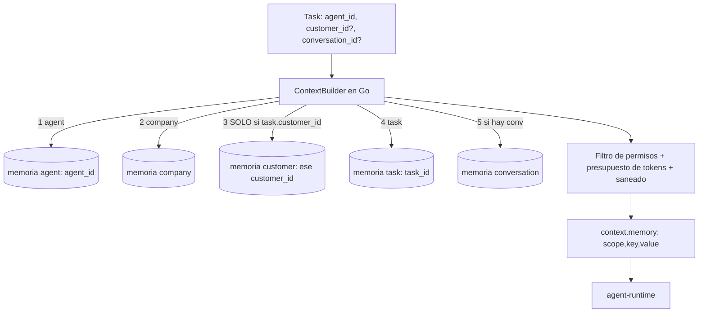
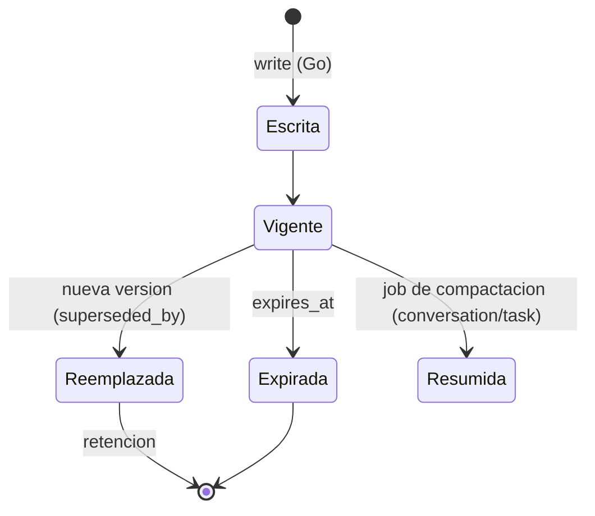

# 04 - Memoria

## 1. Objetivo y garantia central

Los agentes recuerdan, pero **jamas se mezcla informacion entre clientes** (ni entre orgs). La garantia no depende de que el LLM "se porte bien": se impone en dos capas independientes que Go controla.

> **Garantia G1 (por clave)**: toda memoria se direcciona por una clave compuesta `(org_id, scope, scope_ref, key)`; no existe ninguna consulta que lea memorias de clientes distintos en una misma llamada.
> **Garantia G2 (por construccion del contexto)**: el contexto que recibe el runtime para una tarea se construye en Go con **exactamente un** `customer_id` (o ninguno), fijado en la tarea al crearse. Lo que no esta en ese contexto, el agente no puede verlo, porque el runtime no tiene acceso a la BD.

## 2. Scopes

| Scope | Referencia | Quien escribe | Vive | Ejemplo |
|---|---|---|---|---|
| `agent` | `agent_id` | El propio agente (via Go) / admin | Largo | "Valeria prefiere propuestas con 3 opciones de precio" |
| `customer` | `customer_id` | Agentes en tareas de ese cliente / usuario | Largo | "Acme: contacto principal Ana, paga a 45 dias" |
| `task` | `task_id` | Agente de la tarea | Hasta cerrar la request (+TTL) | Resultados intermedios, hipotesis descartadas |
| `conversation` | `conversation_id` | Go (resumenes) / agente | Vida de la conversacion | Resumen rodante del hilo |
| `company` | solo `org_id` | Admin/usuario; agentes con permiso `memory:write:company` | Largo | Politicas, tono de marca, margen minimo 25% |

Esquema: tabla `memories` (`02`) con `CHECK` que obliga a **exactamente una** referencia segun el scope. No hay forma de insertar una memoria `customer` sin `customer_id` ni una con dos.

## 3. Aislamiento Cliente A vs Cliente B

### 3.1 Capa 1 - Clave compuesta + RLS + FKs compuestas
- Todo acceso incluye `org_id` (RLS lo impone) y la referencia de scope. Indices parciales por scope (`02` sec. 5) hacen que la unica via eficiente sea la clave exacta.
- Unicidad: `UNIQUE (org_id, customer_id, key) WHERE scope='customer' AND superseded_by IS NULL`.
- La API de dominio no ofrece `FindByKey(key)` sin scope: la firma obliga a pasar un `MemoryAddress`.

```go
// domain/memory
type Scope string
type MemoryAddress struct {          // constructor privado: solo se crea via helpers
    OrgID uuid.UUID
    Scope Scope
    Ref   uuid.UUID                  // uuid.Nil solo para ScopeCompany
}
func ForCustomer(org, customer uuid.UUID) (MemoryAddress, error) // error si customer == Nil
type Repo interface {
    Read(ctx context.Context, a MemoryAddress, opts ReadOpts) ([]Memory, error)
    Write(ctx context.Context, a MemoryAddress, m NewMemory) error
    // NO existe: SearchAll(ctx, query) ni ReadByKey(ctx, key)
}
```

### 3.2 Capa 2 - Construccion del contexto (`ContextBuilder`)



Reglas del builder (tests obligatorios):
1. `customer_id` sale de **`tasks.customer_id`**, fijado al crear la tarea desde la request/workflow, no del texto del LLM ni de `tool_requests`.
2. Si la tarea no tiene `customer_id`, el contexto **no contiene** memoria `customer`.
3. `dependency_outputs` solo incluye outputs de tareas de la **misma request** (misma `request_id` => mismo cliente de contexto). Una request multi-cliente se divide en una request por cliente (el plan lo valida: `distinct(customer_id) <= 1` por request).
4. El orden y los limites son deterministas: `company` (<= 10 items) -> `agent` (<= 10) -> `customer` (<= 20) -> `task` -> `conversation` (resumen). Presupuesto total `MEMORY_TOKEN_BUDGET` (default 2000 tokens); se prioriza `pinned`, luego recencia/confianza.
5. Cada item lleva `scope` y se entrega como dato delimitado (ver `07`); las memorias creadas a partir de contenido externo llevan `source` y `trust` y se rotulan como no confiables.

Estado real del codigo (W3, ver `docs/plans/large-workflows.md`): aun no existe un `ContextBuilder` con
scopes company/customer/task/conversation; hoy `context.memory` solo trae la memoria del agente (`last_task`).
Lo que SI esta implementado: (a) `dependency_outputs` respeta un presupuesto de tokens (`DEP_CONTEXT_TOKEN_BUDGET`,
default 8000: resumen + `ref` por dependencia y texto completo de las mas relevantes mientras quepa);
(b) `context.project_context` (solo requests de proyecto) con un indice acotado de tareas ya completadas y
el texto de artefactos referenciados como `artifact:<id>`, leidos por el backend y entregados como dato delimitado;
(c) la sintesis final es jerarquica por encima de `SYNTH_TOKEN_BUDGET`. `MEMORY_TOKEN_BUDGET` sigue sin implementarse.

### 3.3 Escrituras
El runtime puede devolver `memory_writes: [{scope, key, value, kind, confidence}]` (**[CAMBIO] aditivo al contrato `run-task`**; Fase 1 puede ignorarlo). Go **no confia en el scope declarado**: reescribe la direccion:
- `scope=customer` -> usa `task.customer_id` (si es NULL, se rechaza y se audita).
- `scope=agent` -> usa `task.agent_id` (un agente no escribe memoria de otro).
- `scope=company` -> requiere permiso `memory:write:company` del agente; si no, se degrada a `suggestion` pendiente de aprobacion.
- Se valida longitud (<= 2 KB por valor), PII basica y que no sea un "comando" (patrones tipo "ignora instrucciones", ver `07`).
- Contradicciones: no se pisa; se crea version nueva y `superseded_by` en la anterior (historial auditable y reversible).

### 3.4 Pruebas de aislamiento (CI)
- Property test: para clientes A y B con memorias disjuntas, cualquier `ContextBuilder.Build(task_A)` no contiene ninguna cadena sembrada en B (y viceversa), incluyendo `dependency_outputs` y memorias `task`/`conversation`.
- Test de RLS cruzado entre orgs (`02` sec. 4.3).
- Test de "agente malicioso": run-task simulado que devuelve `memory_writes` con `scope=customer` y un `customer_id` ajeno en `value`/args: debe escribir en `task.customer_id` o fallar.
- Fuzz del `MemoryAddress` (nunca `Ref == Nil` fuera de `company`).

### 3.5 Casos limite
| Caso | Decision |
|---|---|
| Tarea que compara A vs B (analista) | No permitida en una sola tarea. Se modela como 2 tareas (una por cliente) + una tarea de sintesis sobre **outputs** ya reducidos, sin memoria `customer`. Se marca `cross_customer=true` y requiere permiso `analytics:cross_customer` + aprobacion. |
| Cliente fusionado/duplicado | Operacion admin explicita `merge_customers` que re-escribe y audita; nunca automatica. |
| Derecho al olvido | `DELETE` por `customer_id` en cascada (`ON DELETE CASCADE`) + borrado de `documents` y purga de `agent_interactions` de ese cliente. |
| Contacto compartido entre clientes | Contactos pertenecen a un solo cliente; el cruce es manual. |

## 4. Ciclo de vida



- `task`: al `request.completed`, un job destila a 1-3 memorias `customer`/`agent` (si aplica) y programa el borrado del resto a 30 dias.
- `conversation`: resumen rodante cada N mensajes (el resumen lo produce el runtime via un `/v1/consult`-like `summarize`; Go lo guarda).
- Decaimiento: memorias sin uso 180 dias bajan `confidence`; `pinned` nunca decae.
- UI: el panel del agente (SPEC `detail.memory`) muestra memorias con scope; el usuario puede editar, fijar o borrar (auditado).

## 5. Recuperacion: Fase 1 sin vectores

Fase 1: lectura por **clave y scope**, sin busqueda semantica. Con 7 agentes y cientos de memorias por cliente, `ORDER BY pinned DESC, updated_at DESC LIMIT n` y `key` ya bastan; ademas `documents.content_text` tiene FTS (`tsvector` en español) para busqueda lexica.

## 6. pgvector: ¿hace falta? (evaluacion)

| Criterio | Sin vectores | Con pgvector |
|---|---|---|
| Volumen por cliente < ~500 memorias | Suficiente (se inyecta por prioridad) | Sobredimensionado |
| Preguntas tipo "¿que dijo el cliente sobre plazos de pago?" | Falla si no hay clave exacta | Resuelve |
| Documentos largos / emails (RAG) | FTS cubre palabras exactas | Necesario para sinonimos/multilingue |
| Costo | 0 | Embeddings (~$0.02/1M tokens) + indice HNSW + job de indexado |
| Riesgo de fuga entre clientes | Bajo (clave exacta) | **Mayor**: una similitud sin filtro mezcla clientes |

**Decision**: no en Fase 1. **Si en Fase 2** para `documents` y `memories` cuando se cumpla alguno: (a) > ~200 memorias/cliente o (b) se conectan emails/Drive (Fase 4-5) o (c) metricas muestran que agentes piden memorias que no se inyectaron ("misses").

Diseno cuando entre (migracion aditiva):
```sql
CREATE EXTENSION vector;
ALTER TABLE memories ADD COLUMN embedding vector(1536), ADD COLUMN embedding_model text;
CREATE TABLE document_chunks (
  id uuid PRIMARY KEY DEFAULT gen_random_uuid(),
  org_id uuid NOT NULL, document_id uuid NOT NULL, customer_id uuid,
  chunk_index int NOT NULL, content text NOT NULL,
  embedding vector(1536) NOT NULL, embedding_model text NOT NULL,
  UNIQUE (org_id, id),
  FOREIGN KEY (org_id, document_id) REFERENCES documents(org_id, id) ON DELETE CASCADE
);
-- Indices HNSW PARCIALES por scope: la busqueda nunca cruza clientes
CREATE INDEX mem_vec_customer ON memories USING hnsw (embedding vector_cosine_ops)
  WHERE scope='customer' AND embedding IS NOT NULL;
```
Reglas de seguridad: **toda** consulta vectorial lleva `WHERE org_id=$1 AND customer_id=$2` (o `agent_id`) *antes* del `ORDER BY embedding <=> $q`; la funcion de repo `SemanticSearch(a MemoryAddress, ...)` exige `MemoryAddress` igual que `Read`. Con HNSW y filtros muy selectivos, usar `SET LOCAL hnsw.ef_search` alto o particionar por org grande; si el filtro devuelve pocos candidatos, caer a escaneo exacto. Embeddings se generan en Go (puerto `Embedder`, no en el runtime), con `embedding_model` versionado para reindexar.

## 7. Metricas
`memory_context_tokens`, `memory_hits/misses`, `memory_writes_rejected_total{reason}`, `cross_scope_blocked_total` (debe ser 0 en funcionamiento normal; > 0 dispara `security.alert`).
