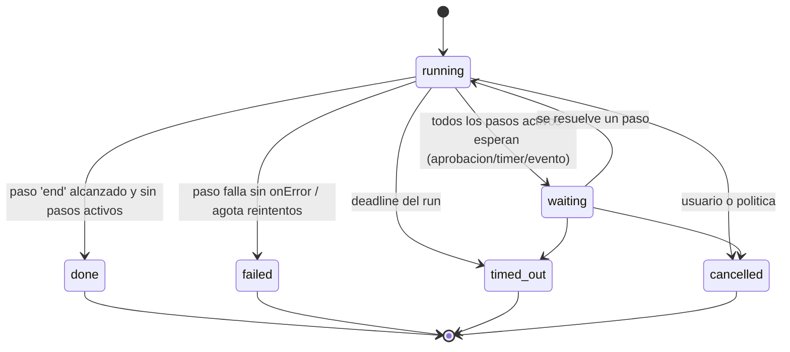
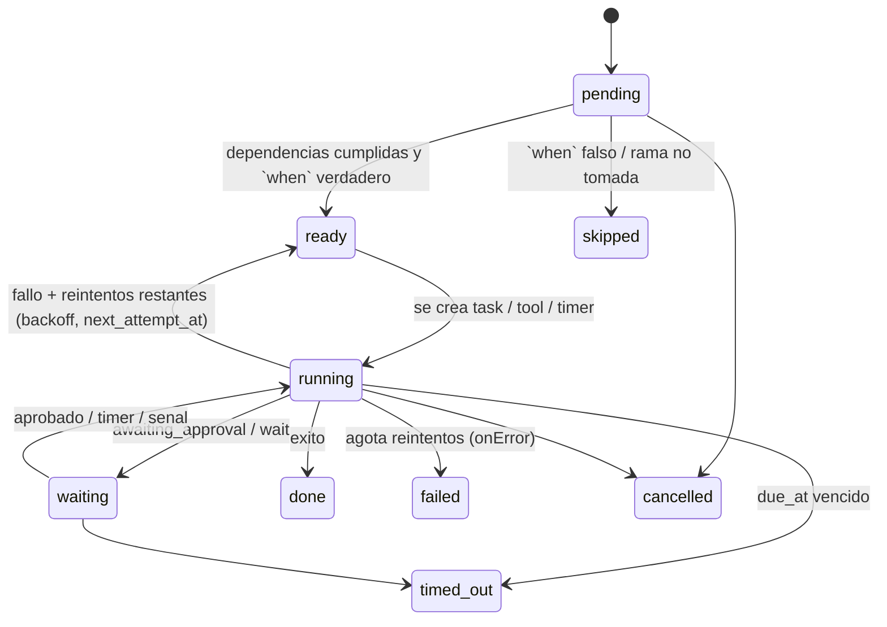
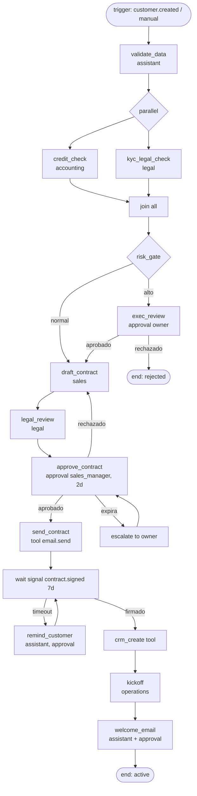

# 05 - Motor de workflows

## 1. Alcance y relacion con el SPEC

Fase 1 (SPEC): el orquestador crea un **plan dinamico** (lo propone el runtime) y el scheduler ejecuta tareas segun `depends_on`. Fase 2: se anade un **motor de workflows declarativos** (maquina de estados) para procesos repetibles (alta de cliente, cobranza, contratacion) que reusa las mismas piezas (tasks, approvals, events).

Relacion:
- Un **plan dinamico** = un workflow efimero generado en runtime (sin version, sin triggers). Se ejecuta con el mismo motor: `plan.created` se traduce a un `workflow_run` interno con pasos tipo `task`.
- Un **workflow definido** = JSON versionado en `workflows` (`02`). Un run (`workflow_runs`) fija la version exacta.
- `Task.workflow_id` del SPEC = `workflow_runs.workflow_id`.

## 2. Modelo de ejecucion

Maquina de estados **de dos niveles**: estado del run + estado de cada paso. El motor es un **reductor puro**: `next(runState, event) -> (runState', commands[])`. Los comandos (crear tarea, pedir aprobacion, programar timer, emitir evento) se ejecutan en la misma transaccion; el motor no hace I/O de negocio.



Paso:


Tipos de paso: `task` (un agente ejecuta), `tool` (Go ejecuta herramienta determinista sin LLM), `approval` (humano decide), `wait` (timer o senal externa), `condition` (ramas), `parallel` + `join`, `end`.

## 3. Garantias del motor

| Garantia | Mecanismo |
|---|---|
| Atomicidad | Cada avance = 1 tx PG: actualiza `workflow_steps`, `workflow_runs.version` (optimistic lock `WHERE version=$n`), crea tasks/approvals, `events`, `audit_logs`. |
| Reanudable tras reinicio | Todo el estado esta en PG. Al arrancar, un barrido reevalua runs `running|waiting`. No hay estado en memoria. |
| Exactamente un avance por evento | `UNIQUE (org_id, run_id, step_key)` + version del run; un avance concurrente falla y se reintenta leyendo estado fresco. |
| Deteccion de timers | Loop `SELECT ... FROM workflow_steps WHERE due_at <= now() AND status IN ('waiting','running') FOR UPDATE SKIP LOCKED` cada 1 s (rol `aiw_system`, `02` 4.4). |
| Determinismo | Condiciones evaluadas por un evaluador de expresiones sandboxed (CEL) sobre `ctx` inmutable; nada de codigo arbitrario. |
| Version | Un run nunca cambia de version; publicar una version nueva solo afecta runs nuevos. |
| Validacion al publicar | Grafo aciclico (salvo bucles de reintento explicitos), todos los `agent` existen y tienen las `tools`, todo camino llega a `end`, referencias `${...}` resolubles, deadlines coherentes. |

## 4. Elementos del DSL

### 4.1 Estructura

```jsonc
{
  "key": "string", "version": 1, "name": "string",
  "inputs":   { "<nombre>": { "type": "string|number|uuid|object", "required": true } },
  "triggers": [ /* 4.2 */ ],
  "limits":   { "deadline": "P14D", "budget_usd": 5.0, "max_parallel": 4 },
  "defaults": { "retry": {...}, "timeout": "PT30M" },
  "steps":    [ /* 4.3 */ ],
  "on_failure": { "notify": ["role:admin"], "step": "<step_key opcional>" }
}
```
Duraciones en ISO-8601 (`PT30M`, `P14D`). Expresiones en `${ ... }` (CEL) con variables: `inputs`, `steps.<key>.output`, `steps.<key>.status`, `run`, `customer`, `now`.

### 4.2 Triggers

| `type` | Config | Ejemplo |
|---|---|---|
| `manual` | `{ "roles": ["owner","sales_manager"] }` | Boton "Iniciar alta" |
| `event` | `{ "event": "customer.created", "filter": "payload.customer.status == 'prospect'" }` | Se crea cliente |
| `schedule` | `{ "cron": "0 9 * * MON", "tz": "America/Mexico_City" }` | Revision semanal |
| `webhook` | `{ "source": "crm", "secret_ref": "secret:crm_webhook" }` | Deal ganado en CRM (Fase 5) |
| `request` | `{ "intent": "alta de cliente" }` | El planificador detecta la intencion y propone el workflow en lugar de un plan libre |

Idempotencia de triggers: clave `dedupe_key` (p. ej. `customer.id`) + `UNIQUE` parcial sobre runs activos para evitar doble alta.

### 4.3 Pasos

Campos comunes: `id`, `type`, `depends_on[]` (default: paso anterior), `when` (condicion de ejecucion; falso => `skipped`), `retry`, `timeout`, `deadline` (`due_in` o `due_at`), `on_timeout`, `on_error`, `outputs` (mapeo a `ctx`).

**`task`**
```json
{ "id":"legal_review","type":"task","agent":"legal",
  "title":"Revisar contrato de ${inputs.customer.name}",
  "prompt":"Revisa clausulas del contrato y senala riesgos.",
  "inputs":{"document_id":"${steps.draft_contract.output.document_id}"},
  "customer_id":"${inputs.customer_id}",
  "retry":{"max":2,"backoff":"exp","base":"PT30S","max_delay":"PT10M","on":["runtime_error","timeout"]},
  "timeout":"PT15M","deadline":{"due_in":"P2D","on_timeout":"escalate"} }
```
`customer_id` fija el scope de memoria (04).

**`tool`** (determinista, sin LLM; pasa por authz/approval igual que `tool_requests`)
```json
{ "id":"crm_create","type":"tool","tool":"crm.create_customer","as_agent":"sales",
  "args":{"name":"${inputs.customer.name}"},"retry":{"max":5,"backoff":"exp","base":"PT10S"} }
```

**`approval`**
```json
{ "id":"approve_contract","type":"approval","action":"send_contract","risk":"high",
  "approver":{"role":"sales_manager","fallback":"owner"},
  "show":{"title":"Enviar contrato a ${inputs.customer.name}","details":"${steps.legal_review.output.summary}"},
  "expires_in":"P2D","on_reject":"revise","on_expire":"escalate" }
```
`approver` = rol RBAC (06); `on_reject`: `fail` | id de paso al que volver (bucle de revision, con `max_loops`).

**`wait`**: `{ "type":"wait","for":"duration","duration":"PT2H" }` o `{ "for":"signal","signal":"customer.replied","timeout":"P3D","on_timeout":"remind" }`.

**`condition`**
```json
{ "id":"risk_gate","type":"condition",
  "branches":[
    {"when":"${steps.credit_check.output.risk == 'high'}","goto":"exec_review"},
    {"when":"${steps.credit_check.output.confidence < 0.6}","goto":"human_review"}
  ],
  "else":"draft_contract" }
```

**`parallel` / `join`**: `{ "type":"parallel","branches":[["a1","a2"],["b1"]] }` y `{ "type":"join","mode":"all|any|n_of","n":2,"on_branch_failure":"fail|continue" }`.

### 4.4 Reintentos

| Parametro | Significado |
|---|---|
| `max` | Reintentos adicionales (default 2 para task, 5 para tool) |
| `backoff` | `fixed` o `exp` (con jitter +-20 %) |
| `on` | Clases reintentables: `runtime_error`, `timeout`, `tool_transient` (5xx/429). **Nunca**: `denied`, `rejected`, `validation`, `budget_exceeded`. |
| Efecto | `attempt++`, `next_attempt_at = now + delay`, evento `task.retrying`. Un tool con efectos laterales usa `idempotency_key` fija por (run, paso) para no duplicar. |
| Agotado | `on_error`: `fail_run` (default), `skip`, `goto:<paso>`, `compensate:<paso>`. |

### 4.5 Deadlines y timeouts

- `timeout`: tope de **ejecucion** de un intento (tarea/tool). Vence => cuenta como fallo reintentable.
- `deadline`: tope de **negocio** del paso (incluye esperas, aprobaciones). Acciones `on_timeout`: `escalate` (notificar + reasignar approver), `skip`, `fail`, `goto:<paso>`, `remind` (notificacion y re-armar).
- `limits.deadline` del run: al vencer, `timed_out` y cancelacion de pasos activos.
- Eventos: `workflow.deadline.approaching` al 80 % del plazo (`03`).

## 5. Ejemplo: flujo "nuevo cliente"



DSL completo:

```json
{
  "key": "new_customer_onboarding",
  "version": 1,
  "name": "Alta de nuevo cliente",
  "inputs": {
    "customer_id": { "type": "uuid", "required": true },
    "deal_value_usd": { "type": "number", "required": false }
  },
  "triggers": [
    { "type": "event", "event": "customer.created", "filter": "payload.customer.status == 'prospect'",
      "dedupe_key": "${payload.customer.id}" },
    { "type": "manual", "roles": ["owner", "sales_manager"] }
  ],
  "limits": { "deadline": "P21D", "budget_usd": 4.0, "max_parallel": 3 },
  "defaults": {
    "retry": { "max": 2, "backoff": "exp", "base": "PT30S", "max_delay": "PT10M", "on": ["runtime_error", "timeout"] },
    "timeout": "PT15M"
  },
  "steps": [
    { "id": "validate_data", "type": "task", "agent": "assistant", "customer_id": "${inputs.customer_id}",
      "title": "Validar y completar datos del cliente",
      "prompt": "Verifica datos fiscales, contactos y canal preferido. Lista faltantes." },

    { "id": "checks", "type": "parallel", "depends_on": ["validate_data"],
      "branches": [["credit_check"], ["kyc_legal_check"]] },

    { "id": "credit_check", "type": "task", "agent": "accounting", "customer_id": "${inputs.customer_id}",
      "title": "Evaluar riesgo crediticio y condiciones de pago" },
    { "id": "kyc_legal_check", "type": "task", "agent": "legal", "customer_id": "${inputs.customer_id}",
      "title": "Verificacion legal / KYC" },

    { "id": "checks_join", "type": "join", "mode": "all", "depends_on": ["credit_check", "kyc_legal_check"],
      "on_branch_failure": "fail" },

    { "id": "risk_gate", "type": "condition", "depends_on": ["checks_join"],
      "branches": [
        { "when": "${steps.credit_check.output.metrics.risk_score >= 70 || steps.kyc_legal_check.output.confidence < 0.6}",
          "goto": "exec_review" }
      ],
      "else": "draft_contract" },

    { "id": "exec_review", "type": "approval", "action": "accept_high_risk_customer", "risk": "high",
      "approver": { "role": "owner" },
      "show": { "title": "Cliente de riesgo alto", "details": "${steps.credit_check.output.summary}" },
      "expires_in": "P3D", "on_reject": "end_rejected", "on_expire": "end_rejected" },

    { "id": "draft_contract", "type": "task", "agent": "sales", "customer_id": "${inputs.customer_id}",
      "title": "Preparar borrador de contrato y propuesta",
      "timeout": "PT20M", "deadline": { "due_in": "P2D", "on_timeout": "escalate" } },

    { "id": "legal_review", "type": "task", "agent": "legal", "customer_id": "${inputs.customer_id}",
      "title": "Revisar borrador de contrato",
      "inputs": { "document_id": "${steps.draft_contract.output.evidence[0]}" } },

    { "id": "approve_contract", "type": "approval", "action": "send_contract", "risk": "high",
      "approver": { "role": "sales_manager", "fallback": "owner" },
      "show": { "title": "Enviar contrato a ${customer.name}", "details": "${steps.legal_review.output.summary}" },
      "expires_in": "P2D", "on_reject": "draft_contract", "max_loops": 3, "on_expire": "escalate" },

    { "id": "send_contract", "type": "tool", "tool": "email.send", "as_agent": "assistant",
      "args": { "to": "${customer.primary_contact.email}", "template": "contract_v1",
                "attachments": ["${steps.draft_contract.output.evidence[0]}"] },
      "retry": { "max": 5, "backoff": "exp", "base": "PT10S", "on": ["tool_transient"] } },

    { "id": "await_signature", "type": "wait", "for": "signal", "signal": "contract.signed",
      "timeout": "P7D", "on_timeout": "remind_customer" },

    { "id": "remind_customer", "type": "task", "agent": "assistant", "customer_id": "${inputs.customer_id}",
      "title": "Redactar recordatorio de firma", "max_loops": 2, "then": "await_signature" },

    { "id": "crm_create", "type": "tool", "tool": "crm.create_customer", "as_agent": "sales",
      "args": { "name": "${customer.name}", "tax_id": "${customer.tax_id}" } },

    { "id": "kickoff", "type": "task", "agent": "operations", "customer_id": "${inputs.customer_id}",
      "title": "Plan de kickoff y asignacion de capacidad" },

    { "id": "welcome_email", "type": "task", "agent": "assistant", "customer_id": "${inputs.customer_id}",
      "title": "Redactar correo de bienvenida", "requests_tool": "email.send" },

    { "id": "end_active", "type": "end", "result": { "customer_status": "active" } },
    { "id": "end_rejected", "type": "end", "result": { "customer_status": "churned", "reason": "rejected" } }
  ],
  "on_failure": { "notify": ["role:owner"] }
}
```

Notas:
- `welcome_email` es `task` con `requests_tool`: el agente redacta, y el `tool_request` resultante pasa por la autonomia de Sofia (06); con `approve_each` genera aprobacion automaticamente.
- `send_contract` solo se ejecuta tras `approve_contract` **aprobado**: el motor exige que un paso `tool` con `risk>=high` o accion en lista de aprobacion tenga como dependencia un `approval` con el **mismo `args_hash`**; la validacion de publicacion lo comprueba.

## 6. Integracion con el resto del sistema

| Pieza | Como se usa |
|---|---|
| Orquestador de tareas (SPEC) | Paso `task` = crea `Task` (con `workflow_run_id`, `customer_id`, `delegation_depth=0`) y deja que el scheduler la ejecute. Al `task.completed|failed`, el motor recibe el evento y avanza. |
| Aprobaciones | Paso `approval` = fila en `approvals` con `workflow_step_id`; `approval.resolved` reanuda. Misma bandeja de la UI. |
| Eventos | `workflow.run.*`, `workflow.step.changed` (`03`). La UI de dashboard dibuja el grafo coloreando pasos por estado. |
| Presupuesto | Costo del run = suma de tareas; `limits.budget_usd` supera => `budget.exceeded` y run `waiting` hasta decision humana. |
| Auditoria | Cada transicion de paso escribe `audit_logs` (`actor_type=system`, `on_behalf_of` = quien disparo el run). |
| Identidad | El run hereda la autoridad de quien lo disparo (usuario) o del trigger de sistema con rol acotado definido en el workflow (`run_as`). Ver 06. |

## 7. Operacion

- **Cancelar**: `POST /workflow-runs/{id}/cancel` => pasos activos `cancelled`, tareas `running` marcadas para abortar (el runtime no se interrumpe a mitad, su resultado se descarta), aprobaciones pendientes `cancelled`.
- **Reintentar paso fallido**: `POST /workflow-runs/{id}/steps/{key}/retry` (permiso `workflow:operate`).
- **Simulacion / dry-run**: `POST /workflows/{key}/dry-run` evalua condiciones con inputs de prueba y devuelve el camino sin crear tareas.
- **Versionado**: publicar = nueva fila `workflows(version+1)`; `status=active` solo una por `key` para triggers.
- **Limites**: max 100 pasos por definicion, max 50 runs activos por org (configurable), max 3 bucles por paso.

## 8. Plan dinamico (Fase 1) sobre este motor

`POST /requests` -> plan del runtime (`tasks[{key,agent_id,depends_on}]`) -> Go lo valida (agentes existentes, DAG, <= 20 tareas) -> crea un `workflow_run` sintetico (`workflow_id` NULL permitido; **[CAMBIO]** `workflow_runs.workflow_id` pasa a NULL-able solo para runs efimeros, con `definition` inline en `context`) o, equivalentemente en Fase 1, solo `tasks` con `depends_on` sin run. Se recomienda Fase 1 = solo tasks (SPEC tal cual) y migrar a run sintetico en Fase 2 sin cambiar API.


**Actualizacion W4 (proyectos grandes).** El limite de profundidad de la cadena de dependencias de una solicitud libre ya no es 5 sino `MAX_PLAN_DEPTH` (por defecto 30; `application.Config.MaxPlanDepth`); los ciclos y las dependencias desconocidas se siguen rechazando. Los proyectos creados desde un objetivo usan planificacion jerarquica (fases, luego tareas por fase) con limites de tamano aplicados: ver `docs/plans/large-workflows.md`, seccion "W4 hierarchical planning and limits".

## 9. Plantillas de workflow como datos (mejora #9, implementado en Fase 1.5)

Antes de existir el DSL completo (secciones 4-7), las plantillas de la galeria se expresan como **datos** con la misma forma que el plan dinamico de la seccion 8: `steps[{key, agent_role, depends_on}]` con textos por clave i18n. Instanciar una plantilla produce un `PlanResponse` (`tasks[{key,title,description,agent_id,depends_on}]`) que entra al orquestador **saltandose solo la llamada de planificacion**: la validacion de DAG/profundidad, el scheduler en paralelo, las aprobaciones, el costo y el informe son los de cualquier solicitud. Cuando exista el DSL (F3), cada plantilla se convierte 1:1 en un `workflow` (`steps[].key` -> `id`, `depends_on` -> `needs`). Detalle, esquema y endpoints: `08-api.md` seccion 11. El resumen diario programado (#10) es la plantilla `daily_briefing` ejecutada por una programacion simple (`schedules`), el primer uso real de `trigger: schedule`.
