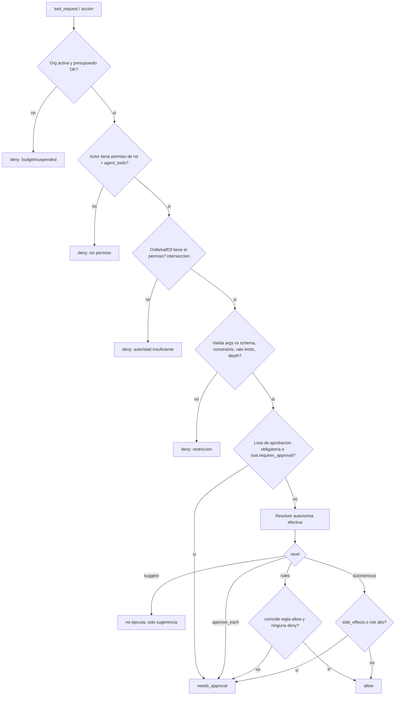
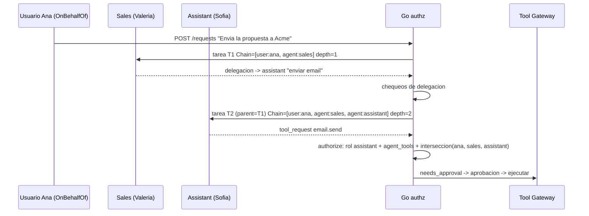

# 06 - Permisos y autonomia

Dos ejes independientes, evaluados siempre en Go (nunca en el runtime):

1. **RBAC / autoridad**: *¿puede* este principal hacer esta accion sobre este recurso? (techo duro)
2. **Autonomia**: dado que puede, *¿necesita que un humano la confirme*? (nivel de supervision)

`decision = authorize(principal, accion, recurso)` => `allow | needs_approval | deny`, con `reason`. Siempre se audita (incluyendo `deny`).

## 1. Principales e identidad

| Principal | Origen | Ejemplo |
|---|---|---|
| `user` | Login (Fase 2) | `ana@empresa.com`, rol `sales_manager` |
| `agent` | Fila `agents` | `assistant` (Sofia) |
| `system` | Motor/jobs | `orchestrator`, trigger de workflow |
| `integration` | Webhook entrante | `gmail:inbound` (siempre **no confiable**) |

Toda accion lleva una **identidad completa** (envelope de autoridad) creada por Go, que el runtime ni ve ni puede alterar:

```go
type Authority struct {
    OrgID        uuid.UUID
    Actor        Principal    // quien ejecuta: agent:assistant
    OnBehalfOf   Principal    // autoridad de origen: user:ana (o system:trigger)
    Chain        []Principal  // cadena trazada: [user:ana, agent:sales, agent:assistant]
    Depth        int          // len(Chain)-1 delegaciones de agentes
    RequestID    uuid.UUID
    TaskID       uuid.UUID
    CustomerID   *uuid.UUID   // scope de datos (04)
    Scopes       []string     // permisos efectivos (interseccion, ver 3)
    BudgetLeft   Money
}
```

Regla: la **autoridad efectiva es la interseccion** de lo que puede el que origina (`OnBehalfOf`) y lo que puede el actor. Un agente nunca obtiene mas poder del que tiene el usuario que le encargo la tarea ni del que tiene su propio rol.

## 2. RBAC

### 2.1 Permisos
Formato `recurso:accion[:alcance]`. Catalogo base:

| Grupo | Permisos |
|---|---|
| Datos | `customers:read`, `customers:write`, `documents:read`, `documents:write`, `memory:read`, `memory:write`, `memory:write:company`, `reports:read` |
| Operacion | `requests:create`, `tasks:read`, `tasks:cancel`, `conversations:read`, `conversations:intervene` |
| Gobierno | `approvals:read`, `approvals:decide`, `approvals:decide:high`, `agents:configure`, `agents:set_autonomy`, `tools:grant`, `workflows:manage`, `workflow:operate`, `roles:manage`, `audit:read`, `budget:manage` |
| Herramientas (por tool) | `tool:email.send`, `tool:crm.read`, `tool:crm.write`, `tool:calendar.create_event`, ... |
| Analitica | `analytics:cross_customer` |

Wildcards solo al final: `tool:crm.*`. `deny` explicito no existe en Fase 2 (menor complejidad); el techo se logra no concediendo.

### 2.2 Roles
| Rol (kind=user) | Permisos clave |
|---|---|
| `owner` | `*` |
| `admin` | todo menos `roles:manage` sobre `owner`, y `budget:manage` |
| `sales_manager` | `requests:create`, lectura general, `approvals:decide` (acciones de ventas), `conversations:intervene` |
| `approver` | `approvals:read`, `approvals:decide` (hasta `risk=medium`) |
| `viewer` | solo lectura |

| Rol (kind=agent) | Permisos de ejemplo |
|---|---|
| `agent.sales` | `customers:read`, `customers:write`, `documents:write`, `memory:write`, `tool:crm.*`, `tool:email.draft` |
| `agent.legal` | `documents:read`, `memory:write`, `tool:docs.annotate` |
| `agent.assistant` | `customers:read`, `tool:email.draft`, `tool:email.send`, `tool:calendar.*`, `conversations:intervene` |
| `agent.accounting` | `customers:read`, `tool:erp.read` |

`agents.role_id` apunta al rol; `Agent.permissions` del SPEC = `roles.permissions` del agente. Las herramientas concedidas se materializan ademas en `agent_tools` (con `max_risk`, `constraints`): **permiso de rol Y fila `agent_tools` son necesarios**.

### 2.3 Orden de evaluacion



## 3. Autonomia: 4 niveles

Campo `agents.autonomy` (SPEC) + override por herramienta `agent_tools.autonomy_override`. **Efectiva = la mas restrictiva** entre: nivel del agente, override de la herramienta, nivel maximo de la org (`organizations.settings.max_autonomy`) y nivel del workflow/paso si lo define.

Orden de restriccion: `suggest` > `approve_each` > `rules` > `autonomous` (de mas a menos supervision).

| Nivel | Comportamiento | `tool_requests` | Uso tipico |
|---|---|---|---|
| `suggest` | El agente solo **propone**. Go guarda la sugerencia (`tool.requested` con `decision=suggested`) y **no ejecuta nada**; el humano puede "convertir en accion" manualmente. | Nunca se ejecutan. | Agentes nuevos, dominios sensibles (legal). |
| `approve_each` | Toda accion con efecto externo crea `Approval` y espera. Lecturas (`side_effects=false`, riesgo low) se ejecutan. | Aprobacion por cada una. | Default de Fase 1. |
| `rules` | Se ejecuta sola si coincide una regla `allow` del agente (y ninguna `deny`); si no, aprobacion. | Condicionado. | Rutina madura: "responder confirmaciones de agenda". |
| `autonomous` | Ejecuta sin aprobacion, **excepto** lo que tenga `requires_approval`, `risk=high` o `side_effects` sobre destinatarios externos nuevos. Limites duros de presupuesto/rate siguen activos. | Auditoria obligatoria. | Tareas internas de bajo riesgo. |

Invariantes (no configurables):
1. Acciones en la lista de aprobacion del SPEC (`send_proposal`, `send_contract`) y cualquier tool `requires_approval=true` **siempre** requieren aprobacion, incluso en `autonomous`, salvo regla `rules` explicita firmada por un usuario con `agents:set_autonomy` **y** `approvals:decide:high`.
2. Subir el nivel de autonomia requiere `agents:set_autonomy`, queda en `audit_logs` y emite `agent.autonomy_changed`.
3. Un agente no puede cambiar su propia autonomia, permisos ni reglas.
4. Cualquier `deny` de regla gana a `allow`.

### 3.1 Reglas (`autonomy_rules`)
```json
[
  { "id": "r1", "effect": "allow", "tool": "calendar.create_event",
    "when": "args.attendees.all(a, a.endsWith('@acme.com') || a in customer.contacts)",
    "limits": { "per_day": 20 } },
  { "id": "r2", "effect": "allow", "tool": "email.send",
    "when": "args.template in ['meeting_confirmation','receipt'] && recipients_known",
    "limits": { "per_day": 30 } },
  { "id": "r3", "effect": "deny",  "tool": "email.send",
    "when": "args.attachments.size() > 0 && risk != 'low'" }
]
```
CEL sobre `args`, `customer`, `agent`, `risk`, `task`, `recipients_known`. Reglas versionadas; evaluadas en sandbox sin I/O. La UI tiene "simular regla" contra tool_requests historicos antes de activarla.

### 3.2 Aprobaciones (reglas de gobierno)
- `args_hash` fija **exactamente** lo aprobado; si la accion cambia (re-ejecucion con otros args), se pide nueva aprobacion.
- Aprobar requiere `approvals:decide` y rol >= `required_role`; `risk=high` requiere `approvals:decide:high`. **Nadie aprueba su propia peticion de alto riesgo** (maker-checker): `decided_by != requests.requested_by` cuando `risk=high` (configurable por org).
- Expiracion por defecto 48 h => `expired` => tarea `blocked`.
- Aprobacion registra `decided_by`, nota y snapshot de `details`.

## 4. Delegacion y cadena trazada

Delegar = un agente crea/solicita trabajo a otro (`consults` del runtime o `suggested_tasks`/subtareas). Go lo implementa asi:



Reglas de delegacion (todas en Go, antes de crear la tarea hija):
1. **Profundidad**: `depth <= organizations.max_delegation_depth` (SPEC: 5). Exceso => `deny`, tarea padre `blocked`, evento `error`.
2. **Sin ciclos**: el agente destino no puede estar ya en `Chain` (A->B->A prohibido salvo consulta de solo lectura).
3. **Atenuacion de privilegios**: `Scopes_hijo = Scopes_padre ∩ permisos(agente_destino)`. Delegar nunca amplia poder. El agente destino **no** hereda las herramientas del padre.
4. **Mismo cliente**: la tarea hija hereda `customer_id` del padre; no se puede cambiar (04).
5. **Presupuesto**: la hija consume del presupuesto restante del padre/request (`BudgetLeft`).
6. **Autonomia**: la efectiva de la hija es la mas restrictiva entre la suya y la de la cadena (si Valeria esta en `approve_each`, lo que ella delegue no sube a `autonomous`).
7. **Solo agentes registrados**: delegar a un `agent_id` inexistente o `active=false` se rechaza.

Trazabilidad: `tasks.delegation_chain`, `tasks.delegation_depth`, `tasks.parent_task_id`, `agent_interactions(kind=delegation, chain, depth)`, `audit_logs.on_behalf_of` + `delegation_chain`, y evento `agent.delegated`. La UI muestra la cadena en la aprobacion ("Pedido por Ana -> Valeria -> Sofia").

## 5. Ejemplo completo: Secretaria -> Email

Escenario: Ana (usuario `sales_manager`) pide *"Enviale la propuesta aprobada a Acme"*.

1. `POST /requests`. Go crea `Authority{Actor: assistant, OnBehalfOf: user:ana, Chain:[user:ana, agent:assistant], CustomerID: acme}`; Sofia = `assistant` recibe la tarea T1.
2. Sofia (runtime) devuelve `tool_requests: [{tool:"email.send", action:"send_proposal", args:{to:"ana.gomez@acme.com", subject:"Propuesta", attachments:[doc_77]}, risk:"high"}]`.
3. Go evalua `authorize`:

| Paso | Chequeo | Resultado |
|---|---|---|
| a | Org activa, presupuesto restante $3.20 | ok |
| b | `agent.assistant` tiene `tool:email.send`; fila `agent_tools(assistant, email.send, max_risk=high)` | ok |
| c | Interseccion con Ana: Ana (`sales_manager`) tiene `tool:email.send`, asi que el permiso sobrevive a la interseccion | ok |
| d | Args vs schema; `to` es contacto de `customer=acme` (`constraints.allowed_domains=["acme.com"]` -> coincide); adjunto `doc_77` pertenece a `acme` | ok |
| e | `send_proposal` esta en lista de aprobacion | **needs_approval** |

4. Go crea `tool_calls(decision=needs_approval)`, `Approval{action:"send_proposal", risk:"high", args_hash, required_role:"sales_manager", details:{to, subject, preview, attachments}}`, tarea -> `awaiting_approval`, Sofia -> `awaiting_approval`; eventos `tool.requested`, `approval.requested`; notificacion a usuarios con `approvals:decide:high`.
5. Maker-checker: Ana pidio la accion y es de riesgo alto => la aprobacion debe darla otra persona con `approvals:decide:high` (p. ej. `owner`). Si la org tiene un solo usuario, el flag `allow_self_approval` (default true en Fase 1 sin auth) lo permite.
6. `POST /approvals/{id}/decision {approve}`: Go verifica permiso y que `args_hash` coincide, ejecuta `email.send` via Tool Gateway con credenciales del vault (nunca pasan por el runtime), guarda `tool_calls.result`, `audit_logs(actor=agent:assistant, on_behalf_of=user:ana, approved_by=user:owner, chain=[...])`, emite `tool.executed`, `task.completed`.
7. Si fuera `rejected`: tarea `blocked`, nota del aprobador entra al contexto de la proxima ejecucion como dato (no como instruccion), Sofia puede reproponer.

Variante con delegacion: Valeria (ventas) prepara la propuesta y delega a Sofia el envio. Chain=`[user:ana, agent:sales, agent:assistant]`, depth=2. Sofia solo puede lo que `assistant` ∩ `sales` ∩ `ana` permiten (`email.send` si; `crm.write` no, aunque Valeria lo tenga).

Variante con autonomia `rules`: Sofia confirmando una reunion con `email.send(template='meeting_confirmation')` a un contacto conocido => regla r2 => `allow`, sin aprobacion, auditada con `reason="rule:r2"`.

## 6. Esquema de auditoria de decisiones

Cada `authorize` produce un registro (`audit_logs.action='authz.decision'`):
`{principal, actor, on_behalf_of, chain, action, resource, decision, reason, rule_id?, autonomy_effective, args_hash}`. Los `deny` por permiso se muestran en el panel admin y alimentan `security.alert` si superan umbral (p. ej. 5 deny/10 min del mismo agente).

## 7. Implementacion (Go)

```go
type Decision struct { Effect Effect; Reason string; RuleID string; ApprovalSpec *ApprovalSpec }
type Authorizer interface {
    Authorize(ctx context.Context, a Authority, act Action) (Decision, error)
}
```
- Paquete `application/authz`: puro y testeable (tabla de casos); sin acceso a red. Cache de roles por org (invalida en `roles.changed`).
- Fase 1 (sin auth): `OnBehalfOf = system:demo`, rol `owner` implicito; la maquina de decision ya funciona con `autonomy` por agente y lista de aprobacion, de modo que Fase 2 solo conecta identidades reales.
- Test de propiedad: para toda `Authority` y accion, `effective_scopes ⊆ actor_scopes ∩ origin_scopes`.
