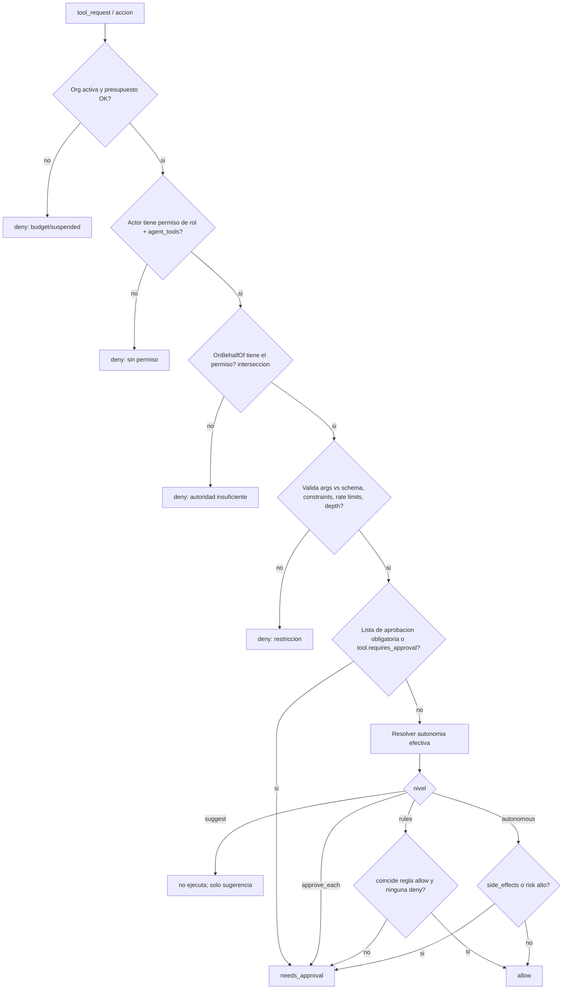
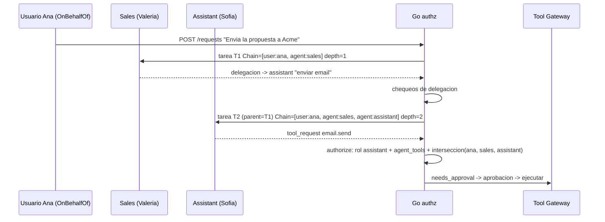

# 06 - Permisos y autonomia

Dos ejes independientes, evaluados siempre en Go (nunca en el runtime):

1. **RBAC / autoridad**: *¿puede* este principal hacer esta accion sobre este recurso? (techo duro)
2. **Autonomia**: dado que puede, *¿necesita que un humano la confirme*? (nivel de supervision)

`decision = authorize(principal, accion, recurso)` => `allow | needs_approval | deny`, con `reason`. Siempre se audita (incluyendo `deny`).

## 1. Principales e identidad

| Principal | Origen | Ejemplo |
|---|---|---|
| `user` | Login (Fase 2) | `ana@empresa.com`, rol `sales_manager` |
| `agent` | Fila `agents` | `assistant` (Sofia) |
| `system` | Motor/jobs | `orchestrator`, trigger de workflow |
| `integration` | Webhook entrante | `gmail:inbound` (siempre **no confiable**) |

Toda accion lleva una **identidad completa** (envelope de autoridad) creada por Go, que el runtime ni ve ni puede alterar:

```go
type Authority struct {
    OrgID        uuid.UUID
    Actor        Principal    // quien ejecuta: agent:assistant
    OnBehalfOf   Principal    // autoridad de origen: user:ana (o system:trigger)
    Chain        []Principal  // cadena trazada: [user:ana, agent:sales, agent:assistant]
    Depth        int          // len(Chain)-1 delegaciones de agentes
    RequestID    uuid.UUID
    TaskID       uuid.UUID
    CustomerID   *uuid.UUID   // scope de datos (04)
    Scopes       []string     // permisos efectivos (interseccion, ver 3)
    BudgetLeft   Money
}
```

Regla: la **autoridad efectiva es la interseccion** de lo que puede el que origina (`OnBehalfOf`) y lo que puede el actor. Un agente nunca obtiene mas poder del que tiene el usuario que le encargo la tarea ni del que tiene su propio rol.

## 2. RBAC

### 2.1 Permisos
Formato `recurso:accion[:alcance]`. Catalogo base:

| Grupo | Permisos |
|---|---|
| Datos | `customers:read`, `customers:write`, `documents:read`, `documents:write`, `memory:read`, `memory:write`, `memory:write:company`, `reports:read` |
| Operacion | `requests:create`, `tasks:read`, `tasks:cancel`, `conversations:read`, `conversations:intervene` |
| Gobierno | `approvals:read`, `approvals:decide`, `approvals:decide:high`, `agents:configure`, `agents:set_autonomy`, `tools:grant`, `workflows:manage`, `workflow:operate`, `roles:manage`, `audit:read`, `budget:manage` |
| Herramientas (por tool) | `tool:email.send`, `tool:crm.read`, `tool:crm.write`, `tool:calendar.create_event`, ... |
| Analitica | `analytics:cross_customer` |

Wildcards solo al final: `tool:crm.*`. `deny` explicito no existe en Fase 2 (menor complejidad); el techo se logra no concediendo.

### 2.2 Roles
| Rol (kind=user) | Permisos clave |
|---|---|
| `owner` | `*` |
| `admin` | todo menos `roles:manage` sobre `owner`, y `budget:manage` |
| `sales_manager` | `requests:create`, lectura general, `approvals:decide` (acciones de ventas), `conversations:intervene` |
| `approver` | `approvals:read`, `approvals:decide` (hasta `risk=medium`) |
| `viewer` | solo lectura |

| Rol (kind=agent) | Permisos de ejemplo |
|---|---|
| `agent.sales` | `customers:read`, `customers:write`, `documents:write`, `memory:write`, `tool:crm.*`, `tool:email.draft` |
| `agent.legal` | `documents:read`, `memory:write`, `tool:docs.annotate` |
| `agent.assistant` | `customers:read`, `tool:email.draft`, `tool:email.send`, `tool:calendar.*`, `conversations:intervene` |
| `agent.accounting` | `customers:read`, `tool:erp.read` |

`agents.role_id` apunta al rol; `Agent.permissions` del SPEC = `roles.permissions` del agente. Las herramientas concedidas se materializan ademas en `agent_tools` (con `max_risk`, `constraints`): **permiso de rol Y fila `agent_tools` son necesarios**.

### 2.3 Orden de evaluacion



## 3. Autonomia: 4 niveles

Campo `agents.autonomy` (SPEC) + override por herramienta `agent_tools.autonomy_override`. **Efectiva = la mas restrictiva** entre: nivel del agente, override de la herramienta, nivel maximo de la org (`organizations.settings.max_autonomy`) y nivel del workflow/paso si lo define.

Orden de restriccion: `suggest` > `approve_each` > `rules` > `autonomous` (de mas a menos supervision).

| Nivel | Comportamiento | `tool_requests` | Uso tipico |
|---|---|---|---|
| `suggest` | El agente solo **propone**. Go guarda la sugerencia (`tool.requested` con `decision=suggested`) y **no ejecuta nada**; el humano puede "convertir en accion" manualmente. | Nunca se ejecutan. | Agentes nuevos, dominios sensibles (legal). |
| `approve_each` | Toda accion con efecto externo crea `Approval` y espera. Lecturas (`side_effects=false`, riesgo low) se ejecutan. | Aprobacion por cada una. | Default de Fase 1. |
| `rules` | Se ejecuta sola si coincide una regla `allow` del agente (y ninguna `deny`); si no, aprobacion. | Condicionado. | Rutina madura: "responder confirmaciones de agenda". |
| `autonomous` | Ejecuta sin aprobacion, **excepto** lo que tenga `requires_approval`, `risk=high` o `side_effects` sobre destinatarios externos nuevos. Limites duros de presupuesto/rate siguen activos. | Auditoria obligatoria. | Tareas internas de bajo riesgo. |

Invariantes (no configurables):
1. Acciones en la lista de aprobacion del SPEC (`send_proposal`, `send_contract`) y cualquier tool `requires_approval=true` **siempre** requieren aprobacion, incluso en `autonomous`, salvo regla `rules` explicita firmada por un usuario con `agents:set_autonomy` **y** `approvals:decide:high`.
2. Subir el nivel de autonomia requiere `agents:set_autonomy`, queda en `audit_logs` y emite `agent.autonomy_changed`.
3. Un agente no puede cambiar su propia autonomia, permisos ni reglas.
4. Cualquier `deny` de regla gana a `allow`.

### 3.1 Reglas (`autonomy_rules`)
```json
[
  { "id": "r1", "effect": "allow", "tool": "calendar.create_event",
    "when": "args.attendees.all(a, a.endsWith('@acme.com') || a in customer.contacts)",
    "limits": { "per_day": 20 } },
  { "id": "r2", "effect": "allow", "tool": "email.send",
    "when": "args.template in ['meeting_confirmation','receipt'] && recipients_known",
    "limits": { "per_day": 30 } },
  { "id": "r3", "effect": "deny",  "tool": "email.send",
    "when": "args.attachments.size() > 0 && risk != 'low'" }
]
```
CEL sobre `args`, `customer`, `agent`, `risk`, `task`, `recipients_known`. Reglas versionadas; evaluadas en sandbox sin I/O. La UI tiene "simular regla" contra tool_requests historicos antes de activarla.

### 3.2 Aprobaciones (reglas de gobierno)
- `args_hash` fija **exactamente** lo aprobado; si la accion cambia (re-ejecucion con otros args), se pide nueva aprobacion.
- Aprobar requiere `approvals:decide` y rol >= `required_role`; `risk=high` requiere `approvals:decide:high`. **Nadie aprueba su propia peticion de alto riesgo** (maker-checker): `decided_by != requests.requested_by` cuando `risk=high` (configurable por org).
- **Estado**: la doble aprobacion, el rol por monto/accion y el maker-checker configurable estan implementados (sec. 8); `approvals:decide:high` aun no existe (hoy `approvals:decide` = admin/owner).
- Expiracion por defecto 48 h => `expired` => tarea `blocked`.
- Aprobacion registra `decided_by`, nota y snapshot de `details`.

## 4. Delegacion y cadena trazada

Delegar = un agente crea/solicita trabajo a otro (`consults` del runtime o `suggested_tasks`/subtareas). Go lo implementa asi:



Reglas de delegacion (todas en Go, antes de crear la tarea hija):
1. **Profundidad**: `depth <= organizations.max_delegation_depth` (SPEC: 5). Exceso => `deny`, tarea padre `blocked`, evento `error`.
2. **Sin ciclos**: el agente destino no puede estar ya en `Chain` (A->B->A prohibido salvo consulta de solo lectura).
3. **Atenuacion de privilegios**: `Scopes_hijo = Scopes_padre ∩ permisos(agente_destino)`. Delegar nunca amplia poder. El agente destino **no** hereda las herramientas del padre.
4. **Mismo cliente**: la tarea hija hereda `customer_id` del padre; no se puede cambiar (04).
5. **Presupuesto**: la hija consume del presupuesto restante del padre/request (`BudgetLeft`).
6. **Autonomia**: la efectiva de la hija es la mas restrictiva entre la suya y la de la cadena (si Valeria esta en `approve_each`, lo que ella delegue no sube a `autonomous`).
7. **Solo agentes registrados**: delegar a un `agent_id` inexistente o `active=false` se rechaza.

Trazabilidad: `tasks.delegation_chain`, `tasks.delegation_depth`, `tasks.parent_task_id`, `agent_interactions(kind=delegation, chain, depth)`, `audit_logs.on_behalf_of` + `delegation_chain`, y evento `agent.delegated`. La UI muestra la cadena en la aprobacion ("Pedido por Ana -> Valeria -> Sofia").

## 5. Ejemplo completo: Secretaria -> Email

Escenario: Ana (usuario `sales_manager`) pide *"Enviale la propuesta aprobada a Acme"*.

1. `POST /requests`. Go crea `Authority{Actor: assistant, OnBehalfOf: user:ana, Chain:[user:ana, agent:assistant], CustomerID: acme}`; Sofia = `assistant` recibe la tarea T1.
2. Sofia (runtime) devuelve `tool_requests: [{tool:"email.send", action:"send_proposal", args:{to:"ana.gomez@acme.com", subject:"Propuesta", attachments:[doc_77]}, risk:"high"}]`.
3. Go evalua `authorize`:

| Paso | Chequeo | Resultado |
|---|---|---|
| a | Org activa, presupuesto restante $3.20 | ok |
| b | `agent.assistant` tiene `tool:email.send`; fila `agent_tools(assistant, email.send, max_risk=high)` | ok |
| c | Interseccion con Ana: Ana (`sales_manager`) tiene `tool:email.send`, asi que el permiso sobrevive a la interseccion | ok |
| d | Args vs schema; `to` es contacto de `customer=acme` (`constraints.allowed_domains=["acme.com"]` -> coincide); adjunto `doc_77` pertenece a `acme` | ok |
| e | `send_proposal` esta en lista de aprobacion | **needs_approval** |

4. Go crea `tool_calls(decision=needs_approval)`, `Approval{action:"send_proposal", risk:"high", args_hash, required_role:"sales_manager", details:{to, subject, preview, attachments}}`, tarea -> `awaiting_approval`, Sofia -> `awaiting_approval`; eventos `tool.requested`, `approval.requested`; notificacion a usuarios con `approvals:decide:high`.
5. Maker-checker: Ana pidio la accion y es de riesgo alto => la aprobacion debe darla otra persona con `approvals:decide:high` (p. ej. `owner`). Si la org tiene un solo usuario, el flag `allow_self_approval` (default true en Fase 1 sin auth) lo permite.
6. `POST /approvals/{id}/decision {approve}`: Go verifica permiso y que `args_hash` coincide, ejecuta `email.send` via Tool Gateway con credenciales del vault (nunca pasan por el runtime), guarda `tool_calls.result`, `audit_logs(actor=agent:assistant, on_behalf_of=user:ana, approved_by=user:owner, chain=[...])`, emite `tool.executed`, `task.completed`.
7. Si fuera `rejected`: tarea `blocked`, nota del aprobador entra al contexto de la proxima ejecucion como dato (no como instruccion), Sofia puede reproponer.

Variante con delegacion: Valeria (ventas) prepara la propuesta y delega a Sofia el envio. Chain=`[user:ana, agent:sales, agent:assistant]`, depth=2. Sofia solo puede lo que `assistant` ∩ `sales` ∩ `ana` permiten (`email.send` si; `crm.write` no, aunque Valeria lo tenga).

Variante con autonomia `rules`: Sofia confirmando una reunion con `email.send(template='meeting_confirmation')` a un contacto conocido => regla r2 => `allow`, sin aprobacion, auditada con `reason="rule:r2"`.

## 6. Esquema de auditoria de decisiones

Cada `authorize` produce un registro (`audit_logs.action='authz.decision'`):
`{principal, actor, on_behalf_of, chain, action, resource, decision, reason, rule_id?, autonomy_effective, args_hash}`. Los `deny` por permiso se muestran en el panel admin y alimentan `security.alert` si superan umbral (p. ej. 5 deny/10 min del mismo agente).

## 7. Implementacion (Go)

```go
type Decision struct { Effect Effect; Reason string; RuleID string; ApprovalSpec *ApprovalSpec }
type Authorizer interface {
    Authorize(ctx context.Context, a Authority, act Action) (Decision, error)
}
```
- Paquete `application/authz`: puro y testeable (tabla de casos); sin acceso a red. Cache de roles por org (invalida en `roles.changed`).
- Fase 1 (sin auth): `OnBehalfOf = system:demo`, rol `owner` implicito; la maquina de decision ya funciona con `autonomy` por agente y lista de aprobacion, de modo que Fase 2 solo conecta identidades reales.
- Test de propiedad: para toda `Authority` y accion, `effective_scopes ⊆ actor_scopes ∩ origin_scopes`.

## 8. Implementación conectada (estado actual del backend)

El motor `backend/internal/policy` ya decide las acciones del orquestador (`application/policyflow.go`); `needsApproval` dejó de ser la única regla. Contrato HTTP y de auditoría: `08-api.md` sec. 14. Lo de las secciones 1-7 es el diseño objetivo (RBAC con `Authority`, CEL, `agent_tools`); esta sección dice **qué está construido y qué decidimos donde el diseño no llegaba**.

### 8.1 Cómo se decide (dos capas, gana la más estricta)

1. **Suelo (`baseline`)**: exactamente la regla de siempre: riesgo `high` declarado por el runtime, acciones de `APPROVAL_ACTIONS` (def. `send_proposal,send_contract`) y agentes en `suggest`/`approve_each`. **Ninguna regla de organización lo debilita** (los tres son invariantes de la sec. 3). Una organización sin reglas se comporta como antes: el escenario de demo y el smoke no cambian (hay tests de equivalencia sobre todas las combinaciones autonomía x riesgo x acción).
2. **Motor**, solo si la organización tiene reglas (`approval_amount_usd`/`always_approve` sembrados por el paquete de onboarding, que **hoy sí se aplican**, o `governance` configurado): monto sobre el umbral, acciones prohibidas, límites por ventana, destinatario nuevo, categorías sensibles, rol del aprobador, doble aprobación.

Qué pasa con cada veredicto: `allow` ejecuta; `require_approval` crea la `Approval` con los requisitos (rol, nº de aprobadores, quién pidió) y la tarea espera; `deny` registra `policy.decision` + `tool.denied`, la acción **no** se ejecuta y la tarea sigue (queda una nota en su evidencia). Tras la aprobación la acción se **revalida** (las reglas pudieron cambiar mientras esperaba: un `deny` posterior o un límite agotado la detienen; cada aprobación se consume una vez, con la huella de la acción). Las lecturas por conexión no pasan por aquí (no necesitan aprobación). Las acciones respaldadas por una conexión (Gmail) pasan por el mismo gate **antes** del Tool Gateway (deny, límites) y su aprobación hereda los requisitos; el Gateway sigue exigiendo su propia aprobación + ventana de 60 s.

### 8.2 Reglas como datos (`GET|PUT /policy/rules`)

Viven en `org_settings.rules` (JSONB, sin migración de esa tabla), junto a las del paquete. Se evalúan en cada decisión desde la base (cambiar una regla surte efecto sin reiniciar; los contadores de ventana se conservan). Esquema y ejemplo: `08-api.md` sec. 14.7. Solo el **owner** las cambia (`policy:manage`) y cada cambio se audita. Reaplicar un paquete de onboarding (`force`) reescribe monto y `always_approve` pero **conserva `governance`**.

### 8.3 Doble aprobación

- Se activa por reglas (`dual_approval`): por acción (`make_payment`, `email.send`...), por monto o por riesgo `high`. Es un **requisito duro**: sube a `require_approval` aunque el agente sea `autonomous`.
- Dos humanos **distintos**, ambos con el rol requerido. Una segunda aprobación del mismo humano es `409`.
- **El solicitante nunca aprueba** una doble aprobación (ni como primero ni como segundo). *Decisión (el diseño solo vetaba al segundo):* se aplica el default más seguro, y es lo que hace útil la regla cuando el solicitante es el owner de una organización pequeña (hacen falta dos aprobadores distintos de él). Solicitante = la persona que envió la solicitud (`OnBehalfOf`); sin autenticación es anónimo y por tanto una doble aprobación no se puede completar (falla cerrado: caduca y la tarea queda `blocked`).
- Un solo rechazo de un humano autorizado es **definitivo**, incluso tras una primera aprobación.
- Maker-checker para aprobaciones simples: `forbid_self_approval` (def. **apagado**, por compatibilidad con equipos de una persona; el diseño 3.2 lo describía "configurable por org").
- La primera aprobación se persiste (`approvals.decisions`) y se anuncia (`approval.progress`); si caduca (`ApprovalTimeout`) se rechaza como cualquier otra.

### 8.4 Quién aprueba (rol por monto y por tipo de acción)

`amount_tiers`: por encima del monto de un tramo se exige aprobación **y** el rol del tramo (gana el tramo más alto). `action_roles`: solo sube el rol para ciertas acciones. Los roles admitidos son `admin` y `owner` (los únicos que pueden decidir). El rol se toma del token (`Authenticator`), nunca del cuerpo. Un monto no interpretable (`"mucho"`) se trata como por encima de todo umbral (falla hacia el humano).

### 8.5 Los agentes nunca reciben "aprobar"

- Ningún rol de agente tiene `approvals:decide` (ni `audit:read` ni `policy:manage`); el agente no tiene token HTTP.
- Defensa en profundidad en `Approvals.Decide`: un actor `system`, `orchestrator`, `agent:*` o cuyo id sea el del agente que pidió la acción recibe `403` aunque llegara por un contexto falsificado; el intento queda en `approval.decision_refused`. Test: `TestAgentsAndSystemNeverApprove`.

### 8.6 Límites por ventana, destinatario nuevo, categorías

- Límites: ventana deslizante por agente (o `per_org`), por llamadas y/o monto acumulado; `on_exceed: deny` (def.) o `require_approval`. Los contadores están **en memoria del proceso**: se pierden al reiniciar y no se comparten entre réplicas (ver 8.7).
- Destinatario nuevo: "conocido" = dominio en `known_domains` o dirección en `known_contacts`, **datos que fija un owner**; nunca se aprende de correo entrante (un correo hostil no puede "ascender" a un atacante a contacto). Sin destinatario reconocible en una acción de salida (`send_*`, `share_*`...) cuenta como nuevo.
- Categorías (`legal`, `financial`, o declaradas en `category`/`type` de los args) por palabras clave del motor.

### 8.7 Pendiente / no verificado (explícito)

- Los contadores de ventana no sobreviven a un reinicio ni se comparten entre instancias: con varias réplicas el límite efectivo es N veces el configurado. Falta persistirlos (por ejemplo, derivarlos de `audit_logs`) o llevarlos a Redis.
- El job diario que verifica la cadena **y publica el último hash** fuera de la base (WORM) no existe: hoy es `GET /audit/verify`, `server ctl audit-verify` y el ancla manual (`08-api.md` 14.4). Sin ancla externa, quien controle toda la base puede reescribir la cadena completa.
- `Authority`/RBAC por recurso, `agent_tools`, reglas CEL y "simular regla" (secciones 1-3.1) **no** están: el motor usa los `grants` sintéticos "todos permitidos, las reglas solo restringen"; qué agente usa qué herramienta lo siguen decidiendo los grants del Tool Gateway. `GET /approvals` no devuelve aún la cadena de delegación.
- Un envío por conexión que el propio Gateway deja pasar sin aprobación (borradores) no escala a aprobación por una regla del motor; el motor sí puede denegarlo.
- Las aprobaciones y la espera siguen viviendo en el proceso (jugada 2 de la hoja de ruta: ejecución duradera).
- Crear la fila de `org_settings` (la primera vez que un owner guarda reglas en una organización sin configurar) hace que el runtime reciba `locale: "es"` (el valor por defecto) desde ese momento.
