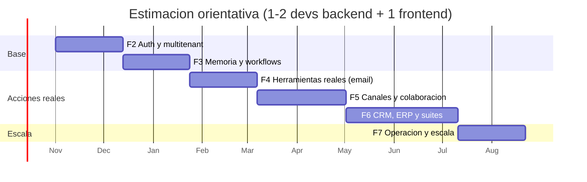
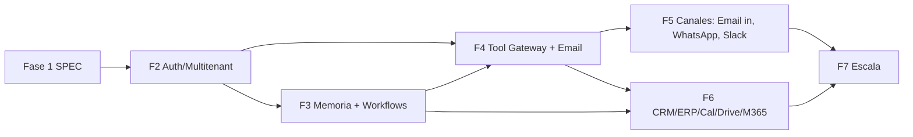

# 09 - Roadmap por fases (Fase 2 en adelante)

Punto de partida: Fase 1 del SPEC (demo con org fija, sin auth, runtime simulado/CrewAI, sin herramientas reales, sin vectores). Cada fase es **liberable por si sola** y no rompe el contrato de la anterior (todo aditivo).

(Estimaciones por orden de magnitud; sirven para secuenciar, no como compromiso.)

## Fase 2 - Auth, multitenant y gobierno

**Objetivo**: pasar de demo a producto con varias organizaciones y usuarios reales, sin cambiar el modelo de datos (ya trae `org_id`).

| Entregable | Detalle | Doc |
|---|---|---|
| Autenticacion | OIDC (Auth0/Keycloak/Google) con JWT; sesion con refresh; `GET /me`; ticket WS | 08 |
| Multi-tenant efectivo | `WithOrg` por request, RLS activa en todas las tablas, rol de BD no-bypass, test de aislamiento en CI | 02 |
| RBAC | `roles`, `user_roles`, permisos por endpoint, UI de roles; permisos del agente = rol `agent.*` | 06 |
| Autonomia real | 4 niveles, reglas CEL, maker-checker, `args_hash`, expiracion de aprobaciones | 06 |
| Presupuesto | Reserva/conciliacion, per-request y per-agent, avisos, override | 07 |
| Auditoria | Hash chain, `GET /audit`, export | 07 |
| Onboarding de org | Crear org, sembrar 7 agentes y roles por plantilla, invitar usuarios | 08 |
| Rate limiting y seguridad base | Redis token bucket, CORS lista blanca, cabeceras | 07 |
| Eventos robustos | `seq`, replay, `resync_required`, outbox con `LISTEN/NOTIFY` | 03 |

**Criterios de salida**: dos orgs de prueba sin ninguna fuga (suite RLS verde); un usuario `viewer` no puede aprobar; sin auth no hay acceso; el demo de la Fase 1 sigue funcionando con org `demo` y `SIMULATION=true`.

**Riesgos**: migracion de `agents.id` slug->uuid (mitigacion: la API sigue usando slug); sesiones WS. 

## Fase 3 - Memoria y workflows

| Entregable | Detalle | Doc |
|---|---|---|
| Memoria por scopes | `ContextBuilder`, `memory_writes` del runtime reescritos por Go, versionado, UI de edicion | 04 |
| Clientes y contactos | CRUD, timeline, `customer_id` en requests/tareas | 08 |
| Compactacion | Resumenes de conversacion/tarea, decaimiento, TTL | 04 |
| Motor de workflows | Estados, condiciones, aprobaciones, timers, reintentos, triggers (manual/evento/schedule); workflow "nuevo cliente"; UI de grafo en dashboard | 05 |
| Documentos | Subida, texto extraido, FTS en español | 02 |
| pgvector (condicional) | Se activa si se cumple el criterio de 04 sec. 6; `document_chunks`, `Embedder`, indices parciales | 04 |
| Notificaciones | In-app + preferencias | 08 |

**Criterios de salida**: test de propiedad "cliente A nunca aparece en el contexto de B" verde; el workflow de nuevo cliente corre de punta a punta en simulacion, sobrevive a reinicio del backend y respeta deadlines; memoria visible/editable por el usuario.

## Fase 4 - Herramientas reales (primer canal: email)

Esta es la fase de **mayor riesgo**: por primera vez el sistema actua fuera. Se hace con un solo canal y control maximo.

| Entregable | Detalle | Doc |
|---|---|---|
| Tool Gateway | Puerto `ToolExecutor`, registro de herramientas con schema y riesgo, `idempotency_key`, `tool_calls`, reintentos transitorios | 01, 07 |
| Vault de secretos | Cifrado envelope, OAuth tokens por org, rotacion | 07 |
| Herramientas read-only | `email.read/search`, `calendar.list`, `drive.read` (riesgo low) | - |
| Herramientas de escritura | `email.draft`, `email.send` (siempre con aprobacion al inicio), `calendar.create_event` | 06 |
| Defensas de inyeccion | Delimitacion, allowlist de destinos, separacion leer/actuar, corpus de pruebas en CI | 07 |
| Modo "borrador" | Todo envio genera borrador editable + aprobacion con edicion | 08 |
| Panel de seguridad | Alertas, denegaciones, uso por herramienta | 07 |

**Criterios de salida**: 0 envios sin aprobacion en `approve_each`; corpus de inyeccion sin ejecuciones no autorizadas; auditoria completa de cada tool call; kill-switch por herramienta/org.

## Fase 5 - Canales y colaboracion: Email entrante, WhatsApp, Slack

| Integracion | Alcance | Notas clave |
|---|---|---|
| **Email (Gmail/IMAP/M365 mail)** entrante | Webhooks/poll -> `integration.inbound` -> conversacion de cliente; clasificacion y triage por Sofia | Todo contenido entrante `external_untrusted`; deteccion de inyeccion; hilos mapeados a `conversations.external_thread_id`. |
| **WhatsApp Business (Cloud API)** | Mensajes entrantes/salientes con clientes; plantillas aprobadas; ventana de 24 h | Consentimiento (`contacts.consent`), plantillas, limites de envio; respuestas siempre `rules`/aprobacion. |
| **Slack** | Notificaciones y **aprobaciones en Slack** (botones aprobar/rechazar firmados), comandos `/aiw`; canal por agente | Verificar firma de Slack; la decision en Slack mapea a un usuario RBAC (vinculacion de identidad). |

Comun: `webhooks/{provider}` verificados (HMAC/anti-replay), cola de entrada con deduplicacion, mapeo identidad externa -> `contacts`, politica de horario y de limites de salida, tablas `integrations`, `integration_accounts`, `secrets`, `inbound_messages`.

**Criterios de salida**: una conversacion de cliente por WhatsApp y por email gestionada con aprobacion; aprobacion desde Slack funcionando con maker-checker.

## Fase 6 - CRM, ERP, Calendar, Drive, Microsoft 365

| Integracion | Herramientas | Sincronizacion | Riesgo |
|---|---|---|---|
| **CRM** (HubSpot/Salesforce/Zoho) | `crm.lookup`, `crm.create_customer`, `crm.update_deal`, `crm.log_activity` | `customers.external_refs`; sync bidireccional por webhook + reconciliacion nocturna; resolucion de conflictos (CRM gana en campos maestros) | Escritura medio/alto: aprobacion hasta madurar reglas |
| **ERP / contabilidad** (QuickBooks/SAP/Odoo) | `erp.read_invoices`, `erp.margin_report`, `erp.create_invoice` | Solo lectura primero (Tomas/accounting); escritura con `approve_each` obligatorio y limites por monto | Alto (dinero): reglas por monto, maker-checker |
| **Calendar** (Google/Outlook) | `calendar.find_slots`, `calendar.create_event`, `calendar.update_event` | Disponibilidad en tiempo real; triggers por evento | Bajo-medio; buen candidato a `rules` |
| **Drive / SharePoint / OneDrive** | `drive.search`, `drive.read`, `drive.create_file` | Indexacion a `documents` (+ chunks si pgvector); permisos heredados del origen respetados (ACL mapeada) | Contenido externo no confiable |
| **Microsoft 365** (Graph) | Mail, Calendar, Teams, OneDrive/SharePoint bajo un solo conector OAuth (Entra ID) | Delta queries; un `integration_account` por tenant M365 | Igual que los anteriores |

Plantilla de cada conector (definition of done): puerto implementado, schema de args, riesgo por accion, `constraints` por defecto, mapeo de errores a transitorio/permanente, idempotencia, rate limiting del proveedor, pruebas con sandbox del proveedor, runbook de revocacion, documentacion para el admin.

**Criterios de salida**: workflow "nuevo cliente" crea el cliente en CRM, agenda kickoff en Calendar y guarda contrato en Drive, todo con aprobaciones configurables; sync CRM sin duplicados tras 1 semana de pruebas.

## Fase 7 - Operacion y escala

| Area | Entregable |
|---|---|
| Observabilidad | OpenTelemetry (trazas request->task->runtime->tool), metricas Prometheus, dashboards de costo, latencia y aprobaciones, alertas (`outbox_lag`, presupuesto, tasa de fallos) |
| Evaluacion de agentes | Conjunto de casos dorados por agente, evaluacion automatica de calidad, A/B de motores/modelos (shadow, 01) |
| Escala | Backend horizontal, WS via Redis, PgBouncer, particionado de `events`/`audit_logs`, workers dedicados para workflows |
| Fiabilidad | Backups PITR, DR, migraciones online, pruebas de caos del runtime |
| Plataforma | API publica con claves, webhooks salientes, marketplace de herramientas/plantillas de workflow, SSO SAML, SCIM |
| Gobierno | Politicas de retencion, DPA, region de datos, SOC2 readiness |
| Reemplazo de motor | Si procede, motor propio o directo sobre API del LLM detras del mismo contrato (01 sec. 4) |

## Dependencias entre fases

Regla: **ninguna herramienta con efectos externos antes de F2 (identidad/RBAC/auditoria) ni antes de F4 (gateway + vault + defensas)**.

## Cambios propuestos al SPEC (resumen)

Todos aditivos o aclaratorios; ninguno rompe el contrato de la Fase 1. Se repiten en la respuesta final.

1. **`Agent.id` = `agents.slug`**; en BD el PK es uuid (02 sec. 1.8).
2. **Envelope WS**: campos opcionales `seq`, `request_id`, `causation_id`, `correlation_id`, `v`; `hello` anade `last_seq`, `resume_supported` (03).
3. **WS cliente->servidor** opcional (`subscribe`, `pong`) y `resync_required` (03).
4. **Nuevos eventos** (catalogo 03 sec. 3.2); la UI puede ignorarlos.
5. **`/healthz`** del backend y del runtime: se anaden `engine`, `contract_versions`, `runtime_version` (01).
6. **Contrato Go->runtime**: campos opcionales `limits`, `untrusted`, `memory_writes`, `delegations`, `contract_version`; nuevo `POST /v1/summarize` (08 sec. 7).
7. **Paginacion por cursor** y errores `problem+json` (compatibles: sin parametros se mantiene el array simple; los errores de Fase 1 pueden seguir como `{error}` hasta Fase 2).
8. **`POST /requests`** acepta `customer_id`, `budget_cap_usd` opcionales (08).
9. **Tareas con `customer_id`, `delegation_chain`, `delegation_depth`** (campos nuevos en `Task` JSON, opcionales) para cumplir aislamiento de memoria y trazabilidad (02, 04, 06).
10. **Una request = a lo sumo un cliente**; solicitudes multi-cliente se dividen (04).
11. **Aprobacion con `args_hash`** y maker-checker en alto riesgo (06): `Approval` JSON gana `expires_at`, `required_role`, `delegation_chain` opcionales; estados extra `expired`, `cancelled`.
12. **Invariante nuevo**: acciones de la lista de aprobacion del SPEC no se pueden saltar ni con `autonomous` (06 sec. 3).
