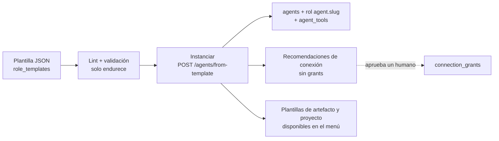

# Catálogo de profesiones y roles como datos

Estado: spec implementable (propuesta). Complementa `docs/SPEC.md`, `06-permisos-autonomia.md`, `05-workflows.md`, `agent-workspaces.md` (sec. 4, "Roles: artefacto por defecto") y `integrations-credentials.md` (Conexiones y controles). Todo es aditivo: los 7 agentes del SPEC (ventas, RR. HH., legal, contabilidad, análisis, operaciones, asistente) no cambian.

Origen del pedido: *"ve pensando en otras profesiones"*. Este documento (1) define cómo se describe un rol como **dato** (plantilla) para sumar profesiones sin tocar el motor, (2) cataloga profesiones adicionales con sus herramientas, artefactos, proyectos paralelos de ejemplo, riesgo y aprobaciones, y (3) prioriza 6-8 para la siguiente fase con criterio explícito.

Convenciones: prosa en español; todo identificador, tabla, columna, endpoint, clave JSON, evento, herramienta, capacidad y `data-testid` en inglés. Los textos visibles de ejemplo son **localizables** (`es`/`en`, siempre por clave i18n). Ningún `data-testid` nuevo empieza con `agent-` ni `approval-` (el e2e los cuenta); aquí se usa el prefijo `role-`.

---

## 1. Principios

1. **Un rol es configuración, no código.** Persona, responsabilidades, herramientas elegidas, conexiones recomendadas, artefactos, políticas de aprobación, límites y proyectos de ejemplo viven en una plantilla JSON versionada.
2. **Las plantillas solo pueden endurecer.** Una plantilla nunca concede poder que el motor, la organización o el RBAC no concedan (06). Puede *añadir* aprobaciones, bajar `max_risk`, reducir límites; no puede quitar un `always_approval` del manifiesto de proveedor ni subir la autonomía por encima del techo de su nivel de riesgo.
3. **Mínimo privilegio también en la contratación.** Instanciar un rol **no** concede conexiones: las recomienda. Los grants se aprueban aparte (`integrations-credentials.md` D1).
4. **La profesión determina el nivel de riesgo y el techo de autonomía** (sec. 2.2), no la preferencia del usuario del momento.
5. **Empezar por borradores y lectura.** Todo rol nuevo nace con autonomía `approve_each` (o `suggest` en nivel rojo) y se gradúa con evidencia.
6. **Los agentes no dan asesoría profesional regulada.** Legal, salud, impuestos, inversión: el agente prepara y organiza; un profesional humano decide (sec. 2.3).

---

## 2. Criterios transversales

### 2.1 Escala de riesgo (`risk_tier`)

| Nivel | Significado | Autonomía por defecto | Techo de autonomía | Efecto externo |
|---|---|---|---|---|
| `green` | Sin efecto externo; trabajo interno sobre archivos, artefactos y lectura | `approve_each` | `autonomous` (solo tareas internas) | Ninguno o reversible interno |
| `amber` | Borradores y comunicaciones con terceros, escrituras reversibles en sistemas del cliente | `approve_each` | `rules` | Todo envío/publicación con aprobación por acción |
| `red` | Dinero, salud, legal, menores, publicación masiva o irreversible | `suggest` | `approve_each` (subir exige firma del `owner` con `agents:set_autonomy` + `approvals:decide:high`) | Aprobación siempre; doble aprobación en acciones `high` |

`autonomy.ceiling` de la plantilla se **intersecta** con `organizations.settings.max_autonomy` y con el nivel de riesgo (se aplica el más restrictivo, como en 06 sec. 3).

### 2.2 Datos sensibles (`sensitive_data`)

Etiquetas que la plantilla declara y que activan controles automáticos: `pii`, `financial`, `health`, `minors`, `legal_privilege`, `credentials_adjacent`. Efectos: perfil de redacción `strict` por defecto en grants, retención más corta de `agent_interactions` (07 sec. 7), aviso de consentimiento en la pantalla Conexiones, y exclusión de la memoria compartida entre clientes (04).

### 2.3 Avisos de responsabilidad (localizables)

Cada plantilla `amber`/`red` lleva `disclaimers` mostrados al contratar el rol y en el encabezado de entregables sensibles. Ejemplo (`role.disclaimer.clinic_admin`): es "Este empleado organiza agenda, recordatorios y facturación. No da diagnósticos ni indicaciones médicas." / en "This employee handles scheduling, reminders and billing. It does not give diagnoses or medical advice."

### 2.4 Convención de acciones que siempre exigen aprobación

Independiente de la profesión (invariante de 06 y de los manifiestos de proveedor): enviar correo/mensaje a un tercero, publicar contenido público, mover o comprometer dinero (pagos, órdenes de compra, transferencias), firmar o enviar contratos, borrar datos de otros sistemas, hacer `merge`/`push`/`deploy` a producción, compartir archivos con acceso externo, y cualquier acción derivada de contenido externo hacia un destino nuevo.

---

## 3. Roles como datos (plantillas)

### 3.1 Qué es una plantilla y dónde vive

- Archivo JSON `backend/internal/roles/templates/<id>.json` embebido con `go:embed` (builtin) y, opcionalmente, filas de `role_templates` por organización (personalizadas).
- Esquema `aiw.role_template/1` (JSON Schema versionado; el lint de 3.5 lo valida).
- Los textos visibles y de persona están en `i18n.es` / `i18n.en`; el motor resuelve por `Accept-Language` y por `organizations.settings.language`.
- El frontend deja de depender de un `ROLE_META` fijo: `GET /role-templates` entrega `display` (color, escritorio, icono) y el `ROLE_META` actual queda como fallback para los 7 roles semilla.



### 3.2 Esquema (campos)

| Campo | Tipo | Descripción |
|---|---|---|
| `schema`, `id`, `version`, `category` | string/int | `id` estable en inglés (`customer_support`). |
| `risk_tier` | `green\|amber\|red` | Ver 2.1. |
| `sensitive_data` | string[] | Ver 2.2. |
| `i18n.<lang>` | objeto | `title`, `description`, `persona` (instrucciones del rol para el runtime, en el idioma de trabajo), `responsibilities[]`, `disclaimers[]`, `glossary`. |
| `display` | objeto | `color`, `desk` (tipo de escritorio 3D), `icon`, `name_pool`. |
| `tools[]` | objeto[] | `{tool, max_risk, constraints?, connection?:{provider, capability, optional}}`. Solo herramientas **registradas** en el motor. |
| `autonomy` | objeto | `{default, ceiling}`. |
| `approval_policy[]` | objeto[] | Reglas `{match, effect:"require_approval"\|"deny", always?:true, when?:CEL}` que se **añaden** a la política. |
| `limits` | objeto | `monthly_budget_usd`, `tool_rates`, `max_items_per_call`, `business_hours`. |
| `suggested_artifacts[]`, `artifact_templates[]` | string[] | Tipos (`sheet`, `doc`, `table`, `board`, `chart`, `pdf`, `form`, `inbox`, `agenda`) y plantillas de `agent-workspaces.md` sec. 4. |
| `project_templates[]` | string[] | Claves de workflows de ejemplo (DSL de 05) instalables. |
| `kpis[]` | objeto[] | Métricas que el rol reporta. |
| `simulation_script` | string | Guion para modo simulación (el demo funciona sin API key). |
| `requires` | objeto | `{min_phase, tools_registered:[...]}` para ocultar roles que aún no pueden operar. |

### 3.3 Ejemplo completo (resumido): `customer_support`

```json
{
  "schema": "aiw.role_template/1",
  "id": "customer_support", "version": 1, "category": "customer",
  "risk_tier": "amber", "sensitive_data": ["pii"],
  "i18n": {
    "es": {
      "title": "Soporte al cliente",
      "description": "Clasifica consultas, redacta respuestas y mantiene la base de conocimiento.",
      "persona": "Eres un agente de soporte empático y preciso. Respondes con la base de conocimiento; si no sabes, lo dices y escalas. Nunca prometes reembolsos ni plazos.",
      "responsibilities": ["Triage de consultas", "Borradores de respuesta", "Actualizar preguntas frecuentes"],
      "disclaimers": []
    },
    "en": {
      "title": "Customer support",
      "description": "Triages inquiries, drafts replies and maintains the knowledge base.",
      "persona": "You are an empathetic, precise support agent. Answer from the knowledge base; if unsure, say so and escalate. Never promise refunds or deadlines.",
      "responsibilities": ["Inquiry triage", "Reply drafts", "Update FAQs"],
      "disclaimers": []
    }
  },
  "display": { "color": "#3b9ca6", "desk": "support_desk", "icon": "headset" },
  "tools": [
    { "tool": "email.search", "max_risk": "low",  "connection": { "provider": "google_gmail", "capability": "mail.read" } },
    { "tool": "email.draft",  "max_risk": "low",  "connection": { "provider": "google_gmail", "capability": "mail.draft", "optional": true } },
    { "tool": "email.send",   "max_risk": "high", "connection": { "provider": "google_gmail", "capability": "mail.send", "optional": true } },
    { "tool": "docs.search",  "max_risk": "low" },
    { "tool": "artifacts",    "max_risk": "low" }
  ],
  "autonomy": { "default": "approve_each", "ceiling": "rules" },
  "approval_policy": [
    { "match": { "tool": "email.send" }, "effect": "require_approval", "always": true },
    { "match": { "tool": "email.send" }, "when": "args.mentions_refund || args.mentions_legal", "effect": "require_approval" }
  ],
  "limits": { "monthly_budget_usd": 15, "tool_rates": { "email.send": { "per_day": 40 } }, "max_items_per_call": 25 },
  "suggested_artifacts": ["inbox", "board", "table", "doc"],
  "artifact_templates": ["support.daily_inbox", "support.faq_gap_table"],
  "project_templates": ["support.backlog_triage"],
  "kpis": [ { "key": "first_draft_minutes", "type": "duration" }, { "key": "approved_without_edit_pct", "type": "percent" } ],
  "simulation_script": "sim/customer_support.json",
  "requires": { "min_phase": "C3", "tools_registered": ["email.search", "email.draft", "email.send"] }
}
```

### 3.4 Dónde termina el "solo datos": niveles de extensión

| Nivel | Qué se agrega | Requiere código | Quién lo puede hacer |
|---|---|---|---|
| **0 - Plantilla de rol** | Persona, herramientas **ya registradas**, políticas, límites, artefactos, proyectos | No | Cualquier admin/curador |
| **1 - Conector declarativo** | Un proveedor REST nuevo descrito por manifiesto (endpoints, mapeo de campos, capacidades, riesgo, `reversibility`) ejecutado por un ejecutor HTTP genérico con anti-SSRF, límites y redacción | No (manifiesto JSON), con revisión de seguridad | Curador de la plataforma (marketplace en Fase 7 de 09) |
| **2 - Adaptador Go** | Proveedor con auth compleja, paginación, webhooks o escritura delicada (GitHub App, bancos, facturación electrónica) | Sí (`Provider` + `tools.Tool`) | Equipo de plataforma |

Un rol nuevo **no** crea herramientas: solo combina las existentes. Si necesita un proveedor nuevo, usa el nivel 1 o 2 y la plantilla del rol queda con `requires.tools_registered` hasta que exista.

### 3.5 Validación, lint y pruebas (en CI y al importar)

`backend ctl template lint <file>` rechaza la plantilla si:
1. alguna herramienta no está registrada o la capacidad no existe en el manifiesto de proveedor;
2. `autonomy.default` o `ceiling` exceden el techo del `risk_tier`;
3. intenta quitar un `always_approval` o añadir `effect:"allow"` (las plantillas solo pueden `require_approval`/`deny`);
4. faltan claves `i18n` en `es` **o** `en`;
5. la persona contiene patrones de secretos, URLs externas o instrucciones de "ignorar políticas";
6. `limits` exceden los máximos de la org o `monthly_budget_usd` > tope de plantilla;
7. `risk_tier=red` sin `disclaimers` ni `sensitive_data`;
8. referencias a plantillas de artefacto/proyecto inexistentes.

Además, cada rol builtin trae su **guion de simulación** y una prueba dorada (caso -> `tool_requests` esperados bajo política): la aserción principal es que los `tool_requests` hostiles del corpus de inyección no se ejecutan (07 sec. 2.2).

### 3.6 Instanciación y gobierno

```sql
-- 207_role_templates.sql (propuesta)
CREATE TABLE role_templates (
  id TEXT NOT NULL, org_id TEXT NOT NULL,          -- org_id='builtin' para las de plataforma (solo lectura)
  version INT NOT NULL, status TEXT NOT NULL DEFAULT 'active' CHECK (status IN ('draft','active','retired')),
  body JSONB NOT NULL, created_by TEXT, created_at TIMESTAMPTZ NOT NULL DEFAULT now(),
  PRIMARY KEY (org_id, id, version)
);
ALTER TABLE agents ADD COLUMN template_id TEXT, ADD COLUMN template_version INT;
```

| Endpoint | Descripción | Permiso |
|---|---|---|
| `GET /role-templates?category=&risk_tier=` | Catálogo (con `requires` y disponibilidad por fase) | `agents:configure` |
| `GET /role-templates/{id}` | Detalle, localizado | `agents:configure` |
| `POST /agents/from-template` `{template_id, slug, name?, department_id?, overrides?}` | Crea el agente, su rol `agent.<slug>`, `agent_tools` (sin conexiones) y devuelve `recommended_connections[]` | `agents:configure` |
| `POST /role-templates` / `PUT .../{id}` | Plantilla personalizada de la org (pasa el lint) | `agents:configure` + `tools:grant` |
| `POST /agents/{id}/template/upgrade` `{to_version}` | Muestra el diff y aplica (no sube autonomía ni grants) | `agents:configure` |

`overrides` solo puede endurecer. La instanciación se audita (`agent.created_from_template`) y emite `agent.created` (evento nuevo, aditivo). **Cómo agregar una profesión** (checklist): (1) escribir la plantilla JSON y su guion de simulación; (2) verificar que las herramientas existen (si no: conector nivel 1/2); (3) correr el lint; (4) añadir plantillas de artefacto y de proyecto (DSL 05); (5) prueba dorada + inyección; (6) asignar `risk_tier`; (7) publicar con `requires.min_phase` correcto. Sin tocar scheduler, política ni UI.

### 3.5b `data-testid` (UI de contratación)

`nav-roles`, `role-catalog`, `role-card-{id}` (`data-risk-tier`, `data-available`), `role-filter-tier`, `role-hire-{id}`, `role-hire-confirm`, `role-recommended-connection-{provider}`, `role-disclaimer`. Localizables: `role.hire.cta` es "Contratar" / en "Hire"; `role.recommended_connections` es "Conexiones recomendadas (no se conceden solas)" / en "Recommended connections (not granted automatically)".

---

## 4. Catálogo de profesiones

Notación de proyectos: `[A | B | C]` = ramas en paralelo (`parallel`/`join` de 05); `->` = dependencia; `(AP)` = punto de aprobación humana; `(R)` = lectura de conexión; `(W)` = escritura. Los agentes existentes aparecen con su `id` del SPEC. Capacidades y herramientas como en `integrations-credentials.md`.

Artefactos: `sheet`, `doc`, `table`, `board`, `chart`, `pdf`, `form`, `inbox`, `agenda` (`agent-workspaces.md`).

### 4.1 Desarrollador / ingeniero de software (`software_engineer`)

- **Riesgo**: `amber` (lectura de repos = bajo; escritura = limitada). `sensitive_data`: `credentials_adjacent` (el código puede contener secretos: el sanitizador los redacta).
- **Conexiones**: GitHub (GitHub App) o GitLab: `repo.read` (default). Opcionales: `issue.comment`, `pr.draft_comment`. CI en solo lectura (`ci.read`, fase posterior).
- **Herramientas**: `repo.list_files`, `repo.read_file`, `repo.search_code`, `repo.list_issues`, `repo.read_pr`, `issue.comment_draft`, `artifacts`.
- **Artefactos**: `doc` (revisión de código, ADR, release notes), `table` (hallazgos), `board` (backlog), `chart` (cobertura/tendencias).
- **Proyecto ejemplo "Preparar release 2.4"**: `[changelog desde PRs fusionados (R) | auditoría de dependencias | revisión de PRs abiertos con checklist | actualización de docs | plan de pruebas de regresión] -> consolidar notas (analyst) -> revisión humana (AP) -> borrador de anuncio (assistant)`.
- **Aprobación obligatoria**: comentar en issues/PRs públicos, abrir PRs o issues, cualquier `push`, `merge`, creación de tags o `deploy` (no se ofrecen en C4: `never_offered` hasta nuevo diseño). **No** se concede acceso de escritura a ramas protegidas.
- **Notas**: el README, issues y comentarios de terceros son datos delimitados; el código nunca se ejecuta en el motor. Valor extra: es el rol natural para "dogfooding" del propio producto.

### 4.2 Project manager (`project_manager`)

- **Riesgo**: `green`.
- **Conexiones**: ninguna obligatoria. Opcionales: Google Calendar (`calendar.read`), Gmail (`mail.read` de un buzón de proyecto), Linear/Jira/Trello/Asana (lectura, nivel 1).
- **Herramientas**: `artifacts` (board, doc, chart), `calendar.find_slots`, `docs.search`; trabaja directamente sobre proyectos/entregables de `workflow-visualization.md`.
- **Artefactos**: `board` (kanban/WBS), `doc` (acta, plan, RAID), `chart` (burndown, ruta crítica), `table` (riesgos), `agenda`.
- **Proyecto ejemplo "Apertura de sucursal Norte"**: `[plan de tareas y dependencias | presupuesto (accounting) | contratación (hr) | revisión de contrato de arrendamiento (legal) | plan de capacidad (operations)] -> ruta crítica y riesgos -> reporte semanal consolidado (assistant)`; seguimiento con `project_status` en el mapa del proyecto.
- **Aprobación**: enviar el reporte a stakeholders externos, convocar reuniones con invitados externos, comprometer presupuesto (delegado a otros roles).
- **Notas**: rol de menor riesgo y mayor reutilización de lo ya diseñado; orquesta, no ejecuta externamente.

### 4.3 Marketing / SEO (`marketing_seo`)

- **Riesgo**: `amber` (publicar es público e irreversible en la práctica).
- **Conexiones**: Google Search Console y Analytics (`analytics.read`), Drive (`drive.read` sobre carpeta de marca vía Picker), proveedores SEO por API key (Semrush/Ahrefs: `seo.read`, con **presupuesto por conexión**), CMS (WordPress/Wix: `cms.draft` opcional, `cms.publish` con aprobación).
- **Herramientas**: `web.fetch_public` (solo páginas públicas, anti-SSRF), `seo.keyword_report`, `analytics.report`, `cms.create_draft`, `artifacts`.
- **Artefactos**: `doc` (briefs, artículos), `sheet` (keywords, calendario), `board` (calendario editorial), `chart` (tráfico), `table` (auditoría técnica).
- **Proyecto ejemplo "Campaña de apertura"**: `[investigación de keywords y competencia (R) | auditoría técnica del sitio (R) | brief y calendario editorial | guion de email de lanzamiento] -> redacción de 8 piezas en paralelo (doc) -> revisión de marca y legal (legal) (AP) -> programación en borrador (W)`.
- **Aprobación**: publicar en el CMS, enviar campañas de email, gasto en anuncios (no ofrecido), cambios de DNS/redirecciones (no ofrecido).
- **Notas**: costo variable de APIs SEO: usar `monthly_budget_usd` de la conexión.

### 4.4 Soporte al cliente (`customer_support`)

- **Riesgo**: `amber` (habla con clientes; PII).
- **Conexiones**: Gmail (`mail.read`, `mail.draft`, `mail.send` opcional); más adelante WhatsApp Business (09 Fase 5: plantillas, ventana de 24 h, consentimiento), helpdesk (Zendesk/Freshdesk/Intercom: `ticket.read`, `ticket.reply_draft`), Drive/Notion como base de conocimiento (`drive.read`).
- **Herramientas**: `email.search`, `email.draft`, `email.send`, `docs.search`, `helpdesk.list_tickets`, `helpdesk.draft_reply`, `artifacts`.
- **Artefactos**: `inbox` (bandeja), `board` (tickets por estado), `table` (preguntas frecuentes sin respuesta), `doc` (macros/respuestas).
- **Proyecto ejemplo "Ordenar el backlog de soporte"**: `[triage de 300 correos por categoría y urgencia (R, lector sin herramientas) | detectar los 20 temas repetidos | auditoría de la base de conocimiento]` -> `[borradores de respuesta por tema | redacción de 10 FAQs | métricas de tiempos]` -> revisión humana de muestras (AP) -> envío por lotes con aprobación en lote (`POST /approvals/batch` de `workflow-visualization.md` sec. 6.2).
- **Aprobación**: **todo** envío a clientes; cualquier respuesta que mencione reembolsos, plazos legales o datos de cuenta; cierre masivo de tickets.
- **Notas**: máximo riesgo de inyección (el cliente controla el texto): lector sin herramientas + taint obligatorio.

### 4.5 Finanzas / tesorería (`finance_treasury`)

- **Riesgo**: `red` si toca bancos; **`amber` en la variante "solo análisis"** (la que se prioriza).
- **Conexiones**: **sin credenciales bancarias en la primera versión**: importación manual de extractos (CSV/xlsx) a `documents` y lectura de la contabilidad (`erp.read`, solo lectura, fase posterior). Bancos/ERP por API en fases posteriores y siempre con tope de monto.
- **Herramientas**: `spreadsheet`, `calculator`, `docs.parse_statement`, `erp.read_invoices` (solo lectura), `artifacts`.
- **Artefactos**: `sheet` (flujo de caja, conciliación), `chart` (proyección), `table` (cuentas por cobrar/pagar), `doc` (memo de tesorería), `form` (solicitud de pago **sin ejecutar**).
- **Proyecto ejemplo "Cierre de caja trimestral"**: `[conciliación bancaria cuenta A | conciliación cuenta B | antigüedad de cuentas por cobrar | proyección de flujo a 13 semanas] -> consolidar y variaciones (accounting) -> memo y alertas (AP) -> preparar lista de pagos propuesta (nunca ejecutada)`.
- **Aprobación**: toda salida de dinero, altas de beneficiarios y cambios de cuentas **no están disponibles** como herramienta; lo único que existe es `payment.propose` que genera un artefacto para que un humano pague fuera del sistema. Cualquier escritura en ERP: `approve_each` + límites por monto + doble aprobación.
- **Notas**: relación con `accounting` existente: finanzas se enfoca en liquidez/tesorería; contabilidad en registros y cierre. Facturación electrónica (autoridades fiscales de cada país: SAT, DIAN, AFIP/ARCA, SII) es un conector nivel 2 de riesgo alto; fuera de la siguiente fase.

### 4.6 Compras / abastecimiento (`procurement`)

- **Riesgo**: `amber` (compromete a la empresa con proveedores).
- **Conexiones**: Gmail (`mail.read`, `mail.draft`), Drive (catálogos/cotizaciones), ERP en lectura (`erp.read`).
- **Herramientas**: `spreadsheet`, `docs.parse_quote`, `email.draft`, `artifacts`.
- **Artefactos**: `sheet` (cuadro comparativo), `table` (proveedores), `form` (solicitud de compra), `pdf` (cotizaciones), `doc` (RFQ).
- **Proyecto ejemplo "Renovar equipos de oficina"**: `[RFQ a 5 proveedores (borradores) | extracción de cotizaciones recibidas | análisis de costo total de propiedad | revisión de condiciones contractuales (legal)] -> cuadro comparativo -> recomendación (AP) -> borrador de orden de compra`.
- **Aprobación**: enviar RFQ/orden de compra, aceptar condiciones, cualquier compromiso de pago.

### 4.7 Diseñador (`designer`)

- **Riesgo**: `green`.
- **Conexiones**: Figma/Canva en lectura (`design.read`, nivel 1), Drive (`drive.read` de assets de marca).
- **Herramientas**: `design.read_file`, `image.generate` (opcional, con tope de costo), `artifacts`.
- **Artefactos**: `doc` (briefs, guía de estilo), `board` (revisiones), `table` (inventario de assets), `pdf` (entregables), `form` (feedback).
- **Proyecto ejemplo "Kit de lanzamiento"**: `[auditoría de consistencia de marca | brief por pieza | variantes de copy para cada pieza] -> selección y notas de revisión (AP) -> inventario y entrega`.
- **Aprobación**: compartir archivos con externos, publicar assets. Generación de imágenes con costo: tope por proyecto.
- **Notas**: poca madurez de herramientas de escritura; útil sobre todo como revisor y organizador.

### 4.8 Analista de datos (`data_analyst`)

- **Riesgo**: `green`/`amber` según datos (`sensitive_data` variable).
- **Conexiones**: archivos CSV/xlsx subidos, Google Sheets vía Drive, **base de datos SQL con usuario de solo lectura** (`db.query_readonly`: timeout, límite de filas, lista de tablas permitidas, sin DDL/DML), BI (Metabase/Looker en lectura).
- **Herramientas**: `spreadsheet`, `calculator`, `db.query_readonly`, `chart`, `artifacts`.
- **Artefactos**: `chart`, `sheet`, `table`, `doc` (informe), `board` (hipótesis).
- **Proyecto ejemplo "Por qué bajaron las ventas"**: `[ventas por canal y región | cohortes de clientes | estacionalidad y precios | calidad de datos] -> hipótesis y evidencia -> informe con gráficas (AP si se comparte fuera)`.
- **Aprobación**: compartir informes con externos, exportaciones con PII, consultas que excedan el límite de filas.
- **Notas**: es una **especialización del `analyst` existente**: se implementa como plantilla con más herramientas, no como motor nuevo.

### 4.8b Auditor interno (`internal_auditor`) - Q1

- **Riesgo**: `green`. Solo lectura, **sin herramientas externas** (`tools: []`); autonomía inicial `approve_each`. No aprueba nada ni modifica lo que revisa.
- **Función**: revisa entregables contra criterios de aceptación (revisor de la calidad a escala, `docs/plans/large-workflows.md` "Q1 quality") y cruza cifras entre tareas (totales que deben coincidir). Sus salidas son **"verificado con evidencia"** (cita qué tareas y campos comparó) o **"inconsistencia"** con detalle; sin referencias de evidencia nunca se marca "verificado".
- **Contratación**: está en la lista "Contratar desde plantilla"; **no** está en la semilla de la demo. Si existe en la organización, es el revisor de los proyectos jerárquicos y el planificador puede insertar un nodo de auditoría al final de cada fase (uno por fase).

### 4.9 Community manager (`community_manager`)

- **Riesgo**: `red` por alcance público (publicar es irreversible en la práctica).
- **Conexiones**: Meta/Instagram, X, LinkedIn, TikTok (fase posterior; requieren revisión de app de cada plataforma): `social.read_metrics`, `social.schedule_draft`, `social.publish` (siempre con aprobación).
- **Herramientas**: `social.draft_post`, `social.read_metrics`, `social.schedule_post`, `artifacts`.
- **Artefactos**: `board` (calendario editorial), `doc` (copys), `table` (comentarios a atender), `chart` (métricas).
- **Proyecto ejemplo "Mes de contenido"**: `[ideas y calendario | copys de 20 publicaciones | moderación de comentarios pendientes (R, taint) | informe de métricas]` -> revisión de marca (AP por lote) -> programación (W con aprobación).
- **Aprobación**: **toda** publicación y respuesta pública; borrar contenido; reposts de terceros.
- **Notas**: no se prioriza hasta tener Meta/otros en Fase 5+ y compliance (derechos de imagen, publicidad).

### 4.10 Administración de clínica / consultorio (`clinic_admin`)

- **Riesgo**: `red` (`sensitive_data`: `health`, `pii`). **No** es un "médico": organiza agenda, recordatorios y facturación; **no da diagnósticos ni indicaciones**.
- **Conexiones**: Google Calendar (agenda del consultorio), Gmail/WhatsApp (recordatorios, plantillas aprobadas), sistema de historia clínica **no se conecta** en la primera versión.
- **Herramientas**: `calendar.find_slots`, `calendar.create_event`, `email.draft`, `form`, `artifacts`.
- **Artefactos**: `agenda`, `table` (pacientes: solo datos administrativos mínimos), `form` (consentimientos y pre-registro), `sheet` (facturación), `doc` (instrucciones administrativas).
- **Proyecto ejemplo "Semana de agenda"**: `[confirmaciones de citas de mañana | reprogramaciones por cancelaciones | pre-registro de pacientes nuevos | conciliación de cobros del día]` -> resumen para el doctor (AP) -> envío de recordatorios aprobados.
- **Aprobación**: todo mensaje a pacientes (plantillas aprobadas por la clínica), cambios en agenda con terceros, cualquier compartición de datos.
- **Notas**: exige redacción `strict`, retención corta, consentimiento explícito, base legal del país (p. ej. leyes de datos personales y de salud locales) y revisión legal **antes** de ofrecerse. Se diseña pero **no** se activa en la siguiente fase.

### 4.11 Inmobiliaria (`real_estate`)

- **Riesgo**: `amber`.
- **Conexiones**: Gmail (`mail.read`, `mail.draft`), Calendar (`calendar.create_event` con invitados: aprobación), Drive (fichas y contratos tipo, `drive.read`), CRM opcional (`crm.read`).
- **Herramientas**: `email.search`, `email.draft`, `calendar.find_slots`, `docs.generate_listing`, `crm.read`, `artifacts`.
- **Artefactos**: `doc` (fichas de propiedad, contratos tipo para revisión de legal), `board` (pipeline de leads), `agenda` (visitas), `table` (inventario), `sheet` (comparables).
- **Proyecto ejemplo "Lanzar una propiedad"**: `[ficha descriptiva y fotos (checklist) | análisis de comparables de precio | plan de visitas y agenda | borradores de respuesta a los leads recibidos (R)] -> revisión del precio (AP) -> publicación manual por el humano (los portales rara vez ofrecen API abierta)`.
- **Aprobación**: respuestas a leads, invitaciones a visitas, cualquier documento contractual (siempre con revisión humana y de `legal`).
- **Notas**: sin dependencia de portales; valor alto con Gmail+Calendar+Drive, que ya están en el plan.

### 4.12 Educación (`education`)

- **Riesgo**: `green` sin datos de estudiantes; `amber`/`red` si hay `minors`. La versión prioritaria **no usa datos personales de estudiantes**.
- **Conexiones**: ninguna obligatoria; Drive (`drive.read` de materiales), Calendar (`calendar.read`). Plataformas LMS (Moodle/Classroom) en lectura, después.
- **Herramientas**: `artifacts`, `docs.search`, `calculator`, `form` (rúbricas, evaluaciones).
- **Artefactos**: `doc` (planeaciones, guías), `form` (evaluaciones), `table` (rúbricas), `sheet` (calificaciones **de ejemplo/anonimizadas**), `board` (calendario académico), `pdf`.
- **Proyecto ejemplo "Unidad didáctica de 4 semanas"**: `[objetivos y alineación con el currículo | actividades por semana | banco de preguntas | rúbricas y guía del docente | material de apoyo para estudiantes con distintos niveles] -> revisión de coherencia -> versión final (AP) -> pack en `pdf`.
- **Aprobación**: compartir con alumnos/familias, uso de datos de estudiantes (no disponible en la primera versión), publicación de calificaciones.
- **Notas**: alto valor para hispanohablantes (currículos y contexto local), bajo riesgo, casi nulo costo de integración.

### 4.13 E-commerce / tienda en línea (`ecommerce_operator`)

- **Riesgo**: `amber`/`red` por precios, inventario y pedidos.
- **Conexiones**: Shopify, Tiendanube, WooCommerce, Mercado Libre (nivel 1/2): `store.read_orders`, `store.read_products`, `store.update_product_draft`; escritura de precios/inventario con aprobación y límites de variación (p. ej. +/-10 %).
- **Herramientas**: `store.read_*`, `analytics.report`, `email.draft`, `artifacts`.
- **Artefactos**: `table` (catálogo), `sheet` (inventario y márgenes), `chart` (ventas), `board` (pedidos con problemas), `doc` (descripciones).
- **Proyecto ejemplo "Preparar temporada alta"**: `[análisis de inventario y quiebres | reescritura de 50 fichas de producto (doc) | plan de descuentos con margen mínimo (accounting) | respuestas a preguntas frecuentes (soporte)] -> cambios propuestos en lote (AP en lote) -> aplicar`.
- **Aprobación**: cambios de precio/inventario/publicación, reembolsos (no ofrecido), descuentos.
- **Notas**: valor muy alto en LatAm; requiere conectores específicos por plataforma.

### 4.14 Otras ideas (sin ficha todavía)

Logística/despachos, restaurantes y hotelería (reservas y compras), construcción (presupuestos de obra y cronogramas), seguros (comparativos y renovaciones), ONG y subvenciones (redacción de propuestas), periodismo/contenido, traducción y localización, despacho contable multi-cliente (cierre mensual por cliente con `customer_id`), cumplimiento/compliance. Se incorporan cuando haya demanda real: la mayoría solo necesita una plantilla (nivel 0).

---

## 5. Priorización para la siguiente fase

### 5.1 Criterios y pesos

| Criterio | Peso | Qué mide |
|---|---|---|
| Valor para hispanohablantes | 30 % | Tamaño del mercado de pymes y profesionales de habla hispana, urgencia, ausencia de alternativas locales |
| Factibilidad con lo que ya se diseñó | 25 % | Cuánto se apoya en Gmail/Calendar/Drive/artefactos/documentos del plan; ausencia de APIs cerradas |
| Riesgo bajo | 25 % | Mayor puntaje = menor riesgo (5 = sin efecto externo) |
| Reutilización del motor y de artefactos | 20 % | Cuánto es solo plantilla (nivel 0) frente a conectores nuevos |

Los puntajes son **juicio del equipo**, a validar con 5-10 entrevistas antes de comprometer el roadmap.

### 5.2 Puntajes

| Rol | Valor (V) | Factib. (F) | Riesgo bajo (R) | Reuso (U) | Puntaje ponderado |
|---|---|---|---|---|---|
| `project_manager` | 4 | 5 | 5 | 5 | **4.70** |
| `education` | 4 | 5 | 4 | 5 | **4.45** |
| `data_analyst` (especialización de `analyst`) | 4 | 4 | 4 | 5 | **4.20** |
| `marketing_seo` | 4 | 4 | 4 | 4 | **4.00** |
| `real_estate` | 4 | 4 | 4 | 4 | **4.00** |
| `software_engineer` | 4 | 4 | 4 | 3 | **3.80** |
| `finance_treasury` (variante solo análisis) | 5 | 3 | 3 | 4 | **3.80** |
| `customer_support` | 5 | 3 | 3 | 3 | **3.60** |
| `ecommerce_operator` | 5 | 3 | 3 | 2 | 3.40 |
| `procurement` | 3 | 3 | 3 | 4 | 3.20 |
| `community_manager` | 4 | 3 | 2 | 3 | 3.05 |
| `designer` | 3 | 2 | 5 | 2 | 3.05 |
| `clinic_admin` | 5 | 2 | 1 | 3 | 2.85 |

(Puntaje = 0.30 V + 0.25 F + 0.25 R + 0.20 U.)

### 5.3 Selección: 8 roles en dos oleadas

| Oleada | Roles | Por qué | Depende de (`integrations-credentials.md`) |
|---|---|---|---|
| **A - Casi solo plantilla (valor inmediato, riesgo mínimo)** | `project_manager`, `education`, `data_analyst`, `software_engineer` | Operan con artefactos y lectura; ninguno envía nada al exterior sin aprobación; el de ingeniería prueba el flujo "repos en solo lectura" (el pedido explícito del dueño) | C0-C1 (+C4 para repos; archivos subidos/Drive para el resto) |
| **B - Comunicación con terceros (borradores + aprobación)** | `marketing_seo`, `real_estate`, `customer_support`, `finance_treasury` (solo análisis) | Mayor valor para pymes hispanohablantes; dependen de Gmail/Calendar/Drive (C2-C3) y de la maquinaria de aprobación en lote | C2-C3 |

**Postergados con motivo**: `ecommerce_operator` (conectores por plataforma, riesgo de precios), `procurement` (compromete a la empresa), `community_manager` (publicar es público; revisión de apps de las redes), `designer` (poca herramienta de escritura), `clinic_admin` (riesgo `red` y requisitos legales/de salud; diseño listo, activación tras revisión legal), facturación electrónica por país (conector nivel 2 de alto riesgo).

Criterios de salida por rol (para marcarlo como "disponible"): plantilla pasa el lint; guion de simulación completo (el demo corre sin clave); prueba dorada + corpus de inyección sin ejecuciones no autorizadas; al menos un proyecto de ejemplo con trabajo paralelo corriendo de punta a punta; `requires` satisfechos; revisión de `disclaimers`.

---

## 6. Matriz de conexiones por profesión

Capacidades mínimas (**R** = solo lectura, siempre por defecto) y opcionales (D = borrador, W = escritura con aprobación). Proveedores marcados con fase de `integrations-credentials.md` sec. 15.

| Rol | Gmail | Calendar | Drive | Repos | BD/Archivos | Otros |
|---|---|---|---|---|---|---|
| `software_engineer` | - | R | R (docs) | **R** (GitHub/GitLab), W: `issue.comment` | - | CI (R) |
| `project_manager` | R (buzón de proyecto) | R, D | R | R (opcional) | - | Jira/Linear/Trello (R) |
| `marketing_seo` | D | - | R (marca) | - | - | Search Console/GA (R), SEO API (R, con tope), CMS (D; publicar W) |
| `customer_support` | **R**, D, W | - | R (base de conocimiento) | - | - | WhatsApp, helpdesk (más adelante) |
| `finance_treasury` | - | - | R | - | **CSV/xlsx subidos**, ERP (R) | Bancos: no en esta fase |
| `data_analyst` | - | - | R (Sheets) | - | **SQL solo lectura**, CSV | BI (R) |
| `real_estate` | **R**, D | R, W (invitados: aprobación) | R | - | - | CRM (R) |
| `education` | - | R | R | - | - | LMS (R, después) |
| `procurement` | R, D | - | R | - | ERP (R) | - |
| `designer` | - | - | R | - | - | Figma/Canva (R) |
| `community_manager` | - | - | R | - | - | Redes: R métricas, D, W con aprobación |
| `clinic_admin` | D | R, W | - | - | - | WhatsApp (plantillas) |
| `ecommerce_operator` | D | - | R | - | - | Tienda: R, W con límites |

Regla común: ninguna fila implica un grant automático; la plantilla solo **recomienda** y la pantalla Conexiones pide el consentimiento (y el segundo aprobador si la org lo exige).

---

## 7. Plan, riesgos y decisiones abiertas

### 7.1 Plan

| Paso | Entregable | Esfuerzo orientativo |
|---|---|---|
| 1 | Motor de plantillas: esquema, lint, `role_templates`, `GET /role-templates`, `POST /agents/from-template`, UI de catálogo (`role-*`), `ROLE_META` desde datos | 8-10 d BE / 6-8 d FE |
| 2 | Oleada A: 4 plantillas + guiones de simulación + proyectos de ejemplo + pruebas doradas | 6-8 d (casi todo contenido) |
| 3 | Oleada B (tras C2-C3): 4 plantillas + aprobación en lote en flujos de soporte/marketing | 8-10 d |
| 4 | Conectores nivel 1 (declarativos) para helpdesk/tienda/Search Console | 10-15 d |

### 7.2 Riesgos

| Riesgo | Mitigación |
|---|---|
| Calidad desigual de personas entre roles (prompts mediocres) | Casos dorados por rol y evaluación continua (09 Fase 7); curaduría con expertos de cada profesión. |
| El usuario cree que el rol "hace de" profesional regulado (médico, abogado, contador) | `disclaimers` visibles, nivel `red`, techo `approve_each`, lenguaje del producto ("organiza y prepara"). |
| Proliferación de roles sin mantener | Solo se publican roles con guion de simulación y prueba dorada; versionado y retiro (`status='retired'`). |
| Plantillas personalizadas que debiliten controles | Lint "solo endurece" también en tiempo de ejecución (el motor ignora cualquier `allow` de plantilla); invariantes de 06 y de manifiestos de proveedor. |
| Datos sensibles (salud, menores) en roles futuros | Perfil `strict`, retención corta, revisión legal por país antes de activar. |
| Alcance: querer cubrir todas las profesiones | Nivel 0 primero; 8 roles en dos oleadas; el resto por demanda. |

### 7.3 Decisiones abiertas para el dueño del producto

1. ¿Confirma las 8 priorizadas y las dos oleadas, o prefiere sustituir alguna (p. ej. `ecommerce_operator` por `finance_treasury`)?
2. ¿`data_analyst` es un rol separado o una "especialización" del analista existente (menos roles en la oficina 3D)?
3. ¿Se permiten **plantillas personalizadas por organización** desde el inicio o solo roles curados por la plataforma?
4. ¿Idioma de trabajo del agente: el de la UI, el de la organización o el de cada conversación?
5. ¿`clinic_admin` y facturación electrónica se postergan hasta tener revisión legal por país? ¿Qué países primero?

## 8. Estado (workstream A5)

**Construido**

- Las profesiones son plantillas de datos (`backend/internal/roles/templates/*.json`, esquema `aiw.role_template/1`): 7 plantillas semilla más la primera oleada `project_manager`, `education`, `data_analyst` y `software_engineer`. Los agentes semilla se crean desde esas plantillas.
- API: `GET /role-templates` (localizada, con conteo `hired`), `GET /role-templates/{id}` y `POST /agents/from-template` (permiso `agents:write`, solo admin/owner). Los agentes nuevos nunca reciben la capacidad de aprobar.
- El backend envía los perfiles de enrutamiento al runtime; el runtime enruta y planifica con los perfiles de rol (simulación de la primera oleada incluida).
- Frontend: entrada "Contratar desde plantilla" (`data-testid="hire-open"`) en el menú de administración, con diálogo (`hire-dialog`), nombre opcional y resultado visible; deshabilitada para no administradores. También funciona en el build mock (`roles-mock.ts`).
- Oficina 3D: los roles sin entrada fija en `ROLE_META` toman color y apariencia de `display` de la plantilla (registrada con `registerRoleTemplates`) y un escritorio libre automático (`assignDesks`); los 7 agentes de la demo no cambian de aspecto ni de lugar.

**Construido en Q3 (finanzas, solo análisis)**

- `finance_treasury` (riesgo `amber`, techo `rules`, arranca en `approve_each`, avisos "ejemplo, no asesoría financiera" en es/en): herramientas solo `spreadsheet`, `calculator`, `artifacts`; no hay ninguna herramienta que mueva dinero. Disponible para contratar, **no** está en la demo (siguen siendo 7 agentes). Enrutamiento propio (`treasury`) y guion de simulación (funciona sin API key), caso dorado `06_run_task_finance_csv_injection` y prueba de que una celda de extracto con órdenes se trata como dato.
- `docs.parse_statement` **no existe como herramienta** del agente: la importación es del backend. `POST /artifacts/import-statement` (humano, no agentes; 5 MB, 5000 filas, 30 columnas, texto de celda 500) convierte un CSV/xlsx en un artefacto `sheet` determinista; no conserva fórmulas (`<f>` ignorado, solo el valor en caché) y el texto que una hoja evaluaría (`= + - @`) queda con apóstrofo, igual que la exportación xlsx. Ese artefacto es contexto de solo lectura (`artifact:<id>` en la tarea, W3). `erp.read_invoices` sigue sin construirse.
- `payment.propose` tampoco es una herramienta: la "lista de pagos propuesta" es un artefacto/borrador que produce una tarea y que revisa una persona en una compuerta (`approve_payment_proposal`); el pago se hace fuera del sistema.
- Proyecto ejemplo "Cierre de caja trimestral" (`quarterly_cash_close`, parámetros `accounts` 1-12 por defecto 6 y `clients` 1-10 por defecto 1): 29 tareas con 6 cuentas y 88 con 3 clientes x 6 cuentas. Requiere haber contratado el rol (si no, el lanzamiento informa `unknown_agent`).

**Pendiente / sin verificar**

- Finanzas: sin verificar con proveedor real ni en navegador; sin herramienta `erp.read_invoices`; la importación no tiene aún pantalla propia en el frontend (solo API).
- Verificación visual en el navegador de la oficina con agentes contratados (solo se verificó compilación, tipos e i18n).
- Pruebas end-to-end con un backend real y el runtime; los escritorios libres son 8 y, al agotarse, se apilan en una fila extra.
- La segunda oleada del catálogo (sección 7) no está construida.

**Decisiones abiertas**

1. ¿Se mantienen las 8 priorizadas y las dos oleadas, o se sustituye alguna?
2. ¿`data_analyst` queda separado del `analyst` existente o pasa a ser una especialización (menos escritorios en la oficina 3D)? Hoy conviven ambos.
3. ¿Plantillas personalizadas por organización o solo roles curados por la plataforma?
