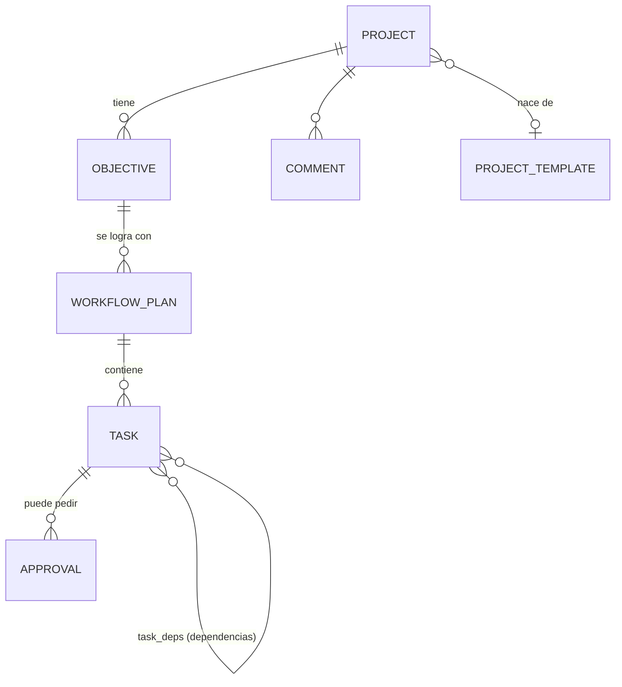
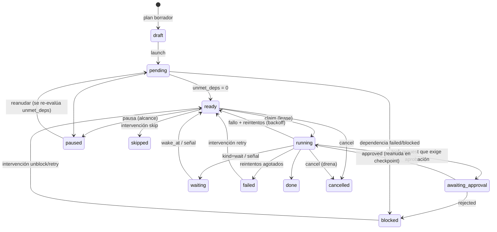
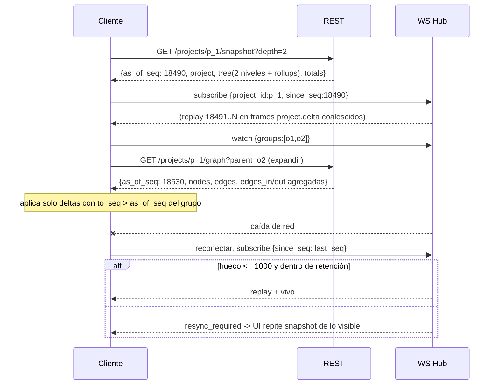
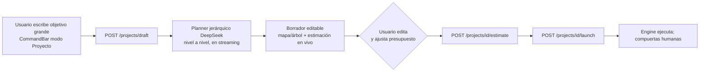

# 10 - Visualización y gestión de workflows largos y procesos gigantes

Estado: propuesta implementable. Complementa `03-eventos-realtime.md`, `05-workflows.md`, `07-seguridad-costos.md` y `08-api.md`. Todo es **aditivo**: el contrato de la Fase 1 (SPEC), los 6 estados legacy de `Task`, los eventos actuales y el look "Animal Crossing" se conservan. No se rediseña nada: se extiende (mismos tokens Tailwind `bg-panel`, `border-line`, `shadow-pop`, `rounded-2xl border-2`, fuentes Fredoka/Nunito, colores por rol de `ROLE_META`).

Objetivo de producto: que el usuario pueda escribir "lanza la campaña de apertura de la sucursal Norte" y obtener un **proyecto** con cientos o miles de tareas, ejecutado por los agentes durante horas o días, con aprobaciones humanas en medio, que **sobrevive a reinicios**, se **ve** de forma comprensible en el dashboard y en la oficina 3D, y se puede **intervenir** sin romperlo.

---

## 0. Resumen de decisiones

| # | Decisión | Motivo |
|---|---|---|
| D1 | Jerarquía **Proyecto > Objetivo > Workflow (plan) > Tarea > Subtarea/Consulta**. `requests` pasa a ser el nivel "Workflow/Plan" (se reutiliza, no se reemplaza); se agregan `projects` y `objectives`; `tasks` crece con `kind`, `wbs_path`, `project_id`. | Cambio mínimo sobre lo que ya funciona (SPEC, e2e, UI actual). |
| D2 | El motor deja de vivir en memoria: **cola de listos en Postgres** (`state='ready'`, `FOR UPDATE SKIP LOCKED`, lease + heartbeat), **checkpoint por tarea** y **aprobaciones sin goroutine bloqueada**. | Hoy un reinicio pierde todo y `Approvals.Wait` caduca a los 30 min. |
| D3 | **Dos profundidades distintas**: `delegation_depth` (tope 5, regla de negocio) y `dag_level` (sin tope, solo layout). | Hoy `createTasks` rechaza cualquier plan con cadena de dependencias > 5 (ver sec. 1). |
| D4 | Dos campos de estado en la tarea: `status` (los 6 legacy, colapsado, para no romper `ws-contract.spec.ts`) y `state` (12 estados finos para la UI nueva). | Compatibilidad. |
| D5 | El grafo grande **nunca viaja completo**: jerarquía = estructura de colapso. El servidor entrega nivel por nivel (`/graph?parent=`) con **agregados**; el cliente solo materializa grupos expandidos (<= ~600 nodos visibles). | 5,000+ nodos inviables en DOM/SVG. |
| D6 | Librerías: **@xyflow/react** (render) + **elkjs** en Web Worker (layout) + **d3-scale/d3-hierarchy** (timeline y árbol) + **@tanstack/react-virtual** (listas). Gantt propio (no hay lib adecuada). Cytoscape/Sigma solo como plan B. | Sec. 4.2. |
| D7 | WS: `seq` gapless por org, **suscripción por proyecto + "watch set" de grupos expandidos**, deltas coalescidos cada 250 ms, snapshot REST + replay con cursor, `resync_required`. | Sec. 5. |
| D8 | Presupuesto por proyecto (y por objetivo) con reserva, avisos 50/80/95 %, y **pausa automática + aprobación `extend_budget`** al tope. Plan y estimación con **DeepSeek** (modelo barato ya soportado en `agent-runtime`). | Sec. 2.7, 7. |
| D9 | Vista 3D: **tablero de proyecto** en la pared de la sala de reuniones (reusa el tablero decorativo), **bandejas de entrada** sobre cada escritorio, hilos de delegación en `Links`, y **cámara "seguir acción"** opcional. Cero meshes por tarea. | Sec. 4.9. |

---

## 1. Estado actual y brechas (verificado en el código)

| # | Hallazgo (archivo) | Consecuencia a escala | Fase que lo corrige |
|---|---|---|---|
| G1 | `application/orchestrator.go` `process()`: el run vive en una goroutine y en el struct `run` (mapa `done`). No hay recuperación al arrancar. | Reinicio = tareas `running` huérfanas para siempre. | F1 |
| G2 | `approvals.go` `Wait()`: canal en memoria + `ApprovalTimeout` (30 min) que **auto-rechaza**. | Una aprobación "en medio de un proyecto de días" se rechaza sola; reinicio la pierde. | F1 |
| G3 | `scheduler.go` `Run()`: O(N²) por iteración (recorre `nodes` completo en cada resultado), una goroutine por nodo lanzado, `MaxParallel` global. | 5,000 nodos = ~25M comprobaciones por resultado; no hay prioridad ni límite por agente/proyecto. | F1 (cola en BD); el `Scheduler` se conserva para planes pequeños y tests |
| G4 | `createTasks()` usa la **profundidad del DAG** como "profundidad de delegación" y rechaza `d > MaxDepth (5)`. | Un plan **secuencial de 6 pasos falla**. Imposible un proyecto largo. (Cubierto por `TestDelegationDepthLimit`, hay que reescribirlo.) | F0 |
| G5 | `emitMetrics()` se llama tras **cada** cambio y `Queries.Metrics()`/`Agents()` hacen `ListTasks(ctx, org, "", "")` (todas las tareas) + `ListRequests`. | Coste O(N) por evento => O(N²) total. Con 5,000 tareas, cientos de ms por evento. | F0 (contadores incrementales) |
| G6 | `orchestrator.finish()` manda **todos** los `outputs` en un único `Synthesize`; `buildRunRequest` manda **todas** las salidas de dependencias completas. | Ventana de contexto y coste explotan (fan-in de 100). | F1 (síntesis jerárquica, tope de contexto) |
| G7 | `events` no tiene `seq`, ni `request_id`/`project_id`; `Hub.Broadcast` envía **todo a todos** (sin org ni topics); cola 256 y el cliente lento se **cierra**; `ws.go` ignora mensajes del cliente. | Sin replay; el navegador recibiría miles de frames/min. | F0 |
| G8 | `AgentState`/`Agent.CurrentTaskID` es **uno solo** por agente. | Con tareas paralelas por agente el estado "parpadea". Necesita `active_tasks` y bandeja. | F0/F6 |
| G9 | Frontend `store.ts`: `tasks: Record<id, Task>` con **todas** las tareas, `apply()` crea objetos nuevos por evento, `deriveRequest` recorre todas las tareas en cada evento; `api.tasks()` baja todas. `Dashboard.Requests` dibuja columnas por profundidad sin virtualizar. | Con >500 tareas la UI se congela. | F2 (store de proyectos aparte) |
| G10 | `Recorder.Emit` guarda evento + audit + activity (+ `activity.logged`) por **cada** acción. | 5,000 tareas = ~60k eventos y 10k filas de actividad "ruidosas". | F0 (política de ruido, sec. 5.2) |
| G11 | `Orchestrator.call` → `OrgCost` hace SUM por cada llamada al runtime. | Se vuelve un hot spot; además no hay tope por proyecto. | F1 |
| G12 | Migraciones reales usan `TEXT` para ids (`001_init.sql`), no `uuid` como describe `02-modelo-datos.md`; RLS usa `app_current_org()` (TEXT) y `202_rls_policies.sql` habilita RLS con un arreglo fijo de tablas. | Las migraciones nuevas deben usar `TEXT` y **habilitar RLS por tabla nueva** (el `ALTER DEFAULT PRIVILEGES` de `203` ya da los GRANT). | F1 |
| G13 | `planTasks`/`plan.created` mandan **todas** las tareas del plan en un solo evento; `task.*` lleva `output` completo. | Frames de MBs en proyectos grandes. | F0 (payload slim + `output_ref`) |

Lo que **sí** sirve y se reutiliza: `Recorder` (evento+audit en un punto), `Locker`, modelo `Approval`, `StructuredOutput.SuggestedTasks` (semilla de subtareas dinámicas), `Usage`/costos del runtime (incluye tarifas DeepSeek en `agent-runtime/app/engine.py`), RLS por transacción (`Store.WithOrgTx`), `LabelLayer/LabelSolver` (overlays HTML sobre la escena), `mock/engine.ts` y los e2e con `data-testid`.

---

## 2. Jerarquía de dominio

### 2.1 Niveles y mapeo con lo existente



| Nivel | Qué es | Existe hoy | Implementación |
|---|---|---|---|
| **Proyecto** | Meta grande con presupuesto, deadline, control (pausar/cancelar), plantilla de origen. | No | tabla `projects` |
| **Objetivo** | Resultado medible dentro del proyecto con criterios de éxito (p. ej. "Local equipado y permisos listos"). Se completa cuando sus workflows terminan **y** sus criterios se verifican (tarea auto `kind='review'`). | Solo `Plan.Objectives []string` (texto en `requests.plan`) | tabla `objectives` |
| **Workflow / Plan** | Unidad ejecutable con su DAG: hoy un `Request` con su plan dinámico; en Fase 3 de `05` también un `workflow_run` (DSL). | `requests` | `requests` + `project_id`, `objective_id`, `kind` (`adhoc`\|`workflow`\|`workflow_run`). Un `Request` sin proyecto sigue funcionando idéntico. |
| **Tarea** | Trabajo de **un agente** (una o varias llamadas al runtime). | `tasks` | `tasks` + columnas nuevas (2.3) |
| **Subtarea** | Tarea creada por un agente durante su ejecución (`suggested_tasks` o `delegations`). `parent_task_id` + `delegation_depth` + `delegation_chain`. | `parent_task_id` existe pero no se usa | `kind='subtask'` |
| **Consulta** | Pregunta agente→agente (`handleConsults`). Hoy es `message.sent kind=consult` + audit. | Mensajes | **No es nodo** por defecto (ruido). Se refleja como contador/arista en el padre (`consults`). Con `settings.materialize_consults=true` se crea `kind='consult'` (sin cola, ya resuelto) para el árbol de delegación. |
| **Grupo** | Nodo de agregación sin agente (p. ej. "Fase 2: instalaciones"). Permite jerarquías profundas sin tocar `delegation_depth`. | No | `kind='group'`, no se ejecuta; su estado es derivado de sus hijos |
| **Hito/Compuerta** | `kind='milestone'` y `kind='gate'` (aprobación humana planificada entre objetivos). | No | `gate` crea un `Approval` al quedar listo |
| **Espera** | `kind='wait'`: temporizador (`wake_at`) o señal externa (`wait_signal`). | No | tarea sin agente |

`kind` permitido: `task | subtask | consult | group | milestone | gate | wait | review`.

### 2.2 Estados

`state` (fino) y `status` (legacy colapsado, el que viaja en `task.*` para no romper contratos):

| `state` | Significado | `status` legacy | Color UI (extiende `TASK_STATUS_COLOR`) |
|---|---|---|---|
| `draft` | En plan borrador, aún no lanzado | pending | `#c9bfa8` |
| `pending` | Esperando dependencias (`unmet_deps > 0`) | pending | `#8a7a66` (actual) |
| `ready` | Dependencias listas, en cola (incluye reintento con `next_attempt_at` futuro => se muestra "reintentando") | pending | `#6bb6d6` |
| `running` | Con lease de un worker | running | `#2f9fd0` (actual) |
| `awaiting_approval` | Pausada por aprobación humana (sin goroutine) | awaiting_approval | `#cf8a0f` (actual) |
| `waiting` | Temporizador o señal externa | pending | `#b09ad8` |
| `paused` | Pausa de usuario/política (presupuesto) | blocked | `#a89f91` |
| `blocked` | Dependencia fallida/rechazada | blocked | `#e0584f` (actual) |
| `done` | Terminada | done | `#3ca35a` (actual) |
| `skipped` | Saltada por humano (satisface dependencias) | done | `#c9bfa8` rayado |
| `failed` | Agotó reintentos | failed | `#d93c3c` (actual) |
| `cancelled` | Cancelada | failed | `#9a8a7a` |

Reintentando = `state='ready' AND attempt>0` (la UI lo pinta ámbar `#e08a3c` con contador `attempt/max_attempts`, igual que `task.retrying` de `03`).

Estado de **grupos/objetivos/proyecto** = derivado (función pura `RollupState(children)`): cualquier `failed`→`at_risk`; todos `done|skipped`→`done`; alguno `running|ready`→`running`; solo `awaiting_approval|waiting` activos→`waiting_human` / `waiting`; etc. Se calcula en el servidor y viaja en los rollups.



### 2.3 Modelo Go (nuevo `backend/internal/domain/project.go`)

```go
type ProjectStatus string // draft|planning|ready|running|paused|waiting_human|done|failed|cancelled
type Control string       // active|pausing|paused|cancelling|cancelled

type BudgetPolicy struct {
	Mode            string    `json:"mode"`              // "hard" | "soft"
	WarnAt          []float64 `json:"warn_at"`           // [0.5,0.8,0.95]
	OnHard          string    `json:"on_hard"`           // "pause_and_ask" | "fail"
	ReservePct      float64   `json:"reserve_pct"`       // colchón para retries/síntesis (10)
	MaxTaskCostUSD  float64   `json:"max_task_cost_usd"` // 0 = sin tope
	PerObjective    bool      `json:"per_objective"`
}

type Project struct {
	ID, Name, Goal   string
	Status           ProjectStatus
	Control          Control
	TemplateID       *string
	BudgetUSD        float64
	Budget           BudgetPolicy
	SpentUSD         float64 // rollup
	ReservedUSD      float64
	Estimate         *Estimate
	MaxParallel      int
	Priority         int
	DeadlineAt       *time.Time
	StructureVersion int64 // sube al cambiar el grafo (invalida layouts/cachés)
	Settings         map[string]any
	CreatedBy        string
	CreatedAt, StartedAt, FinishedAt ...
}

type Objective struct {
	ID, ProjectID, Title, Description string
	Position         int
	Status           string
	SuccessCriteria  []Criterion // {Text, Check:"manual|agent_review", Done bool}
	BudgetUSD        *float64
	Weight           float64
}

// Task (campos NUEVOS; los existentes no cambian)
type TaskGraphFields struct {
	ProjectID, ObjectiveID *string
	Kind            string
	State           string
	WBSPath         string // "0003.0012.0001" segmentos de ancho fijo => orden lexicográfico = orden del árbol
	DagLevel        int    // capa topológica (solo layout)
	DelegationDepth int    // 1..MaxDepth (5)
	DelegationChain []string // agentes: ["assistant","sales","legal"]
	Priority        int
	Attempt, MaxAttempts int
	NextAttemptAt, WakeAt *time.Time
	WaitSignal      *string
	UnmetDeps       int
	Checkpoint      *Checkpoint
	ModelOverride   *string
	Est             *NodeEstimate // {CostUSD, Tokens, Seconds, Complexity}
	Rev             int           // concurrencia optimista en intervenciones
	PausedBy        *string
}
```

`Task.Depth` (legacy, `json:"-"`) pasa a significar `DelegationDepth`. El cálculo por DAG que hoy hace `createTasks` se mueve a `DagLevel` y **deja de comparar con `MaxDepth`**. `Config.MaxDepth` solo se valida en `handleConsults`/`delegations`/creación de subtareas: `parent.DelegationDepth+1 <= MaxDepth`.

### 2.4 Migraciones (carpeta `backend/internal/infrastructure/postgres/migrations/`, orden por nombre; `down` en `backend/migrations/down/`)

Todas usan `TEXT` (G12), llevan `org_id` y RLS. El `GRANT` ya lo da el `ALTER DEFAULT PRIVILEGES` de `203`.

**`301_projects.sql`**
```sql
CREATE TABLE IF NOT EXISTS projects (
  id TEXT PRIMARY KEY,
  org_id TEXT NOT NULL REFERENCES organizations(id),
  name TEXT NOT NULL, goal TEXT NOT NULL DEFAULT '',
  status TEXT NOT NULL DEFAULT 'draft' CHECK (status IN
    ('draft','planning','ready','running','paused','waiting_human','done','failed','cancelled')),
  control TEXT NOT NULL DEFAULT 'active' CHECK (control IN ('active','pausing','paused','cancelling','cancelled')),
  template_id TEXT, template_version INT,
  budget_usd NUMERIC(12,4) NOT NULL DEFAULT 0,
  budget_policy JSONB NOT NULL DEFAULT '{}',
  spent_usd NUMERIC(12,6) NOT NULL DEFAULT 0,
  reserved_usd NUMERIC(12,6) NOT NULL DEFAULT 0,
  estimate JSONB,
  max_parallel INT NOT NULL DEFAULT 4,
  priority INT NOT NULL DEFAULT 0,
  deadline_at TIMESTAMPTZ,
  structure_version BIGINT NOT NULL DEFAULT 0,
  settings JSONB NOT NULL DEFAULT '{}',
  created_by TEXT NOT NULL DEFAULT 'user',
  created_at TIMESTAMPTZ NOT NULL DEFAULT now(),
  started_at TIMESTAMPTZ, finished_at TIMESTAMPTZ
);
CREATE INDEX IF NOT EXISTS projects_org_status_idx ON projects (org_id, status, created_at DESC);

CREATE TABLE IF NOT EXISTS objectives (
  id TEXT PRIMARY KEY,
  org_id TEXT NOT NULL REFERENCES organizations(id),
  project_id TEXT NOT NULL REFERENCES projects(id) ON DELETE CASCADE,
  position INT NOT NULL DEFAULT 0,
  title TEXT NOT NULL, description TEXT NOT NULL DEFAULT '',
  status TEXT NOT NULL DEFAULT 'draft',
  success_criteria JSONB NOT NULL DEFAULT '[]',
  budget_usd NUMERIC(12,4), weight DOUBLE PRECISION NOT NULL DEFAULT 1
);
CREATE INDEX IF NOT EXISTS objectives_project_idx ON objectives (org_id, project_id, position);

ALTER TABLE requests ADD COLUMN IF NOT EXISTS project_id TEXT;
ALTER TABLE requests ADD COLUMN IF NOT EXISTS objective_id TEXT;
ALTER TABLE requests ADD COLUMN IF NOT EXISTS kind TEXT NOT NULL DEFAULT 'adhoc';
CREATE INDEX IF NOT EXISTS requests_project_idx ON requests (org_id, project_id) WHERE project_id IS NOT NULL;

-- agregados incrementales (sustituyen a los ListTasks completos, G5)
CREATE TABLE IF NOT EXISTS project_rollups (
  org_id TEXT NOT NULL REFERENCES organizations(id),
  project_id TEXT NOT NULL REFERENCES projects(id) ON DELETE CASCADE,
  node_id TEXT NOT NULL,            -- id de proyecto, objetivo, request o grupo
  counts JSONB NOT NULL DEFAULT '{}',  -- {"pending":120,"ready":9,"running":4,"awaiting_approval":2,"done":300,...}
  spent_usd NUMERIC(12,6) NOT NULL DEFAULT 0,
  est_remaining_usd NUMERIC(12,6) NOT NULL DEFAULT 0,
  updated_at TIMESTAMPTZ NOT NULL DEFAULT now(),
  PRIMARY KEY (org_id, project_id, node_id)
);
```

**`302_task_graph.sql`**
```sql
ALTER TABLE tasks
  ADD COLUMN IF NOT EXISTS project_id TEXT, ADD COLUMN IF NOT EXISTS objective_id TEXT,
  ADD COLUMN IF NOT EXISTS kind TEXT NOT NULL DEFAULT 'task',
  ADD COLUMN IF NOT EXISTS state TEXT NOT NULL DEFAULT 'pending',
  ADD COLUMN IF NOT EXISTS wbs_path TEXT NOT NULL DEFAULT '',
  ADD COLUMN IF NOT EXISTS dag_level INT NOT NULL DEFAULT 0,
  ADD COLUMN IF NOT EXISTS delegation_chain JSONB NOT NULL DEFAULT '[]',
  ADD COLUMN IF NOT EXISTS priority INT NOT NULL DEFAULT 0,
  ADD COLUMN IF NOT EXISTS attempt INT NOT NULL DEFAULT 0,
  ADD COLUMN IF NOT EXISTS max_attempts INT NOT NULL DEFAULT 3,
  ADD COLUMN IF NOT EXISTS next_attempt_at TIMESTAMPTZ,
  ADD COLUMN IF NOT EXISTS lease_owner TEXT, ADD COLUMN IF NOT EXISTS lease_expires_at TIMESTAMPTZ,
  ADD COLUMN IF NOT EXISTS heartbeat_at TIMESTAMPTZ,
  ADD COLUMN IF NOT EXISTS wake_at TIMESTAMPTZ, ADD COLUMN IF NOT EXISTS wait_signal TEXT,
  ADD COLUMN IF NOT EXISTS unmet_deps INT NOT NULL DEFAULT 0,
  ADD COLUMN IF NOT EXISTS checkpoint JSONB,
  ADD COLUMN IF NOT EXISTS model_override TEXT,
  ADD COLUMN IF NOT EXISTS est JSONB,
  ADD COLUMN IF NOT EXISTS error JSONB,
  ADD COLUMN IF NOT EXISTS rev INT NOT NULL DEFAULT 0,
  ADD COLUMN IF NOT EXISTS paused_by TEXT;
-- backfill: dag_level := depth (semántica anterior); depth pasa a ser delegation_depth
UPDATE tasks SET dag_level = depth, depth = 1 WHERE project_id IS NULL AND dag_level = 0;
UPDATE tasks SET state = CASE status WHEN 'awaiting_approval' THEN 'awaiting_approval' ELSE status END;

CREATE TABLE IF NOT EXISTS task_deps (            -- sustituye a depends_on JSONB para grafos grandes
  org_id TEXT NOT NULL REFERENCES organizations(id),
  task_id TEXT NOT NULL, dep_id TEXT NOT NULL,
  kind TEXT NOT NULL DEFAULT 'finish_to_start',
  PRIMARY KEY (task_id, dep_id)
);
CREATE INDEX IF NOT EXISTS task_deps_dep_idx ON task_deps (org_id, dep_id);   -- "quién depende de mí"
INSERT INTO task_deps (org_id, task_id, dep_id)
  SELECT t.org_id, t.id, d FROM tasks t, jsonb_array_elements_text(t.depends_on) d ON CONFLICT DO NOTHING;

-- Índices del motor y de las vistas
CREATE INDEX IF NOT EXISTS tasks_ready_idx   ON tasks (org_id, priority DESC, wbs_path) WHERE state = 'ready';
CREATE INDEX IF NOT EXISTS tasks_lease_idx   ON tasks (lease_expires_at) WHERE state = 'running';
CREATE INDEX IF NOT EXISTS tasks_wake_idx    ON tasks (wake_at) WHERE state = 'waiting';
CREATE INDEX IF NOT EXISTS tasks_project_state_idx ON tasks (org_id, project_id, state);
CREATE INDEX IF NOT EXISTS tasks_project_path_idx  ON tasks (org_id, project_id, wbs_path text_pattern_ops);
CREATE INDEX IF NOT EXISTS tasks_parent_idx  ON tasks (org_id, parent_task_id) WHERE parent_task_id IS NOT NULL;
CREATE INDEX IF NOT EXISTS tasks_agent_active_idx ON tasks (org_id, agent_id) WHERE state IN ('running','awaiting_approval');
```
`tasks.depends_on` (JSONB) se **mantiene** para planes pequeños/legacy y para el contrato SPEC; el motor usa `task_deps`. Un `Store` escribe ambos mientras exista el legacy.

**`303_events_seq.sql`** (aplica también a F0)
```sql
ALTER TABLE events
  ADD COLUMN IF NOT EXISTS seq BIGINT,
  ADD COLUMN IF NOT EXISTS request_id TEXT, ADD COLUMN IF NOT EXISTS project_id TEXT,
  ADD COLUMN IF NOT EXISTS node_id TEXT, ADD COLUMN IF NOT EXISTS v SMALLINT NOT NULL DEFAULT 1;
CREATE TABLE IF NOT EXISTS org_event_seq (org_id TEXT PRIMARY KEY REFERENCES organizations(id), last BIGINT NOT NULL DEFAULT 0);
-- SaveEvent: UPDATE org_event_seq SET last=last+1 WHERE org_id=$1 RETURNING last  -> mismo tx que el INSERT
-- (el bloqueo de fila serializa por org: seq SIN huecos y en orden de commit; un INSERT por evento, ~1 ms).
UPDATE events e SET seq = s.rn FROM (SELECT id, row_number() OVER (PARTITION BY org_id ORDER BY ts, id) rn FROM events) s WHERE e.id = s.id;
INSERT INTO org_event_seq SELECT org_id, max(seq) FROM events GROUP BY org_id ON CONFLICT (org_id) DO UPDATE SET last = EXCLUDED.last;
CREATE UNIQUE INDEX IF NOT EXISTS events_org_seq_uq ON events (org_id, seq);
CREATE INDEX IF NOT EXISTS events_project_seq_idx ON events (org_id, project_id, seq) WHERE project_id IS NOT NULL;
CREATE INDEX IF NOT EXISTS events_node_seq_idx    ON events (org_id, node_id, seq)    WHERE node_id IS NOT NULL;
```

**`304_project_support.sql`** — checkpoints extra, intervenciones, comentarios, aprobaciones ampliadas
```sql
ALTER TABLE approvals
  ADD COLUMN IF NOT EXISTS project_id TEXT, ADD COLUMN IF NOT EXISTS expires_at TIMESTAMPTZ,
  ADD COLUMN IF NOT EXISTS on_expire TEXT NOT NULL DEFAULT 'wait',   -- wait|remind|escalate|reject
  ADD COLUMN IF NOT EXISTS reminders INT NOT NULL DEFAULT 0,
  ADD COLUMN IF NOT EXISTS args_hash TEXT, ADD COLUMN IF NOT EXISTS group_key TEXT;
CREATE INDEX IF NOT EXISTS approvals_project_pending_idx ON approvals (org_id, project_id, created_at) WHERE status = 'pending';

CREATE TABLE IF NOT EXISTS interventions (        -- bitácora de acciones humanas sobre nodos (además de audit_logs)
  id TEXT PRIMARY KEY, org_id TEXT NOT NULL REFERENCES organizations(id),
  project_id TEXT NOT NULL, node_id TEXT NOT NULL, actor TEXT NOT NULL,
  action TEXT NOT NULL, params JSONB NOT NULL DEFAULT '{}', before JSONB, after JSONB,
  effects JSONB NOT NULL DEFAULT '{}', ts TIMESTAMPTZ NOT NULL DEFAULT now()
);
CREATE INDEX IF NOT EXISTS interventions_node_idx ON interventions (org_id, node_id, ts DESC);

CREATE TABLE IF NOT EXISTS comments (
  id TEXT PRIMARY KEY, org_id TEXT NOT NULL REFERENCES organizations(id),
  project_id TEXT NOT NULL, node_id TEXT NOT NULL, author TEXT NOT NULL,
  body TEXT NOT NULL, mentions JSONB NOT NULL DEFAULT '[]', directive BOOLEAN NOT NULL DEFAULT false,
  resolved_at TIMESTAMPTZ, ts TIMESTAMPTZ NOT NULL DEFAULT now()
);
CREATE INDEX IF NOT EXISTS comments_node_idx ON comments (org_id, node_id, ts);
```

**`305_project_templates.sql`**
```sql
CREATE TABLE IF NOT EXISTS project_templates (
  id TEXT PRIMARY KEY, org_id TEXT NOT NULL REFERENCES organizations(id),
  key TEXT NOT NULL, version INT NOT NULL DEFAULT 1, name TEXT NOT NULL, description TEXT NOT NULL DEFAULT '',
  params JSONB NOT NULL DEFAULT '[]',       -- [{key,label,type,default,required}]
  definition JSONB NOT NULL,                -- árbol objetivos>workflows>tareas (sec. 2.8)
  budget_hint JSONB, tags JSONB NOT NULL DEFAULT '[]',
  status TEXT NOT NULL DEFAULT 'draft' CHECK (status IN ('draft','published','archived')),
  created_from_project TEXT, created_at TIMESTAMPTZ NOT NULL DEFAULT now(),
  UNIQUE (org_id, key, version)
);
CREATE TABLE IF NOT EXISTS cost_stats (       -- calibración del estimador (sec. 7.4)
  org_id TEXT NOT NULL, agent_role TEXT NOT NULL, kind TEXT NOT NULL, complexity TEXT NOT NULL, model TEXT NOT NULL,
  n BIGINT NOT NULL DEFAULT 0, mean_cost NUMERIC(12,6) NOT NULL DEFAULT 0, p90_cost NUMERIC(12,6) NOT NULL DEFAULT 0,
  mean_secs DOUBLE PRECISION NOT NULL DEFAULT 0, p90_secs DOUBLE PRECISION NOT NULL DEFAULT 0, updated_at TIMESTAMPTZ NOT NULL DEFAULT now(),
  PRIMARY KEY (org_id, agent_role, kind, complexity, model)
);
```

**`306_project_rls.sql`** (obligatorio: `202` no cubre tablas nuevas)
```sql
DO $$ DECLARE t TEXT; BEGIN
  FOREACH t IN ARRAY ARRAY['projects','objectives','project_rollups','task_deps','interventions','comments',
                           'project_templates','cost_stats','org_event_seq'] LOOP
    EXECUTE format('ALTER TABLE %I ENABLE ROW LEVEL SECURITY', t);
    EXECUTE format('ALTER TABLE %I FORCE ROW LEVEL SECURITY', t);
    EXECUTE format('DROP POLICY IF EXISTS tenant_isolation ON %I', t);
    EXECUTE format('CREATE POLICY tenant_isolation ON %I USING (org_id = app_current_org()) WITH CHECK (org_id = app_current_org())', t);
  END LOOP; END $$;
REVOKE UPDATE, DELETE ON interventions FROM app_user;   -- bitácora append-only como audit_logs

-- El motor necesita saber QUÉ orgs tienen trabajo sin usar BYPASSRLS: función SECURITY DEFINER que solo devuelve ids.
CREATE OR REPLACE FUNCTION active_project_orgs() RETURNS SETOF TEXT
LANGUAGE sql SECURITY DEFINER SET search_path = public AS
$$ SELECT DISTINCT org_id FROM projects WHERE status IN ('running','waiting_human') $$;
REVOKE ALL ON FUNCTION active_project_orgs() FROM PUBLIC; GRANT EXECUTE ON FUNCTION active_project_orgs() TO app_user;
```
Con esto el bucle del motor itera orgs y entra a cada una con `WithOrgTx` (nunca lee datos cross-org). Prueba obligatoria: extender el test de aislamiento (`auth/pg_integration_test.go`) con las tablas nuevas.

**`307_events_partition.sql`**: ver sec. 5.7 (diferida a F7).

### 2.5 Motor durable (sustituye el ciclo `process()+Scheduler` para tareas de proyecto)

Nuevo `application/engine.go`. El `Orchestrator`/`Scheduler` actuales **se conservan** para `Request` sin proyecto (cero riesgo para la demo y los e2e existentes) y el engine se activa con `ENGINE_DURABLE=true` y siempre para tareas con `project_id`. Meta de F7: un solo camino.

```
Engine.Run(ctx):
  go sweeper (cada 15 s): leases vencidos, wake_at vencidos, approvals expiradas, recordatorios
  go claimLoop (cada 500 ms o NOTIFY tasks_ready):
     for org in active_project_orgs():
        WithOrgTx(org): claim hasta (free_slots) tareas
  go rollupFlusher (cada 1 s): aplica deltas de contadores/costos -> project_rollups, emite project.delta/project.rollup
```

**Reclamo** (una sentencia; respeta pausa, tope por proyecto y por agente):
```sql
WITH cand AS (
  SELECT t.id FROM tasks t JOIN projects p ON p.id = t.project_id
  WHERE t.org_id = $1 AND t.state = 'ready' AND p.control = 'active' AND p.status = 'running'
    AND (t.next_attempt_at IS NULL OR t.next_attempt_at <= now())
    AND t.agent_id = ANY($2)                          -- agentes con cupo (concurrencia por agente en Go)
  ORDER BY t.priority DESC, p.priority DESC, t.wbs_path
  LIMIT $3 FOR UPDATE OF t SKIP LOCKED)
UPDATE tasks SET state='running', status='running', lease_owner=$4, lease_expires_at=now()+$5::interval,
       heartbeat_at=now(), attempt=attempt+1, started_at=COALESCE(started_at, now())
FROM cand WHERE tasks.id = cand.id RETURNING tasks.*;
```
Límites: `agent.max_concurrent` (default 2 por agente; hoy implícito), `project.max_parallel`, `Config.MaxParallel` global; fair-share entre proyectos por `priority` y round-robin por proyecto cuando empatan.

**Avance sin escaneos**: al terminar una tarea, en la misma tx:
```sql
UPDATE tasks t SET unmet_deps = t.unmet_deps - 1,
       state = CASE WHEN t.unmet_deps - 1 = 0 AND t.state = 'pending' THEN 'ready' ELSE t.state END
FROM task_deps d WHERE d.dep_id = $1 AND d.task_id = t.id RETURNING t.id, t.state;
```
(`ready` dispara `NOTIFY tasks_ready`). Si falla/bloquea: `UPDATE ... SET state='blocked'` en cascada con CTE recursivo limitado (`task_deps`), emitiendo **un** `project.delta` con los N nodos afectados, no N eventos. Equivalencia con el `Scheduler` actual (los dependientes de fallo/bloqueo quedan `blocked`, no se ejecutan) se verifica con un **test de propiedad** (grafos aleatorios: engine en memoria vs `Scheduler.Run`).

**Checkpoint y reanudación** (`tasks.checkpoint`): `runTask` se parte en fases idempotentes; tras cada una se persiste:
```json
{ "v": 1, "phase": "tools",              // run | consults | tools | finalize
  "run_output": { "summary": "...", "findings": [] },   // StructuredOutput ya obtenido (NO se vuelve a pagar el LLM)
  "usage_recorded": true,
  "consults_done": [0, 1],
  "tools": [ {"idx":0,"decision":"approved","approval_id":"ap_1"}, {"idx":1,"decision":"pending","approval_id":"ap_2"} ],
  "tool_idx": 1 }
```
- Reinicio: el sweeper convierte `running` con `lease_expires_at < now()` en `ready` (conserva `checkpoint`; si `attempt >= max_attempts` → `failed`); el worker que lo reclama retoma desde `phase`. Heartbeat cada 30 s extiende el lease (`LockTTL` actual = 10 min se mantiene como lease por defecto).
- **Aprobación sin goroutine**: `handleTools` crea el `Approval`, deja `state='awaiting_approval'` + checkpoint y **retorna** (libera el worker). `Approvals.Decide()` llama a `engine.OnApprovalResolved(approval)`: aprobada → `ready` (reanuda en `tools[idx+1]`); rechazada → `blocked` + cascada. El canal `waiters` queda solo para el camino legacy.
- `ApprovalTimeout` pasa a **política por aprobación** (`expires_at`, `on_expire`): en proyectos el default es `wait` con recordatorio a las 24 h (`approval.reminded`), nunca auto-rechazo. Los `gate` pueden usar `escalate`.
- Pasos de horas/días: son `wait`/`gate`/`awaiting_approval` (persistidos, 0 recursos). Una llamada al runtime sigue siendo corta (`TaskTimeout` 120 s); el trabajo largo de un agente se modela como **cadena de subtareas/checkpoints**. Fase 7 opcional: contrato asíncrono `POST /v1/run-task:async` + `GET /v1/jobs/{id}` para llamadas largas.

**Contexto acotado (G6)**: `buildRunRequest` envía por dependencia solo `summary` + `recommendations` (tope ~1.5k tokens por dependencia, ~8k en total, priorizando por cercanía en el DAG); el resto como `output_ref`. Síntesis **jerárquica**: `finish()` se ejecuta por Workflow (map), luego `objective report` sintetiza los reportes de sus workflows y `project report` los de los objetivos (reduce). Cada síntesis recibe <= 12 resúmenes.

**Subtareas dinámicas**: `StructuredOutput.SuggestedTasks` (hoy ignorado) y `delegations` (doc 08 sec. 7) crean `kind='subtask'` con `parent_task_id`, `delegation_depth = parent+1` (<= 5; si excede: audit `delegation.depth_exceeded` y la sugerencia queda como comentario del nodo), heredan `project_id/objective_id/request_id` y se enlazan como dependencias del **padre** (el padre queda `waiting` hasta que sus subtareas terminen = patrón fork/join), con tope `settings.max_dynamic_children` (20).

### 2.6 Pausar, reanudar y cancelar

`POST /api/v1/projects/{id}/control` `{ "action": "pause|resume|cancel", "scope": {"objective_id": "..."} | {"path": "0003.0012"} | {}, "drain": "graceful|immediate", "reason": "..." }`

| Acción | Efecto en BD | Tareas `running` | Aprobaciones pendientes | Timers (`waiting`) |
|---|---|---|---|---|
| pause (graceful) | `projects.control='pausing'`; `UPDATE tasks SET state='paused', paused_by=$scope WHERE state IN ('pending','ready','waiting') AND wbs_path LIKE prefix` | Terminan la llamada actual y quedan `paused` en el siguiente checkpoint (no se interrumpe el runtime a medias; coherente con `05` sec. 7). Al vaciar: `control='paused'`. | Siguen pendientes y accionables | `wake_at` se congela (se guarda restante en `checkpoint.wait_remaining_s`) |
| pause (immediate) | Igual + cancela el `context` de las llamadas en vuelo | Resultado descartado, vuelven a `ready` con el mismo checkpoint (el costo ya incurrido se registra) | idem | idem |
| resume | `paused_by=scope` → `pending`/`ready` según `unmet_deps` (re-evalúa con `task_deps`) | — | — | `wake_at = now()+restante` |
| cancel | `control='cancelling'`; nodos no terminados → `cancelled`; hijos por prefijo `wbs_path` | `drain` decide como arriba | → `cancelled` (`approval.cancelled`) | se descartan |

Cancelar **no** borra nada (se conserva árbol, salidas y costos). Un nodo cancelado se puede **clonar** a un proyecto nuevo (`POST /projects/{id}/clone?only=failed|cancelled`). Pausa por presupuesto: `paused_by='budget'`; solo se levanta con la aprobación `extend_budget` o `PUT /projects/{id}/budget`.

Cada acción: `audit_logs` (`project.pause`, ...), fila en `interventions`, evento `project.status_changed` (un solo evento por acción, no uno por nodo) + `project.delta` con los nodos afectados.

### 2.7 Presupuesto por proyecto

- `projects.budget_usd` + `budget_policy` (2.3). Chequeo **antes de reclamar** cada tarea: `spent + reserved + est_cost*1.5 <= budget*(1-reserve_pct)`. La reserva se registra en `reserved_usd` (rollup incremental) y se concilia al terminar con el costo real (`Usage.CostUSD`).
- Avisos `budget.warning` (50/80/95 %) y `budget.exceeded` con `scope:"project"` (catálogo de `03` ya los define, se añade `project_id`).
- Al tope (`on_hard=pause_and_ask`): `projects.control='pausing'`, `paused_by='budget'`, `status='waiting_human'` y se crea una `Approval` `action='extend_budget'`, `risk='medium'`, `details` con gastado/forecast/ETA y tres botones (UI): "+10 %", "+25 %", "Fijar monto…". El tope **por tarea** (`max_task_cost_usd`) marca la tarea `failed` con `error.code='task_budget'`.
- El presupuesto de la org (`Config.BudgetUSD`/`OrgCost` en `Orchestrator.call`) sigue como techo duro; `OrgCost` pasa a leerse de un contador incremental (G11).

### 2.8 Plantillas de proyecto reutilizables

`project_templates.definition` (tree without ids or outputs, agents by **role**, parameters with literal `{{param}}` substitution, **no expression evaluation**). Templates are **defined by keys, not by fixed text**: every user-visible string is a `*_key` resolved against the template's `i18n` catalog (`es` default, `en`), so the same template renders in either locale. A complete worked example is in 11.6.

```json
{
  "key": "branch_opening", "version": 3, "default_locale": "es",
  "name_key": "tpl.name",
  "params": [ {"key":"city","label_key":"param.city","type":"string","required":true},
              {"key":"budget_usd","label_key":"param.budget","type":"number","default":40} ],
  "budget_hint": { "p50_usd": 18.5, "p90_usd": 31.0, "basis": "calibrated", "samples": 4 },
  "objectives": [
    { "key": "o1", "title_key": "o1.title",
      "success_criteria": [ {"text_key":"o1.crit.permits","check":"agent_review"} ],
      "workflows": [
        { "key": "w1", "title_key": "w1.title", "workflow_key": null,
          "nodes": [
            { "key": "n1", "kind": "task",  "title_key": "n1.title", "agent_role": "legal", "complexity": "M" },
            { "key": "n2", "kind": "group", "title_key": "n2.title", "children": [
                { "key": "n2a", "kind": "task", "title_key": "n2a.title", "agent_role": "legal", "depends_on": ["n1"] } ] },
            { "key": "g1", "kind": "gate", "title_key": "g1.title", "depends_on": ["n2"], "approver_role": "owner" },
            { "key": "n3", "kind": "wait", "title_key": "n3.title", "wait": {"for":"duration","duration":"P5D"}, "depends_on": ["g1"] }
        ] } ] } ],
  "i18n": {
    "es": { "tpl.name": "Apertura de sucursal", "o1.title": "Local y permisos en {{city}}", "n1.title": "Listar permisos requeridos en {{city}}" },
    "en": { "tpl.name": "Branch opening",        "o1.title": "Premises and permits in {{city}}", "n1.title": "List required permits in {{city}}" }
  }
}
```

**Localization rule (applies to the whole spec).** Code, identifiers, tables, columns, endpoints, JSON keys, WS events and `data-testid` are always English. Anything the user *reads* is localizable (`es` default, `en`): (a) UI labels go through `t(key, params)` (`frontend/src/lib/i18n/{es,en}.ts`, a tiny helper with a `locale` in the store, no extra dependency; the current hardcoded Spanish in `meta.ts`/components migrates to keys progressively, starting with everything new); (b) the backend never sends prose for system conditions: it sends codes + params (`headline_key`, `detail_key`, `error.code`) and the UI localizes; (c) template nodes carry `title_key`/`description_key`; on instantiation they are resolved with `projects.settings.locale` and **both** the resolved text (`title`) and the key (`title_key`) are stored, so a project can be re-localized; (d) free-text goals/titles written by the user are stored as-is; (e) LLM-generated text (plans, narratives) is requested in the project locale via a `language` parameter.
- **Guardar como plantilla**: `POST /projects/{id}/save-as-template` recorre el árbol, reemplaza `agent_id`→`agent_role`, elimina outputs/costos reales (los costos reales alimentan `cost_stats`/`budget_hint`), detecta literales repetidos y propone parámetros.
- **Instanciar**: `POST /projects/from-template` `{template_id, params, budget_usd}` → proyecto `draft` (mismo editor que el plan generado, sec. 7). Un `workflow_key` (de `05`) en un workflow lo ejecuta como `workflow_run` DSL cuando exista F3 de `05`.
- Versionado: publicar = nueva `version`; un proyecto guarda `template_id/version`; nunca cambia en caliente.

### 2.9 Límites configurables (`application.Config`)

`MaxNodesPerProject=20000`, `MaxChildrenPerGroup=200` (el planner apunta a <= 12-40), `MaxWBSDepth=10`, `MaxDelegationDepth=5`, `MaxActiveProjects=20`, `AgentMaxConcurrent=2`, `ProjectMaxParallelDefault=4`, `MaxDynamicChildren=20`, `MaxApprovalsBatch=500`.

---

## 3. Qué agregar al dominio, en una lista

1. Tablas: `projects`, `objectives`, `project_rollups`, `task_deps`, `interventions`, `comments`, `project_templates`, `cost_stats`, `org_event_seq`; columnas nuevas en `tasks`, `requests`, `approvals`, `events` (2.4).
2. Puertos Go: **`ProjectStore`** y **`GraphStore`** (nuevas interfaces en `ports.go`; no inflar `Store`), con implementación Postgres y **memoria** (`infrastructure/memory`) para que la demo sin `DATABASE_URL` siga funcionando.
3. Servicios: `Engine`, `Projects` (casos de uso), `GraphQueries` (snapshot/graph/timeline/lanes), `Health` (camino crítico/ETA), `Explain`, `Estimator`, `Interventions`, `Rollups`.
4. Runtime Python: `POST /v1/plan-hierarchical`, `POST /v1/estimate`, `model` por llamada (`RunTaskRequest.Model`, para "reintentar con otro modelo").
5. Eventos y endpoints (sec. 5, 6, 7).

---

## 4. Vistas

### 4.1 Catálogo y cuándo usar cada una

Todas viven en el **dashboard** como pestañas del detalle de proyecto (nueva sección "Proyectos" en `SECTIONS` de `Dashboard.tsx`, entre "Resumen" y "Solicitudes y plan") y comparten **un solo store** (`lib/projects/store.ts`) y un selector de alcance (breadcrumb Proyecto › Objetivo › Workflow › Grupo) que filtra todas.

| Vista | `data-testid` de pestaña | Responde a | Cuándo usarla | Escala |
|---|---|---|---|---|
| **Resumen / Salud** | `pv-tab-health` | ¿Va bien? ¿Cuándo termina? ¿Cuánto cuesta? ¿Qué espera por mí? | Por defecto al abrir un proyecto; reunión de seguimiento | Agregados, sin nodos |
| **Mapa (DAG)** | `pv-tab-map` | ¿Qué depende de qué? ¿Dónde está el cuello? | Entender estructura, camino crítico, impacto de un fallo, editar el plan | Jerárquico, <=600 nodos visibles |
| **Línea de tiempo (Gantt)** | `pv-tab-timeline` | ¿Cuándo? ¿Qué se atrasa? Planeado vs real vs pronóstico | Planificación y seguimiento de plazos; proyectos de días | Filas virtualizadas |
| **Kanban** | `pv-tab-kanban` | ¿En qué estado está el trabajo? ¿Qué reintenta/falla? | Operación diaria sobre un objetivo/workflow | Columnas virtualizadas, alcance obligatorio |
| **Carriles por agente** | `pv-tab-lanes` | ¿Quién está saturado/ocioso? ¿Cuánto espera cada uno? | Balancear carga, reasignar | 7 carriles + carril "Humano" |
| **Árbol de delegación** | `pv-tab-delegation` | ¿Quién delegó a quién? ¿A qué profundidad (máx 5)? | Auditar cadenas, depurar delegaciones | Árbol virtualizado |
| **Aprobaciones** | `pv-tab-approvals` | ¿Qué espera una decisión humana? | Aprobar en lote | Lista virtualizada agrupada |
| **Costos** | `pv-tab-costs` | Gasto vs presupuesto por objetivo/agente/modelo | Control de gasto | Series |
| **Actividad / nodo** | panel lateral `node-drawer` | Detalle, salida, trazas, comentarios, intervención | Siempre que se selecciona un nodo | 1 nodo |
| **Oficina 3D** | modo oficina | Estado "vivo" de un vistazo, ambiente | Monitoreo pasivo; la parte emocional del producto | Agregados (sec. 4.9) |

Regla de navegación (guía en la UI, `data-testid="pv-hint"`): "Salud para saber si hay un problema → Mapa para ver dónde → Kanban/Carriles para actuar → Tiempo para replanificar".

Nodo seleccionado (cualquier vista) abre el **`node-drawer`** (panel derecho, mismo estilo que `AgentPanel`): título, estado, agente, intento, costo/estimado, dependencias (entrantes/salientes clicables), salida (`StructuredOutput` bajo demanda `GET /nodes/{id}`), línea de tiempo de eventos del nodo (paginada), comentarios, botones de intervención y "¿Por qué está bloqueado?".

### 4.2 Mapa/DAG: evaluación de librerías y elección

| Opción | Render | Layout | Pro | Contra | Veredicto |
|---|---|---|---|---|---|
| **@xyflow/react (React Flow) 12** | DOM/SVG con nodos React | Externo (ELK/dagre) | Nodos = componentes React (tarjetas con el look actual, botones, handles); `onlyRenderVisibleElements`, `MiniMap`, `Controls`, `NodeToolbar`, edición (conectar/borrar para editar el plan), `useStore` selectores finos, mantenido | DOM: se degrada >1–2k nodos visibles; sin layout propio | **Elegida** para render + edición |
| **elkjs** (Eclipse Layout Kernel, WASM/JS) | — | `layered` (DAG, ortogonal/polilínea), compuestos jerárquicos, puertos | Mejor calidad de DAG; corre en **Web Worker**; soporta jerarquía (grupos) | ~3x más lento que dagre; API de opciones extensa | **Elegida** para layout |
| **@dagrejs/dagre** | — | Layered simple | Muy rápido, trivial | Sin compuestos reales, peor cruce de aristas | Solo fallback si ELK tarda >1.5 s (>800 nodos) o en el árbol de delegación pequeño |
| **cytoscape.js** (+fcose/dagre) | Canvas | Muchos | Aguanta 5–10k en canvas; algoritmos (camino más corto) | Nodos sin componentes React => no hay tarjetas ricas ni edición con el look actual; integración React manual | Plan B si se pide un "mapa global" sin colapso |
| **sigma.js + graphology** | WebGL | Externo | 50k+ nodos | Etiquetas/tarjetas pobres | Solo spike futuro para "universo" >20k |
| d3-hierarchy | SVG propio | `tree/cluster/treemap` | Cero dependencias pesadas | Solo árboles | Árbol de delegación y treemap de costos |

**Cómo se manejan >5,000 nodos** (decisión D5): la jerarquía (Proyecto>Objetivo>Workflow>Grupo>Tarea) *es* la estructura de colapso. Un proyecto de 5,000 tareas con ramificación ~8 tiene 4 niveles; el servidor entrega **un nivel a la vez**.

1. **Endpoint por nivel**: `GET /projects/{id}/graph?parent={groupId}` devuelve los hijos directos, las aristas entre hermanos y las aristas externas **agregadas** (`edges_in/out` con conteo). Cada grupo trae `rollup` (conteos por estado, costo, `critical`, `waiting_human`). El servidor mantiene el grafo en un caché en memoria por proyecto (invalidado por `structure_version`; 20k nodos ~ 4 MB) y agrega aristas con un recorrido O(E).
2. **Capas visibles**: el cliente solo materializa los grupos **expandidos**. Tope duro `MAX_VISIBLE_NODES=600`; al superarlo, el siguiente grupo se abre en modo "drill-in" (navega dentro, con breadcrumb) en vez de expandir en el sitio.
3. **Zoom semántico (LOD)** (umbrales sobre `viewport.zoom`, sin re-render de nodos: se aplica con atributo `data-lod` en el contenedor y CSS):

| Zoom | Grupo (colapsado) | Tarea |
|---|---|---|
| < 0.30 | Cápsula con **anillo de progreso** y color de peor estado; sin texto salvo título corto | Punto de color (no se dibuja si no está seleccionada ni es crítica) |
| 0.30 – 0.75 | Tarjeta compacta: título, barra segmentada por estado, costo, badges (`!` bloqueos, ✋ aprobaciones) | Chip: dot de estado + título truncado + inicial del agente |
| 0.75 – 1.4 | Tarjeta completa | Tarjeta completa: agente, progreso, intento, costo, badge de comentarios |
| > 1.4 en un grupo | **Auto-expansión** (carga hijos) con animación `ac-pop` | Acciones rápidas (`NodeToolbar`) |

4. **Virtualización**: `onlyRenderVisibleElements` de React Flow + las aristas de nodos fuera de viewport no se montan; las aristas largas entre grupos se dibujan como **aristas agregadas** con grosor = log(conteo). Aristas de tareas solo visibles al seleccionar un nodo (resalta predecesores/sucesores) o en el camino crítico.
5. **Layout fuera del hilo principal**: `layout.worker.ts` (elkjs + `comlink`) calcula por grupo y se cachea por `(projectId, groupId, structure_version)`. Presupuesto: 300 nodos < 400 ms; 600 < 900 ms. Los **cambios de estado no re-layoutan** (la geometría no depende del estado). Al expandir un grupo se lanza layout compuesto solo del subgrafo y se "inserta" desplazando vecinos con animación (o drill-in). Opciones ELK: `elk.algorithm=layered`, `elk.direction=RIGHT`, `elk.layered.spacing.nodeNodeBetweenLayers=56`, `elk.spacing.nodeNode=24`, `elk.layered.crossingMinimization.strategy=LAYER_SWEEP`, `elk.hierarchyHandling=INCLUDE_CHILDREN` (solo compuestos <=150 hijos).
6. **Minimapa**: `<MiniMap pannable zoomable nodeColor={byState} />` de React Flow para la capa actual + una **barra de calor del proyecto** (`ProjectHeatStrip`, un `<canvas>` de 1×N píxeles: un segmento por objetivo, subdividido por workflows, color = estado dominante) siempre visible arriba del mapa; clic en un segmento hace `fitView` al grupo.
7. **Navegación**: breadcrumb, búsqueda `GET /projects/{id}/search?q=&state=&agent=` → devuelve `path`; el cliente expande ancestros y centra el nodo; "Ir al camino crítico" y "Ir al primer bloqueo" son botones.
8. **Rendimiento del cliente**: nodos con `React.memo` y selector por id (`useProjectNode(id)` con `useSyncExternalStore`) para que un delta no re-renderice los 600 nodos; los deltas se aplican en lote por `requestAnimationFrame` (sec. 5.5). Meta: pan/zoom >= 50 fps con 600 nodos; aplicar 200 cambios en <= 8 ms.

Modo **edición** (plan borrador, sec. 7): mismas piezas con `nodesDraggable`, `onConnect` (crear dependencia; valida ciclos en el cliente con DFS y en el servidor), borrar/duplicar, "insertar paso entre", reasignar agente por menú. Los cambios se envían como operaciones (`PATCH /projects/{id}/plan` con `ops[]`), no como el grafo entero.

Cada nodo muestra: borde = color del **rol del agente** (`ROLE_META`), relleno = estado, icono de tipo (`kind`), anillo punteado si es `human wait`. Camino crítico = aristas gruesas con el color de acento `#3fae8c`.

### 4.3 Línea de tiempo / Gantt (propio)

No hay librería que cubra 5,000 filas agregadas, pronóstico, hatch de esperas y estilo propio (frappe-gantt < ~1k tareas; dhtmlx/bryntum de pago o GPL; gantt-task-react sin mantenimiento) → **componente propio** con `d3-scale` (`scaleTime`), `d3-time` (ticks), `d3-array` y `@tanstack/react-virtual`.

- Filas = árbol WBS expandible (mismo breadcrumb). Fila de grupo = barra envolvente (min inicio / max fin de hijos) con progreso; fila de tarea = barra.
- Tres capas por barra: **planificado** (de `est.seconds` y dependencias, gris), **real** (relleno por estado), **pronóstico** (franja punteada desde `now` hasta ETA P50–P90). Segmentos de **espera humana** y **temporizador** con rayado; hitos/compuertas como rombos; línea "ahora".
- Dependencias: flechas solo para el nodo seleccionado y el camino crítico.
- Zoom temporal: hora / día / semana / mes (cambia ticks; para proyectos de días, vista día por defecto). Pan horizontal con arrastre; zoom con Ctrl+rueda.
- Datos: `GET /projects/{id}/timeline?parent=&from=&to=&limit=300` → `{rows:[{id,kind,title,path,has_children,planned:{s,e},actual:{s,e},forecast:{e50,e90},state,agent,critical,segments:[{kind:"human_wait",s,e}]}]}`; paginación por cursor sobre `wbs_path`.
- Render: SVG para las <= ~80 filas visibles (virtualizadas, alto de fila 28 px); cabecera de ejes sticky.

### 4.4 Kanban por estado

Columnas fijas (no por 12 estados): **Listo** (`ready`), **En curso** (`running`), **Esperando humano** (`awaiting_approval`), **Esperando** (`pending`,`waiting`), **Reintentando** (`ready & attempt>0`), **Bloqueado/Fallado** (`blocked`,`failed`), **Hecho** (colapsada, contador). Alcance **obligatorio** (un objetivo/workflow/grupo) para no mostrar 5,000 tarjetas; tarjetas virtualizadas con `@tanstack/react-virtual`; "+1,240 más" navega al alcance hijo. Agrupación opcional por agente. Arrastrar con `@dnd-kit/core`: solo transiciones permitidas por el servidor (`GET /nodes/{id}/allowed-actions`): arrastrar a otro agente (carril) = `reassign`; a "Hecho" = `skip`/`force_done` con confirmación; a "Listo" desde Fallado = `retry`.

### 4.5 Swimlanes por agente

Carriles: los agentes + un carril **"Humano"** (aprobaciones y compuertas, con el color ámbar de `awaiting_approval`). Eje X = tiempo (mismo `scaleTime` que el Gantt, ventana por defecto "últimas 2 h + próximas 6 h"). Cada tarea es una barra en su carril; empaquetado de intervalos (greedy por `start`) para solapes, ya que cada agente corre hasta `max_concurrent` tareas. Encabezado de carril: avatar con color del rol, **histograma de carga** (concurrencia en el tiempo) y cola (`ready` futuros). Detecta cuellos: carril con cola > N y carril vecino ocioso → sugerencia "reasignar 12 tareas de Legal a Operaciones" (acción por lote, sec. 6). Datos: `GET /projects/{id}/lanes?from=&to=`.

### 4.6 Árbol de delegación (profundidad máx. 5)

Árbol indentado virtualizado + modo "horizontal" con `d3-hierarchy` (`tree`) renderizado en React Flow (<= ~300 nodos por rama). Nodo = `agente · tarea`; aristas etiquetadas `delegó` / `consultó` (por mensajes `kind`), con insignia de profundidad `d/5` (ámbar en 4, rojo en 5 = "tope de delegación": ya no puede delegar). Colapsa por agente. Raíces: tareas con `delegation_depth=1`. Datos: `GET /projects/{id}/delegation?root=&limit=` (sobre `parent_task_id`/`delegation_chain`).

### 4.7 Vista "Salud del proyecto"

Primera pestaña. `GET /projects/{id}/health`:

```json
{
  "project_id": "p_1", "as_of_seq": 18512, "computed_at": "2026-10-06T14:03:22Z", "light": "amber",
  "progress": { "tasks_done": 1840, "tasks_total": 5012, "weighted_pct": 0.37 },
  "schedule": { "deadline_at": "2026-10-20T00:00:00Z", "eta_p50": "2026-10-18T09:00:00Z", "eta_p90": "2026-10-22T16:00:00Z",
                "slip_hours_p50": -39, "basis": "critical_path+capacity" },
  "critical_path": { "length_hours": 71.5, "node_ids": ["t1","t77","t140"], "blocked_on_human": 2, "slack_min_hours": 0 },
  "budget": { "limit_usd": 40.0, "spent_usd": 12.84, "reserved_usd": 1.1, "burn_usd_per_h": 0.42,
              "forecast_at_completion_usd": 31.9, "forecast_p90_usd": 39.4, "cpi": 1.04, "warning": "p90_near_limit" },
  "waiting_human": { "count": 14, "oldest_age_hours": 19.2, "blocking_critical": 2,
                     "groups": [ { "key": "send_contract", "count": 6, "risk_max": "high" } ] },
  "risks": [
    { "kind": "retry_storm", "node_ids": ["t900"], "detail_key": "risk.retry_storm", "detail_params": {"count": 7, "window_h": 1} },
    { "kind": "agent_saturated", "agent_id": "legal", "queue": 212, "eta_hours": 31 },
    { "kind": "stalled", "node_ids": ["t301"], "detail_key": "risk.stalled", "detail_params": {"hours": 6, "reason": "waiting_signal"} }
  ],
  "by_objective": [ { "id": "o1", "title": "...", "pct": 0.62, "state": "running", "spent_usd": 3.1, "eta_p50": "..." } ]
}
```

- **Camino crítico**: sobre los nodos **no terminados**, longitud = suma de `est.seconds` P50 (histórico por agente/tipo; espera humana = mediana histórica de resolución, por defecto 4 h) por el camino más largo en el DAG (orden topológico, O(V+E)). Se recalcula máx. 1 vez cada 5 s si hay `dirty` (cualquier transición) y se cachea por `structure_version`.
- **ETA**: `max(camino crítico, simulación de lista con capacidad por agente)`; la simulación asigna tareas listas por prioridad a agentes con `max_concurrent` (O(V log V)); P90 = mismas simulaciones con duraciones P90. Se marca `basis`.
- **Semáforo** (`light`): rojo si `eta_p50 > deadline` o `forecast_at_completion > budget` o nodos críticos `failed`/`blocked`; ámbar si `eta_p90 > deadline`, `forecast_p90 > 0.95*budget`, aprobaciones críticas > 12 h o riesgos; verde en otro caso.
- UI: tarjetas KPI (mismo componente `Kpi` del dashboard), tira del camino crítico (chips clicables → abre el mapa centrado), lista "Esperando por ti" con botones aprobar/lote, gráfico gasto real vs presupuesto vs pronóstico (SVG propio con `d3-scale`/`d3-shape`), "Riesgos".

### 4.8 Estado y rendimiento del cliente (todas las vistas)

`lib/projects/store.ts` (Zustand, **separado** de `useStore` para no tocar la demo):

- `projects: Record<id, ProjectSummary>` (lista), `active: ProjectView` con `groups: Map<id, GroupNode>` (rollups de **todos** los grupos cargados, pequeños), `nodes: Map<id, TaskNode>` (solo grupos expandidos), `lastSeq`, `watch: Set<groupId>`, `feed: ring buffer(500)`.
- Límites: <= 3,000 nodos materializados (LRU por grupo; al sobrepasar se **colapsa** el grupo menos reciente), salidas (`output`) **nunca** en el store (se piden al abrir el drawer y se cachean 20 entradas), eventos del feed 500, comentarios por nodo 50. Meta: heap < 150 MB con proyecto de 20k nodos.
- Los deltas entran a un buffer y se aplican en `requestAnimationFrame` (<= 1 `set` por frame). Los componentes se suscriben por id (`useSyncExternalStore` con `subscribeWithSelector`).
- `useStore.apply()` (legacy) **ignora** `task.*` con `payload.task.project_id` (esos nodos viven en el store de proyectos). Evita el problema G9 sin refactor del legacy.

### 4.9 Vista en la oficina 3D (sin saturar la escena)

Principio: **la escena muestra agregados y agentes, nunca tareas individuales**. Cero meshes por tarea; todo lo nuevo son <= ~15 objetos y 3 instanced meshes.

1. **Tablero de proyecto** (`ProjectBoard.tsx`): reutiliza el tablero decorativo de `MeetingRoom` (pared del fondo, RoundedBox 3.4×1.6) y lo hace **real**: un `CanvasTexture` (2D canvas de 1024×480) que dibuja el nombre del proyecto fijado, anillo de progreso, mini mapa de calor por objetivo (segmentos), contadores (✋ aprobaciones, ⚠ fallos, $ gasto/presupuesto) y semáforo de salud. Se redibuja solo cuando llega `project.rollup` (máx. 1/s) o cambia el proyecto fijado. Clic en el tablero → cambia a dashboard con el proyecto abierto en "Salud". Con varios proyectos activos: **post-its** (hasta 4 mini-tableros en la pared del fondo + un archivador "Más (N)" que abre la lista). Un overlay HTML en `LabelLayer` (con `data-testid="project-board-label"` y `data-progress`, `data-health`) garantiza accesibilidad y testabilidad (el canvas 3D no es consultable por Playwright).
2. **Bandeja de entrada por escritorio** (`AgentTray.tsx`): sobre cada `Desk` una pila instanciada (`InstancedMesh`, máx. 12 hojas) cuya altura = `min(12, ceil(log2(1+queue)))` con la cola real (`ready` del agente), color ámbar si hay `awaiting_approval`, rojo si hay `failed`. Badge HTML en la etiqueta del agente: `+N` (tareas activas, resuelve G8) y "cola 212". Se alimenta del campo nuevo `Agent.load = {active, queued, awaiting}` (en `hello` y `agent.state_changed`).
3. **Delegación visible**: `Links.tsx` ya dibuja líneas/burbujas con `message.sent`; se añaden hojas de papel viajando por la línea en delegaciones (instanciado, máx. 6 simultáneas, throttle global 2/s). El resto se agrega en un contador "delegaciones/min" en el tablero.
4. **Zona de aprobaciones** (`ApprovalsZone`): ya apila hojas por pendiente (máx. 6). Se mantiene y se agrega el contador con **sello por lotes**: al haber >= 5 pendientes agrupables aparece un sello gigante (mesh) clicable que abre el diálogo de lote (sec. 6.3). El número en el letrero ya existe ("N pendientes").
5. **Cámara "seguir acción"** (`CameraFollow.tsx`, opcional, toggle `data-testid="camera-follow-toggle"` junto al hint inferior): cada 1 s calcula el centroide ponderado de agentes con `state` cambiado en los últimos 5 s (`awaiting_approval`=3, `blocked/error`=3, `talking`=2, `working`=1) y mueve suavemente (`MathUtils.damp`) el `target` del `OrbitControls` (`Rig` ya lo acota). Reglas: permanencia mínima 4 s por foco; se **suspende** al detectar `pointerdown`/`wheel` del usuario y se reanuda tras 8 s de inactividad; nunca cambia la distancia ni el azimut (no marea); desactivado por defecto con `prefers-reduced-motion`.
6. **Pastilla de proyecto** (`ProjectPill` en `Shell`, bajo la tarjeta "Actividad en vivo"): "Apertura Norte · 37 % · ✋2" (`data-testid="project-pill"`); clic abre el dashboard. En modo oficina el `CommandBar` gana un selector "Tarea | Proyecto" (`command-mode-project`) para lanzar proyectos (sec. 7).
7. **Alertas**: `agent.state_changed` ya anima manos arriba (awaiting_approval); no se crean animaciones nuevas por proyecto. `project.status_changed paused/failed` muestra un toast Animal Crossing (`ac-pop`) arriba, con texto.
8. **Presupuesto de render**: el tablero actualiza textura 1/s; las bandejas cambian `instanceMatrix` solo cuando cambia `queue`; cero listeners por tarea. La escena sigue siendo la de hoy + ~3 draw calls.

---

## 5. Streaming y escala

### 5.1 Principios

1. Un cliente nunca recibe eventos por nodo de proyectos que no está mirando.
2. Los nodos visibles reciben **deltas**; los grupos colapsados reciben **rollups** (agregados) como máximo 1 Hz.
3. Reconexión barata: `last_seq` + replay, o snapshot si el hueco es grande.
4. Todo lo que no es hecho ya persistido (eventos) no se emite.

### 5.2 Eventos nuevos y política de ruido

Se mantiene el envelope de `03` y se añaden (aditivos) `seq`, `project_id`, `node_id`, `v`.

| Tipo | Payload | Persistido | WS por defecto |
|---|---|---|---|
| `project.created / status_changed` | `{project_id, status, control, reason?}` | sí | sí (org) |
| `project.delta` | ver abajo | **no** (derivado de `task.*`/`node.*` persistidos) | solo suscritos |
| `project.rollup` | `{project_id, groups:[{id,counts,spent,pct,health}], totals}` 1 Hz | no | suscritos |
| `node.state_changed` | `{node_id, from, to, attempt, error?}` | **sí** (replay/línea de tiempo) | no (se entrega vía `project.delta`) |
| `node.intervened` | `{node_id, action, actor, effects}` | sí | suscritos |
| `plan.draft_progress` | `{project_id, level, done, total, est_cost_usd}` | no | suscritos |
| `approval.requested/resolved` | (existentes) `+project_id,+group_key` | sí | sí (org) |
| `approval.batch_resolved` | `{project_id, decision, count, ids_sample}` | sí | sí |
| `approval.reminded / expired` | `{approval_id,age_s}` | sí | sí |
| `budget.warning / exceeded` | `+scope:"project",+project_id` | sí | sí |
| `comment.created` | `{comment}` | sí | suscritos |
| `bulk.progress` | `{job_id,done,total}` | no | solicitante |
| `resync_required` | `{reason, project_id?, from_seq}` | — | — |

- `task.created/started/completed/failed/blocked` **se siguen emitiendo y persistiendo** (contrato SPEC), pero para tareas de proyecto se emite el payload **slim** (sin `output`: `output_ref`) y el hub **no los reenvía** a clientes que no están suscritos al proyecto. `agent.state_changed`, `approval.*`, `error`, `metrics.updated` siguen siendo globales (volumen bajo; `agent.state_changed` con el throttle 4/s ya definido en `03` sec. 7).
- `Recorder.Emit` con `Text` genera `activity` + `activity.logged`: en proyectos solo se pasa `Text` para hitos (objetivo/workflow terminado, aprobación, fallo, pausa), no por tarea. `emitMetrics` por evento se sustituye por contadores incrementales publicados 1 Hz (G5, F0).
- `metrics.updated` gana `projects_active`, `projects_waiting_human`.

`project.delta` (frame, compacto, <= 64 KB, <= 300 nodos por frame):
```json
{ "id":"0190…","type":"project.delta","seq":18512,"ts":"2026-10-06T14:03:22.114Z","org_id":"0000…0001",
  "payload": {
    "project_id":"p_1","from_seq":18490,"to_seq":18512,"sv":42,
    "nodes":[ {"id":"t981","st":"running","at":1,"p":40,"a":"legal","c":0.0031,"cm":2} ],
    "groups":[ {"id":"g12","n":{"done":120,"running":4,"ready":9,"pending":300,"await":2,"failed":0},"c":1.92,"pc":0.31,"h":"amber"} ],
    "totals":{"done":1840,"total":5012,"spent":12.84,"await":14},
    "structure":{"added":0,"removed":0}   // si >0 el cliente pide /graph?parent= del grupo afectado
  } }
```
`st` = `state` fino, `at` = attempt, `p` = progreso, `a` = agente, `c` = costo, `cm` = nº de comentarios. Claves cortas porque es el frame de mayor volumen.

### 5.3 Protocolo WS (extiende `03` sec. 5)

Servidor→cliente: `hello` (+`last_seq`, `resume_supported`, `caps:["projects"]`, `agents` con `load`), eventos, `project.delta`, `project.rollup`, `resync_required`, `ping`.

Cliente→servidor (el `ws.go` actual solo lee y descarta; se agrega un decodificador con límite 4 KB y 10 ops/s):
```json
{"op":"subscribe","project_id":"p_1","since_seq":18490}
{"op":"watch","project_id":"p_1","groups":["g12","g40","o2"]}      // grupos expandidos (<= 50): deltas por nodo SOLO bajo estos
{"op":"unsubscribe","project_id":"p_1"}
{"op":"pong"}
```
- `subscribe` sin `since_seq` ⇒ solo vivo; con `since_seq` ⇒ el servidor reproduce desde `events` (<= 1,000 frames y dentro de retención) y luego pasa a vivo, **sin duplicados** (dedupe por `id`, el cliente ignora `seq <= last_seq`). Si el hueco es mayor ⇒ `resync_required{project_id}`.
- El filtro por nodo se calcula en el servidor con `wbs_path`: un `node` entra en el frame si su ancestro está en `watch`; los grupos reciben rollup siempre. Ancho de banda objetivo: <= 40 KB/s por cliente a 200 transiciones/s en el proyecto.
- Sin `subscribe` el cliente recibe el set "core" (comportamiento actual: agentes, aprobaciones, errores, request/plan de `Request` sin proyecto).

### 5.4 Snapshot + replay


Cada respuesta REST lleva `as_of_seq`; el cliente descarta deltas anteriores a ese `seq` para ese grupo. `ETag` = `structure_version`+`as_of_seq` (`304` si no cambió).

### 5.5 Backpressure y coalescencia

Hub nuevo (`events/hub.go`; hoy `Broadcast` envía a todos y cierra a los lentos):

- `Client{ org, topics, projects map[id]*sub, send chan []byte (256), pending map[nodeID]NodeDelta }`. Frames **críticos** (`approval.*`, `error`, `project.status_changed`, `resync_required`) van directo a `send`; los **coalescibles** (`project.delta`, `project.rollup`, `agent.state_changed` de progreso) se acumulan en `pending` (último estado gana por `node_id`) y un ticker de 250 ms los vuelca como un frame. Mientras `send` > 75 %, el flush se alarga a 1 s; si se llena: `resync_required` y cierre (`4408 slow consumer`) con backoff del cliente. Esto sustituye el "descarta cliente lento" actual sin perder consistencia.
- El **publicador** (engine) ya entrega deltas por proyecto agrupados cada 250 ms a Redis (`aiw:org:{id}:events`), no un mensaje por transición. Redis sigue por org; el filtrado fino ocurre en el hub.
- El hub se vuelve **por org** (hoy sin org): `Register(orgID)`.
- Límites: sockets por org (200), frame <= 64 KB, `watch` <= 50 grupos, 1 `subscribe` de proyecto por socket (máx. 3 proyectos).
- Cliente: aplica en `requestAnimationFrame`; si la pestaña está oculta, acumula (coalesce por id) y aplica al volver.

### 5.6 Paginación

Convención de `08`: `?limit=&cursor=` → `{items, next_cursor}` (cursor = `seq` o `(wbs_path,id)` opaco, keyset, nunca OFFSET).

- `GET /projects/{id}/events?types=&node_id=&cursor=&limit=200` (descendente por `seq`) → línea de tiempo del proyecto/nodo; usa `events_project_seq_idx` / `events_node_seq_idx`.
- `GET /projects/{id}/nodes?parent=&state=&agent_id=&q=&cursor=&limit=100` (orden `wbs_path`).
- `GET /projects/{id}/approvals?...` y `GET /approvals?project_id=` con cursor `created_at,id`.
- Las listas legacy sin `limit` siguen devolviendo array (compatibilidad), pero `GET /tasks` sin filtro devuelve **solo tareas sin proyecto** (los nodos de proyecto se piden por `/projects/...`) para no romper `loadAll()` del frontend actual.

### 5.7 Índices y particionado en Postgres

Índices: ya listados en 2.4 (`tasks_ready_idx`, `tasks_project_state_idx`, `tasks_project_path_idx` con `text_pattern_ops` para `LIKE '0003.0012%'`, `task_deps_dep_idx`, `events_org_seq_uq`, `events_project_seq_idx`, `approvals_project_pending_idx`). Reglas: nada de `SELECT *` de `tasks` con `output` en listados (columna `output` TOAST: listados proyectan sin ella; `GET /nodes/{id}` la lee); `checkpoint` también se excluye de listados.

Volumen estimado: 5,000 tareas × ~10 eventos = 50k eventos/proyecto; 100 proyectos = 5M filas/org/trimestre. Un índice b-tree por `(org_id, seq)` aguanta bien hasta decenas de millones, así que el **particionado es F7**, disparado por métrica (`events` > 20M filas o necesidad de retención):

```sql
-- 307_events_partition.sql (online: tabla nueva + copia por lotes + swap en ventana corta)
CREATE TABLE events_p (LIKE events INCLUDING DEFAULTS) PARTITION BY RANGE (ts);
-- PK debe incluir la clave de partición: PRIMARY KEY (org_id, id, ts); UNIQUE (org_id, seq, ts) en cada partición
-- particiones mensuales creadas por un job (pg_partman o goroutine "partition-keeper" 3 meses adelante)
-- retención: DETACH + archivo (COPY a parquet/objeto) de eventos 'node.*' > 90 días; audit_logs NO se purga (legal).
```
`audit_logs` se particiona igual. `ALTER TABLE ... SET (autovacuum_vacuum_scale_factor=0.02)` en `tasks` (muchas actualizaciones de estado) y `fillfactor=80` en `tasks` para HOT updates (las columnas indexadas `state` cambian, pero `lease_*`/`heartbeat_at` no están indexadas salvo `lease_expires_at`, parcial).

Hot rows: `projects.spent_usd` y `project_rollups` **no** se actualizan por evento: el `rollupFlusher` acumula deltas en memoria y hace `UPDATE ... SET spent_usd = spent_usd + $` por lote cada 1 s (una fila por grupo tocado).

### 5.8 Observabilidad

Métricas: `engine_ready_queue_depth{project}`, `engine_claim_latency_ms`, `engine_lease_expired_total`, `ws_pending_coalesced`, `ws_resync_total{reason}`, `project_delta_bytes_total`, `layout_worker_ms` (cliente → `console.timeEnd` y `performance.mark`), `rollup_flush_lag_s`. Alertas: `ready_queue_depth` creciendo con agentes ociosos, `lease_expired_total` > 0 sostenido.

---

## 6. Interacción humana

### 6.1 Intervenir un nodo

`POST /api/v1/projects/{pid}/nodes/{nid}/actions` con `If-Match: "<rev>"` (concurrencia optimista) e `Idempotency-Key`. `?dry_run=true` devuelve el impacto sin aplicar.

```json
{ "action": "retry", "params": { "model": "deepseek/deepseek-reasoner", "reset_attempts": true, "note": "Usa solo fuentes oficiales." } }
{ "action": "reassign", "params": { "agent_id": "operations", "reason": "Legal saturado" } }
{ "action": "skip", "params": { "satisfy_deps": true, "reason": "Ya lo hizo el cliente" } }
{ "action": "edit", "params": { "title": "…", "description": "…", "priority": 5, "reopen": false } }
{ "action": "provide_output", "params": { "summary": "…", "findings": ["…"] } }         // humano resuelve y marca done
{ "action": "unblock", "params": { "mode": "re_request_approval | override_dependency" } }
{ "action": "pause" | "resume" | "cancel", "params": {} }
{ "action": "insert_before", "params": { "title": "Revisar con finanzas", "agent_id": "accounting", "kind": "gate" } }
```
Respuesta: `200 { "node": {…nuevo rev…}, "effects": { "affected": 14, "invalidated_done": 0, "cost_delta_usd": 0.04, "events": ["node.intervened"] } }`. `409 invalid_state` con `allowed_actions` si el nodo no admite la acción.

| Acción | Estados válidos | Semántica / reglas |
|---|---|---|
| `edit` | `draft, pending, ready, waiting, paused, blocked, failed` | Nunca `running` (primero pausar; o `apply_next_attempt`). Con `reopen:true` sobre `done`: pasa a `ready` y **invalida descendientes** `done` (dry_run muestra cuántos; requiere confirmar). Sube `rev`; si cambia el DAG, `structure_version++`. |
| `reassign` | no `running` | Valida herramientas/permiso del agente destino, recalcula `delegation_chain`, respeta `agent.max_concurrent`. Por lote: sec. 6.2. |
| `skip` | `pending, ready, blocked, failed, paused` | `skipped`; `satisfy_deps:true` descuenta `unmet_deps` de sucesores y añade nota "saltado por humano" a su contexto. |
| `retry` | `failed, blocked, cancelled` | Resetea `attempt` (opcional), `state=ready`; `model` → `model_override` (el runtime acepta `model`); `note` → memoria de la tarea (`user_note:` como en `PostUserMessage`). Reintenta también sucesores `blocked` por esa causa (dry_run lo cuenta). |
| `provide_output` | no `running` | Valida `StructuredOutput`; `done` con `output.provenance="human"`; activa sucesores. |
| `unblock` | `blocked` | Re-pide aprobación o fuerza la dependencia (queda auditado como `override`). |
| `insert_before` | `pending, ready, draft` | Crea nodo y reencadena dependencias (en una tx); `structure_version++`. |

Todas escriben `interventions` + `audit_logs` (`actor` = usuario) y emiten `node.intervened`.

### 6.2 Acciones en lote (miles de nodos) y aprobaciones en lote

- `POST /projects/{pid}/actions:batch` `{ "selector": {"ids":[…]} | {"filter":{"state":"failed","objective_id":"o2","agent_id":"legal","path_prefix":"0003"}}, "action":"retry", "params":{…}, "dry_run":true }` → con `dry_run` devuelve `{matched: 212, by_state:{…}, cost_delta_usd, confirm_token}`; con `confirm_token` y sin `dry_run` → `202 {job_id}`; avance por `bulk.progress`. El filtro (no listas de ids) escala a miles. Tope `MaxApprovalsBatch`/`MaxBatch=2000`.
- **Aprobaciones en lote**: `GET /approvals?project_id=&status=pending&group_by=action|risk|objective` → `{groups:[{key,count,risk_max,oldest_age_h,sample:[approval…3],title}]}`. `POST /approvals/batch`:
```json
{ "filter": { "project_id":"p_1", "action":"send_proposal", "risk_max":"medium", "objective_id":"o2" },
  "decision": "approve", "note": "Revisado el lote de muestra",
  "expected_count": 38, "confirm_token": "sha256(ids+args_hash)", "dry_run": false }
```
Reglas de seguridad (coherentes con `06`): el `dry_run` calcula `confirm_token` = hash de los ids y `args_hash` mostrados; el lote solo se aplica si coincide (evita aprobar algo que el usuario no vio); `risk=high` o acciones de la lista de aprobación del SPEC (`send_contract`...) **no** entran en lote salvo `include_high:true` + confirmación tecleada ("APROBAR 38"); `expected_count` distinto del real ⇒ `409`; cada aprobación del lote se audita individualmente. Emite un `approval.batch_resolved` y un `approval.resolved` por aprobación **solo** hacia clientes que tengan esa aprobación en pantalla (no se hace fan-out de 500 eventos: se usa `project.delta`).
- UI: pestaña "Aprobaciones" con grupos colapsables, checkbox por grupo, vista previa de muestra, botón "Aprobar N" con modal de confirmación (`approvals-batch-confirm`); en la oficina 3D, el sello gigante (4.9).

### 6.3 Comentarios

`POST /projects/{pid}/nodes/{nid}/comments` `{ "body": "Ojo: el cliente cambió el monto", "mentions": ["legal"], "directive": true }` → `201 {comment}`; `GET` paginado. `directive:true` o mención a un agente guarda `user_note:<id>` en la memoria de la tarea (mismo mecanismo que `PostUserMessage`) y se incluye en el siguiente intento; en nodos `running` aplica al próximo intento/fase. Badge `cm` en nodos (conteo) y panel de hilo en el `node-drawer`. Evento `comment.created`.

### 6.4 "Explícame por qué está bloqueado"

`GET /projects/{pid}/nodes/{nid}/explain?narrate=false|true` — **determinista** (consulta del grafo) con narración opcional por DeepSeek (~$0.0004, cacheada 60 s).

```json
{
  "node_id": "t140", "state": "pending", "headline_key": "explain.waiting_approval", "headline_params": {"action": "send_contract", "age_hours": 19},
  "blockers": [
    { "kind": "approval", "approval_id": "ap_9", "node_id": "t97", "age_hours": 19.2, "approver": "owner",
      "expires_at": null, "action": "send_contract", "blocks": 41 },
    { "kind": "dependency_failed", "node_id": "t88", "error": {"code":"runtime_error","message":"timeout x3"}, "attempts": 3 },
    { "kind": "timer", "node_id": "t120", "wake_at": "2026-10-09T09:00:00Z" },
    { "kind": "agent_busy", "agent_id": "legal", "queue_position": 37, "eta_hours": 6.5 },
    { "kind": "budget_hold", "scope": "project", "remaining_usd": 0.4 },
    { "kind": "paused", "scope": "objective", "paused_by": "user:ana", "since": "2026-10-06T10:00:00Z" }
  ],
  "root_causes": ["t97", "t88"],                      // primeros ancestros no terminados que NO dependen de otro bloqueo
  "chain": ["t140", "t131", "t97"],                   // camino desde el nodo a la causa raíz
  "suggested_actions": [
    { "label_key": "explain.action.approve", "action": "approvals.decide", "approval_id": "ap_9" },
    { "label_key": "explain.action.retry_other_model", "action": "retry", "node_id": "t88", "params": {"model":"deepseek/deepseek-reasoner"} },
    { "label_key": "explain.action.skip", "action": "skip", "node_id": "t88" }
  ],
  "narrative": "(optional LLM text in the requested Accept-Language; es by default)"
}
```
Algoritmo: recorrer predecesores no `done|skipped` con BFS acotado (profundidad 50, 2,000 nodos), clasificar cada nodo hoja (sin predecesor no terminado) por su causa (`approval`/`waiting`/`failed`/`paused`/`ready+agent_busy`/budget). UI: botón "¿Por qué?" en el drawer; resalta `chain` en el mapa.

---

## 7. Lanzamiento de procesos gigantes

### 7.1 Flujo



1. `POST /api/v1/projects/draft` `{ "goal": "…texto largo…", "template_id"?: "…", "params"?: {}, "budget_usd"?: 40, "constraints": {"max_nodes": 8000, "deadline_at": "…"} }` → `202 {project_id}`. Crea `projects(status='planning')`. El `CommandBar` (modo Proyecto) y la sección "Proyectos" del dashboard ("Nuevo proyecto", `data-testid="project-new"`) lo invocan; también acepta adjuntar preguntas aclaratorias (`clarifying_questions` ya existen en el plan).
2. **Planner jerárquico por niveles** (cada nivel es una llamada barata y paralelizable, no un plan monolítico de 5,000 tareas):
   - L0 objetivo → **Objetivos** (3–8) con criterios de éxito.
   - L1 por objetivo (en paralelo) → **Workflows** (3–8) con dependencias entre ellos.
   - L2 por workflow (en paralelo) → **Tareas y grupos** (hasta `MaxChildrenPerGroup`; si más, el planner agrupa y recursa un nivel `group`).
   - Las **subtareas** (nivel 5) **no se planifican de antemano**: las crean los agentes en ejecución (`suggested_tasks`/`delegations`, tope de profundidad 5).
   - Cada nodo trae `agent_role`, `kind`, `complexity` (S/M/L/XL), `depends_on` (claves), `gate` (bool), `acceptance` (criterios cortos). Go valida: agentes por rol existentes (si no, reasigna a `assistant` con audit, como hoy), DAG sin ciclos (DFS iterativo, no recursivo: Go recursivo con 20k nodos es válido pero se usa pila explícita), límites 2.9, y asigna `wbs_path`, `dag_level`, `task_deps`.
   - Progreso: evento `plan.draft_progress {level, done, total, est_cost_usd}`; la UI muestra el árbol creciendo (nodos `draft`).
   - Contrato runtime (aditivo, usa el proveedor ya configurado; el modelo barato por defecto es `deepseek/deepseek-chat`):
```json
POST /v1/plan-hierarchical
{ "goal": "…", "level": "workflows", "parent": {"id":"o2","title":"…","description":"…","criteria":[…]},
  "siblings": [{"id":"o1","title":"…"}], "agents": [{"id":"legal","role":"legal","title":"Abogada","responsibilities":[…]}],
  "constraints": {"max_children": 8, "budget_usd": 40, "language": "es"}, "model": "deepseek/deepseek-chat" }
→ { "children": [ { "key":"w1","kind":"workflow","title":"…","description":"…","agent_role":null,
                     "depends_on":["w0"],"complexity":"M","gate":false,"acceptance":["…"] } ],
    "clarifying_questions": [], "usage": {"model":"deepseek-chat","input_tokens":2400,"output_tokens":1500,"cost_usd":0.0025,"duration_ms":4100} }
```
   En modo simulación (`SIMULATION=true`) el runtime devuelve un árbol guionado determinista de tamaño configurable (`SIM_PROJECT_NODES`), para tests y demos sin costo.
3. **Revisión/edición** (`ProjectDraftEditor`): mapa en modo edición + árbol lateral (reordenar, renombrar, mover entre grupos, cambiar agente, marcar `gate`, borrar, "regenerar este objetivo" que relanza solo el sub-árbol), panel de **estimación en vivo** y de **validación** (`POST /projects/{id}/plan/validate` → `{ok, issues:[{severity,node_id,code,message}]}`: ciclos, agente inexistente, nodo sin criterios, grupo con > N hijos, profundidad de delegación esperada, presupuesto < P50). Operaciones: `PATCH /projects/{id}/plan` `{ "base_structure_version": 12, "ops":[ {"op":"update","id":"t5","fields":{…}}, {"op":"move","id":"t5","parent":"g2","index":3}, {"op":"add","parent":"g2","node":{…}}, {"op":"delete","id":"t9"}, {"op":"link","from":"t3","to":"t5"}, {"op":"unlink",…} ] }` → `{structure_version, issues}` (conflicto ⇒ `409` con la versión actual).
4. **Lanzar**: `POST /projects/{id}/launch` `{ "approved_budget_usd": 40, "budget_policy": {…}, "gates": {"between_objectives": true, "before_actions": ["send_contract","send_proposal"]}, "max_parallel": 4, "start_at"?: "…", "dry_run"?: false }`. Pasa `draft→pending/ready` en una tx (calcula `unmet_deps`), `projects.status='running'`. Lanzar con presupuesto < P50 estimado exige `acknowledge_underbudget:true`. `step_by_step` (opcional) inserta una compuerta tras cada objetivo.

### 7.2 Estimación de costo (DeepSeek, modelo barato)

`POST /projects/{id}/estimate` → calcula y guarda `projects.estimate`. Dos capas:

1. **Priors deterministas** por `(rol, kind, complexity, modelo)`: tokens entrada/salida típicos y duración. Valores iniciales (ajustables en `Config`): tarea S 1.2k/0.4k, M 2.5k/0.9k, L 5k/1.8k, XL 9k/3k; subtarea ≈ 0.5×; consulta 0.6k/0.25k; síntesis por grupo 3k/1k; sobrecoste por **contexto de dependencias** `+ min(8k, 0.8k × nº_deps)`; factor de reintentos `1 + p_fallo × (max_attempts-1)` con `p_fallo=0.08`; subtareas dinámicas `+ 0.15 × nº_tareas`. Costo = `Σ (in × price_in + out × price_out)/1e6` con las **tarifas reales de `agent-runtime/app/engine.py` `MODEL_PRICES`** (p. ej. `deepseek-chat` 0.30/1.20 USD por millón en tarifa pico).
   Ejemplo: tarea M ≈ (2,500×0.30 + 900×1.20)/1e6 = **$0.00183**; 5,000 tareas ≈ $9.2; con contexto de dependencias, reintentos y subtareas ≈ **$14–22 (P50) / ~$30 (P90)** en DeepSeek. Con un modelo clase Sonnet (≈10× más caro) el mismo proyecto ~ $150–220: por eso la UI muestra el modelo y permite elegir **modelo por objetivo** (`settings.model_by_kind`).
2. **Clasificación por LLM barato** (solo si faltan `complexity`): lotes de ~50 nodos por llamada `POST /v1/estimate` `{nodes:[{id,title,description,agent_role,kind}], model}` → `{items:[{id,complexity,expected_calls,notes}], usage}`; costo del propio estimador para 5,000 nodos ≈ 100 llamadas × ~$0.003 ≈ **$0.30**, mostrado y descontado del presupuesto.
3. **Calibración**: `cost_stats` (p50/p90 reales por `(rol,kind,complexity,model)`, alimentado al terminar cada tarea) reemplaza los priors cuando `n >= 20` (`basis:"calibrated"`). Las plantillas guardan `budget_hint`.

Respuesta:
```json
{ "estimate": { "basis": "priors|calibrated", "model": "deepseek-chat", "confidence": "low|medium|high",
    "total": { "p50_usd": 17.9, "p90_usd": 29.6, "tokens_in": 21500000, "tokens_out": 7800000, "calls": 6120 },
    "duration": { "p50_hours": 58.0, "p90_hours": 96.0, "human_wait_hours": 31.0 },
    "by_objective": [ {"id":"o1","p50_usd":4.1,"p90_usd":6.9,"nodes":812} ],
    "by_agent": [ {"agent_id":"legal","p50_usd":3.2,"calls":740} ],
    "by_kind": [ {"kind":"task","p50_usd":14.2} ],
    "estimator_cost_usd": 0.31, "warnings": ["El objetivo o3 supera el 40% del costo"] } }
```
Mostrado en el editor como **rango** (barra P50–P90 contra el presupuesto) con el semáforo del lanzamiento.

### 7.3 Presupuesto por proyecto

Ver 2.7. En el lanzamiento: sugerencia por defecto = `ceil(P90 × 1.1)`; el usuario fija el tope y la política (`on_hard`). Control durante la ejecución: pestaña "Costos" y KPI en Salud; `PUT /projects/{id}/budget` (auditado) y aprobación `extend_budget`.

### 7.4 Endpoints de proyectos (resumen)

| Método y ruta | Descripción |
|---|---|
| `POST /projects/draft` / `POST /projects/from-template` | Crear borrador |
| `GET /projects?status=&cursor=&limit=` | Lista (con `rollup` resumido) |
| `GET /projects/{id}` | Cabecera + totales + `structure_version` |
| `GET /projects/{id}/snapshot?depth=2` | Árbol superior con rollups + `as_of_seq` |
| `GET /projects/{id}/graph?parent=` | Hijos + aristas + aristas agregadas |
| `GET /projects/{id}/nodes?parent=&state=&agent_id=&q=&cursor=` | Lista paginada |
| `GET /projects/{id}/nodes/{nid}` | Detalle (con `output`, `checkpoint` resumido, deps) |
| `GET /projects/{id}/nodes/{nid}/explain` | 6.4 |
| `GET /projects/{id}/nodes/{nid}/allowed-actions` | Acciones válidas |
| `POST /projects/{id}/nodes/{nid}/actions` · `POST /projects/{id}/actions:batch` | 6.1/6.2 |
| `GET/POST /projects/{id}/nodes/{nid}/comments` | 6.3 |
| `PATCH /projects/{id}/plan` · `POST /projects/{id}/plan/validate` · `POST /projects/{id}/estimate` · `POST /projects/{id}/launch` | Borrador |
| `POST /projects/{id}/control` | Pausar/reanudar/cancelar (2.6) |
| `PUT /projects/{id}/budget` | Presupuesto |
| `GET /projects/{id}/health` · `/timeline` · `/lanes` · `/delegation` · `/events` · `/costs?group_by=` | Vistas |
| `POST /projects/{id}/save-as-template` · `POST /projects/{id}/clone` | Plantillas |
| `GET/POST /project-templates` · `GET /project-templates/{id}` · `POST .../publish` | Plantillas |
| `POST /approvals/batch` · `GET /approvals?project_id=&group_by=` | Lote |
| `POST /dev/projects/synthetic?nodes=5000&shape=layered` | **Solo con `ENABLE_DEV_TOOLS=true`**: genera un proyecto sintético en estado `running` para pruebas de carga/e2e |

Permisos (de `06`/`08`): `projects:read`, `projects:create`, `projects:operate` (control, acciones de nodo), `projects:budget`, `approvals:decide`. En Fase 1 (sin auth) todos pasan, pero cada handler declara el permiso desde el inicio para no reabrir.

---

## 8. Plan de fases

Convenciones: estimación en días-persona (dp). Equipo de referencia: 1 backend + 1 frontend en paralelo; las fases se pueden solapar entre backend y frontend. Versiones npm: fijar con `npm view <pkg> version` el día de instalar (todas compatibles con React 19 / Next 15 / Node 22). `data-testid` nuevos en **negrita**. Los tests e2e existentes (`ws-contract`, `request-flow`, `office`, `dashboard-mode`) deben seguir verdes en cada fase.

Ruta de entrega de valor: **F0** habilita escala → **F1** proyectos que sobreviven a reinicios y se ven en oficina/dashboard → **F2** lanzar un proyecto gigante con plan editable y costo → **F3** el mapa → **F4** control humano fino → **F5** salud/tiempo/kanban/carriles/delegación → **F6** 3D completo → **F7** plantillas y endurecimiento.

### Fase 0 - Fundaciones de escala y compatibilidad (backend 6 dp, frontend 2 dp)

| Tarea | Archivos |
|---|---|
| Separar `delegation_depth` de `dag_level` (G4); `createTasks` ya no rechaza cadenas largas; reescribir `TestDelegationDepthLimit` para delegaciones/consultas | `application/orchestrator.go`, `orchestrator_test.go`, `domain/domain.go` |
| Contadores incrementales para `metrics`/`Agent.Metrics` (G5), `OrgCost` incremental (G11) | `application/queries.go`, `application/counters.go` (nuevo), `infrastructure/{postgres,memory}/store.go` |
| `events.seq` gapless, `request_id/project_id/node_id`, `hello.last_seq` | `migrations/303_events_seq.sql` + down, `postgres/store.go` `SaveEvent`, `domain.Event`, `application/recorder.go` |
| Hub por org con `subscribe/watch/unsubscribe`, coalescencia, `resync_required`, replay `GET /events?since_seq=`, frames criticos vs coalescibles (5.5) | `events/hub.go`, `api/ws.go`, `api/events.go`, `events/hub_test.go` |
| Campos `state` + `status` colapsado; `Agent.load` | `domain/domain.go`, `migrations/302` (parte tasks), `frontend/src/lib/types.ts`, `meta.ts` (colores/labels nuevos con default) |
| Payload slim de `task.*` (G13) y política de ruido (`Text` solo hitos) | `application/orchestrator.go`, `recorder.go` |
| Generador de grafos sintéticos (Go) y modo `SIM_TIME_SCALE` en runtime | `backend/internal/application/synth.go`, `agent-runtime/app/simulation.py` |

Paquetes: ninguno nuevo (Go: opcional `golang.org/x/sync` para `semaphore`).
Criterios de aceptación (Playwright, `e2e/tests/ws-resume.spec.ts` y regresión):
- Conectar WS, leer `hello.payload.last_seq`; desconectar; lanzar un request (`POST /requests`); reconectar con `?since_seq=` ⇒ llegan todos los eventos perdidos **en orden y sin duplicados**; si se fuerza un hueco > 1,000 ⇒ `resync_required`.
- Un plan secuencial de 7 tareas (helper de test con runtime simulado) llega a `done` (antes fallaba por G4).
- `ws-contract.spec.ts` verde sin cambios (statuses legacy intactos).
- Benchmark (Go test, `-run Bench`): `Metrics()` con 5,000 tareas < 5 ms.

### Fase 1 - Proyectos durables, lista y tablero 3D v0 (backend 14 dp, frontend 8 dp)

| Tarea | Archivos |
|---|---|
| Migraciones 301, 302 (resto), 304 (aprobaciones), 306 (RLS) + tests de aislamiento | `postgres/migrations/301…306`, `backend/migrations/down/…`, `auth/pg_integration_test.go` |
| Dominio y puertos `ProjectStore`/`GraphStore` + implementación Postgres y memoria | `domain/project.go`, `application/ports.go`, `postgres/projects_store.go`, `memory/projects_store.go` |
| **Engine durable** (claim, lease, heartbeat, checkpoint por fases, sweeper, recovery al arrancar, aprobaciones sin goroutine, wait/timers) + test de propiedad vs `Scheduler` + test de reinicio con reloj falso | `application/engine.go`, `engine_claim.go`, `engine_recover.go`, `engine_test.go`, `approvals.go` (`OnApprovalResolved`) |
| Rollups y `rollupFlusher`; eventos `project.status_changed/delta/rollup` | `application/rollups.go`, `events/projectdelta.go` |
| Control pausar/reanudar/cancelar (2.6) y presupuesto por proyecto (2.7) | `application/projects.go`, `application/budget.go` |
| Síntesis jerárquica y contexto acotado (G6) | `orchestrator.go` `finish`/`buildRunRequest`, runtime `engine.py` (tope de contexto) |
| API: `POST /projects/draft` (planner simple: reutiliza `/v1/plan` y envuelve el resultado en 1 objetivo/1 workflow), `GET /projects`, `/snapshot`, `/control`, `/launch`, `/dev/projects/synthetic` | `api/projects.go`, `api/router.go`, `config/config.go` (`ENGINE_DURABLE`, `ENABLE_DEV_TOOLS`) |
| Frontend: tipos, API, store de proyectos, WS `subscribe`, pestaña **Proyectos** (lista + detalle con árbol WBS virtualizado, progreso, botones pausar/reanudar/cancelar, aprobaciones del proyecto), `ProjectPill`, selector Tarea\|Proyecto en `CommandBar` | `lib/projects/{types,api,store,ws}.ts`, `components/projects/{ProjectsView,ProjectDetail,WbsTree,ProjectControls}.tsx`, `Dashboard.tsx` (SECTIONS), `Shell.tsx`, `CommandBar.tsx`, `lib/mock/giant.ts` |
| **Tablero 3D v0**: textura canvas con nombre, anillo de progreso y contadores | `components/office/ProjectBoard.tsx`, `OfficeEnv.tsx` (MeetingRoom usa `<ProjectBoard/>`), `LabelLayer.tsx` (overlay `project-board-label`) |

Paquetes frontend: `@tanstack/react-virtual@^3.13.0`. Backend: ninguno.
Criterios de aceptación (Playwright):
- `projects-lifecycle.spec.ts`: crear proyecto sintético de 300 nodos (`/dev/projects/synthetic`) → `nav-projects` → **`project-card-{id}`** visible; **`project-progress`** (atributo `data-done`) aumenta con el tiempo; `project-pause` ⇒ **`project-status`** `data-status="paused"` y `data-done` constante durante 4 s; `project-resume` ⇒ vuelve a aumentar; `project-cancel` ⇒ `data-status="cancelled"`.
- `projects-restart.spec.ts` (`@restart`, usa `execSync("docker compose restart backend")` desde `e2e/support/docker.ts`): proyecto en curso → reiniciar backend → en <= 60 s `project-progress` vuelve a avanzar y ninguna tarea queda `running` huérfana (`GET /projects/{id}` sin `running` con lease vencido).
- `projects-approval-wait.spec.ts`: un nodo con aprobación **no** se auto-rechaza (esperar > `ApprovalTimeout` reducido a 5 s por env en test) y al aprobarla desde **`approval-{id}`** (existente) el proyecto continúa.
- `office-project-board.spec.ts`: modo oficina → **`project-board-label`** con `data-progress` creciente y **`project-pill`** visible.
- `go test`: aislamiento RLS con tablas nuevas; recuperación tras reinicio; `engine` ≡ `Scheduler` (propiedad, 200 grafos aleatorios).

### Fase 2 - Lanzamiento: planner jerárquico, borrador editable, estimación y presupuesto (backend 10 dp, runtime 4 dp, frontend 9 dp)

| Tarea | Archivos |
|---|---|
| Planner jerárquico por niveles con paralelismo y validación (pila explícita) | `application/planner.go`, `agent-runtime/app/planner_hier.py`, `models.py`, `main.py` (`/v1/plan-hierarchical`), `simulation.py` |
| Estimador (priors + clasificación LLM + calibración `cost_stats`) | `application/estimator.go`, `agent-runtime/app/estimator.py` (`/v1/estimate`), `postgres/cost_stats.go` |
| `PATCH /plan` (ops), `/plan/validate`, `/estimate`, `/launch` (con `acknowledge_underbudget`), `PUT /budget`, aprobación `extend_budget` | `api/projects.go`, `application/plan_ops.go`, `budget.go` |
| `RunTaskRequest.Model` (reintentar con otro modelo) | `application/ports.go`, `infrastructure/runtime/client.go`, `agent-runtime/app/models.py` |
| UI: asistente "Nuevo proyecto" (objetivo, plantilla opcional, presupuesto), progreso del planner en vivo, editor de borrador (árbol + panel de estimación/validación; el mapa llega en F3), diálogo de lanzamiento | `components/projects/{NewProjectWizard,DraftEditor,EstimatePanel,LaunchDialog,BudgetBar}.tsx` |

Paquetes: ninguno nuevo.
Criterios de aceptación:
- `projects-launch.spec.ts`: en modo proyecto (**`command-mode-project`**) escribir un objetivo grande → aparece **`draft-editor`** con >= 3 objetivos (**`draft-objective-{id}`**) y contador **`draft-node-count`** creciendo (simulación con `SIM_PROJECT_NODES=400`) → **`estimate-p50`** y **`estimate-p90`** visibles con `$` > 0 y P90 >= P50 → editar el título de un nodo (**`draft-node-title-input`**) y cambiar su agente → **`validate-ok`** → fijar presupuesto (**`budget-input`**) < P50 muestra **`underbudget-warning`** y exige **`launch-ack-underbudget`** → **`launch-confirm`** ⇒ proyecto `running`.
- `projects-budget.spec.ts`: presupuesto muy bajo (env de test) ⇒ el proyecto pasa a `waiting_human` (**`project-status`** `data-status="waiting_human"`), aparece la aprobación `extend_budget`; aprobar "+25 %" reanuda.
- Test Go: el plan generado por el simulador (400 nodos) pasa validación: sin ciclos, `delegation_depth<=5`, `unmet_deps` correcto; estimación P90 >= P50 y `estimator_cost_usd` < 1 % del P50.

### Fase 3 - Mapa/DAG con colapso, LOD y minimapa (backend 6 dp, frontend 16 dp)

| Tarea | Archivos |
|---|---|
| `GET /graph?parent=`, `/search`, caché de grafo por `structure_version`, agregación de aristas, `watch` en WS | `application/graph_queries.go`, `application/graph_cache.go`, `api/graph.go`, `events/hub.go` |
| `layout.worker.ts` (elkjs + comlink), cache de layouts, política de expansión y tope de 600 nodos | `lib/projects/layout.worker.ts`, `lib/projects/layout.ts`, `lib/projects/lod.ts` |
| Componentes del mapa: `ProjectMap` (React Flow), `TaskNodeCard` (3 LOD), `GroupNodeCapsule`, `AggregatedEdge`, `ProjectHeatStrip`, breadcrumb, búsqueda, "ir al camino crítico/primer bloqueo", modo edición del plan | `components/projects/map/*.tsx` |
| Aplicación de deltas por `requestAnimationFrame` + suscripción por id | `lib/projects/store.ts`, `lib/projects/useNode.ts` |
| Generador `shape=layered` de 5,000 y 20,000 nodos para pruebas | `application/synth.go` |

Paquetes frontend: `@xyflow/react@^12.8.0`, `elkjs@^0.10.0`, `comlink@^4.4.2`; opcional `@dagrejs/dagre@^1.1.4` (fallback). Dev: sin nuevos.
Criterios de aceptación:
- `project-map.spec.ts` (proyecto sintético de 5,000 nodos): **`pv-tab-map`** → el mapa carga en < 3 s con **`map-node-count`** <= 600 (atributo `data-count`); **`map-minimap`** y **`project-heat-strip`** visibles; doble clic en **`map-group-{id}`** expande (aparecen hijos **`map-node-{id}`**) y `map-node-count` sigue <= 600; **`map-search-input`** + Enter centra un nodo profundo y `breadcrumb` (**`map-breadcrumb`**) refleja la ruta; zoom con rueda cambia **`map-canvas`** `data-lod` de `full` a `mini` a `dot`.
- Rendimiento (Playwright `page.evaluate` con `performance`): 300 deltas/s durante 10 s no producen long tasks > 100 ms (PerformanceObserver) y FPS medio >= 40 (headless).
- Un cambio de estado de un nodo visible actualiza su `data-state` en < 1 s; **no** dispara re-layout (`window.__layoutCount` constante).
- Test Go: `GET /graph?parent=` p95 < 120 ms con 20,000 nodos.

### Fase 4 - Interacción humana: intervenir, lote, comentarios, "¿por qué?" (backend 9 dp, frontend 9 dp)

| Tarea | Archivos |
|---|---|
| Acciones de nodo, `allowed-actions`, dry-run, `If-Match`, `interventions`, cascadas | `application/interventions.go`, `api/actions.go`, `postgres/interventions.go` |
| Acciones y aprobaciones en lote con `confirm_token`, jobs con `bulk.progress` | `application/batch.go`, `approvals.go` (`DecideBatch`), `api/batch.go` |
| Comentarios y notas a agentes | `application/comments.go`, `api/comments.go` |
| `explain` determinista + narración opcional con DeepSeek | `application/explain.go`, `agent-runtime/app/narrate.py` (`/v1/narrate`) |
| UI: `NodeDrawer`, `InterventionMenu`, `BatchBar` (selección por filtro), `ApprovalsBatch` (grupos), `CommentThread`, `ExplainPanel` (resalta cadena en el mapa) | `components/projects/{NodeDrawer,InterventionMenu,BatchBar,ApprovalsBatch,CommentThread,ExplainPanel}.tsx` |

Paquetes: ninguno nuevo.
Criterios de aceptación:
- `node-intervention.spec.ts`: forzar un fallo (runtime simulado con `FAIL_NODES`) → nodo `failed` → abrir **`node-drawer`** → **`action-retry`** con **`retry-model-select`** = `deepseek-reasoner` → el nodo pasa a `running`/`done`; **`action-skip`** en otro libera sucesores (`data-state` de dependiente pasa a `ready`/`running`); `GET /nodes/{id}` refleja `rev` incrementado; reintentar con `If-Match` viejo ⇒ UI muestra **`conflict-toast`**.
- `approvals-batch.spec.ts`: proyecto con >= 20 aprobaciones `send_proposal` → **`pv-tab-approvals`** muestra **`approval-group-send_proposal`** con `data-count>=20` → **`approvals-batch-approve`** abre **`approvals-batch-confirm`** con el recuento → confirmar → todas `approved` y **`project-status`** deja `waiting_human`; un grupo `risk=high` exige escribir el texto de confirmación (**`approvals-batch-typed-confirm`**).
- `explain-blocked.spec.ts`: nodo `pending` tras una aprobación pendiente → **`action-explain`** → **`explain-headline`** contiene "aprobación" y **`explain-root-cause-{id}`** enlaza a la aprobación; clic en **`explain-suggest-approve`** la resuelve.
- `comments.spec.ts`: comentar con `@legal` y `directive` → **`comment-{id}`** visible, badge **`node-comment-count`** = 1, y el siguiente intento incluye la nota (verificable en la traza `interactions`).

### Fase 5 - Salud, línea de tiempo, Kanban, carriles, árbol de delegación (backend 10 dp, frontend 18 dp)

| Tarea | Archivos |
|---|---|
| Camino crítico, ETA (capacidad por agente), semáforo, riesgos | `application/health.go`, `critical_path.go`, `listsim.go`, tests de propiedad (camino crítico vs fuerza bruta en grafos pequeños) |
| `/health`, `/timeline`, `/lanes`, `/delegation`, `/costs` | `api/views.go`, `application/timeline.go`, `lanes.go`, `delegation.go` |
| Vistas | `components/projects/{HealthView,Timeline,KanbanBoard,AgentLanes,DelegationTree,CostsView,CriticalPathStrip}.tsx` |

Paquetes frontend: `d3-scale@^4.0.2`, `d3-time@^3.1.0`, `d3-time-format@^4.1.1`, `d3-array@^3.2.4`, `d3-shape@^3.2.0`, `d3-hierarchy@^3.1.2` (+ `@types/d3-*` en dev), `@dnd-kit/core@^6.3.1`.
Criterios de aceptación:
- `project-health.spec.ts`: **`pv-tab-health`** por defecto; **`health-light`** (`data-light` ∈ green|amber|red), **`health-eta-p50`**, **`health-budget-forecast`**, **`health-waiting-human`** (`data-count` = nº de aprobaciones pendientes reales), **`critical-path-strip`** con >= 1 **`cp-node-{id}`**; clic en un chip abre el mapa centrado (**`map-node-{id}`** `data-selected="true"`). Con presupuesto forzado a 50 % del forecast ⇒ `health-light` = `red`.
- `project-timeline.spec.ts`: **`timeline-row-{id}`** virtualizadas (<= 120 en DOM con 5,000 nodos), cambio de zoom **`timeline-zoom-day`**/**`timeline-zoom-week`** altera el ancho de ticks, **`timeline-now-line`** presente, barra de pronóstico **`timeline-forecast-{id}`** en un grupo en curso.
- `kanban-lanes.spec.ts`: Kanban exige alcance (**`kanban-scope-required`** sin alcance); con alcance, columnas **`kanban-col-running`**, **`kanban-col-awaiting`**, **`kanban-col-failed`**; arrastrar una tarjeta a otro carril en **`pv-tab-lanes`** (**`lane-{agentId}`**) ⇒ `agent_id` cambia (API) y `lane-load-{agentId}` se actualiza.
- `delegation-tree.spec.ts`: árbol con insignia **`depth-badge`** (`data-depth` <= 5); un nodo a profundidad 5 muestra **`depth-limit-badge`**.
- Test Go: camino crítico == solución por fuerza bruta (DFS exhaustivo) en 500 DAGs aleatorios de <= 12 nodos; ETA P90 >= P50.

### Fase 6 - Oficina 3D completa (frontend 8 dp, backend 1 dp)

| Tarea | Archivos |
|---|---|
| Tablero con post-its y archivador; textura por rollup | `components/office/ProjectBoard.tsx` |
| Bandejas por escritorio (`InstancedMesh`), badge `+N` y "cola" en `AgentTag` | `components/office/AgentTray.tsx`, `OfficeEnv.tsx` (`Desk`), `LabelLayer.tsx` |
| Papeles de delegación en `Links`, sello de lote | `components/office/Links.tsx`, `components/office/BatchStamp.tsx` |
| Cámara seguir acción | `components/office/CameraFollow.tsx`, `OfficeScene.tsx` (`Rig`), `Shell.tsx` (toggle) |
| `Agent.load` en `hello`/`agent.state_changed` | `application/queries.go`, `events` |

Paquetes: ninguno nuevo.
Criterios de aceptación (sobre overlays DOM; la escena WebGL no se consulta):
- `office-project.spec.ts`: con un proyecto de 2,000 nodos corriendo, el modo oficina mantiene **FPS >= 30** (medido con `requestAnimationFrame` durante 5 s, headless) y los draw calls no crecen más de +5 respecto a la línea base (`window.__rendererInfo`, expuesto solo con `NEXT_PUBLIC_E2E=1`).
- **`agent-queue-{id}`** (`data-queued`, `data-active`) en la etiqueta del agente coincide con `GET /agents`/`load`; **`batch-stamp`** aparece al haber >= 5 aprobaciones agrupables y abre **`approvals-batch-confirm`**.
- **`camera-follow-toggle`**: activarlo y provocar una aprobación pendiente en `legal` mueve `window.__cameraTarget` hacia el escritorio de `legal` en < 6 s; al hacer `pointerdown` en el canvas, `window.__cameraFollowPaused` = true.
- `prefers-reduced-motion`: el toggle empieza apagado.

### Fase 7 - Plantillas y endurecimiento a 20,000 nodos (backend 10 dp, frontend 6 dp)

| Tarea | Archivos |
|---|---|
| Plantillas: guardar/instanciar/publicar/versionar, parámetros | `application/templates.go`, `api/templates.go`, `components/projects/{TemplatesView,SaveAsTemplateDialog}.tsx` |
| Particionado de `events` y `audit_logs`, job de particiones, retención/archivo | `migrations/307_events_partition.sql`, `application/partition_keeper.go` |
| Un solo camino de ejecución (retirar `process()+Scheduler` para proyectos), `run-task:async` opcional para llamadas largas | `engine.go`, `agent-runtime/app/main.py` |
| Pruebas de carga y presupuestos de rendimiento en CI (nightly) | `scripts/loadtest/`, `e2e/tests/perf-giant.spec.ts`, `Makefile` (`make test-load`) |
| Recomendaciones de reasignación en carriles, "clonar solo fallidos", exportar proyecto (`json`/`md`) | `application/reco.go`, `api/export.go` |

Criterios de aceptación:
- `templates.spec.ts`: terminar un proyecto → **`save-as-template`** → plantilla en **`template-card-{id}`**; **`project-from-template`** con parámetro `ciudad` crea borrador con el título parametrizado y `estimate` calibrada (`data-basis="calibrated"`).
- `perf-giant.spec.ts` (nightly): proyecto de 20,000 nodos: snapshot < 600 ms p95; mapa interactivo < 3 s; memoria JS (`performance.memory`) < 250 MB tras 2 min de deltas a 300/s; reconexión con replay < 2 s.
- Reinicio con 20,000 nodos y 14 aprobaciones pendientes: al volver, el engine reclama y el conteo `awaiting` se conserva.

Total orientativo: backend ~66 dp, runtime ~8 dp, frontend ~76 dp (≈ 16–18 semanas calendario con 1 BE + 1 FE, solapando). **Valor temprano**: tras F1 (≈ 3–4 semanas) ya hay proyectos que sobreviven a reinicios con pausa/cancelación, visibles en dashboard y oficina; tras F2, el flujo completo "escribo un objetivo gigante → reviso plan y costo → lanzo".

---

## 9. Riesgos y decisiones abiertas

| Riesgo | Mitigación |
|---|---|
| Doble camino de ejecución (legacy en memoria + engine) | Engine solo para `project_id`/`ENGINE_DURABLE`; test de propiedad de equivalencia; se unifica en F7. |
| Contención en `org_event_seq` (fila caliente) con > 1,000 eventos/s por org | Eventos de nodo ya van coalescidos y sin `activity`; si hiciera falta: asignación de `seq` por lotes (`last += n` por tx del `rollupFlusher`) o secuencia por proyecto con cursor `(project_id, seq)`. |
| Calidad del plan jerárquico del LLM barato | Validación determinista + "regenerar sub-árbol" + criterios de aceptación por nodo + plantillas; evaluar con casos dorados antes de F2. |
| Estimación inexacta al inicio (priors) | Mostrar rango y `confidence:"low"`, tope duro y pausa por presupuesto; calibración con `cost_stats`. |
| Tarifas de modelo cambian | Una sola fuente (`MODEL_PRICES` / `PRICE_*_PER_M` del runtime) expuesta por `GET /v1/pricing`; el estimador la consume, no la duplica. |
| ELK lento en grupos muy anchos | Límite `MaxChildrenPerGroup`; fallback a dagre; layout en worker; agrupar en el planner. |
| `LIKE prefix` sobre `wbs_path` en proyectos enormes | Índice `text_pattern_ops`; alternativa `ltree` si hiciera falta (extensión disponible en PG16). |
| Saturar la oficina 3D | Solo agregados (4.9); presupuesto de draw calls verificado en e2e. |
| Tabla `tasks` con mucho UPDATE | `fillfactor=80`, columnas de lease fuera de índices, autovacuum agresivo, rollups por lotes. |
| `GET /tasks` legacy devolviendo miles | Filtra nodos de proyecto (5.6); el frontend legacy no cambia. |
| Hostil: contenido externo en comentarios/notas | Las notas a agentes siguen entrando como **datos delimitados** (`07` sec. 2.1), nunca como instrucciones de sistema. |

Decisiones abiertas para el dueño del producto: (1) política por defecto de expiración de aprobaciones en proyectos (`wait`+recordatorio 24 h propuesto); (2) concurrencia por agente por defecto (2); (3) si los proyectos deben poder abarcar varios clientes (hoy "una request = a lo sumo un cliente", `04`: se propone `customer_id` a nivel de objetivo/workflow, no de proyecto); (4) tope de nodos por proyecto (20,000 propuesto).

---

## 10. Catálogo de `data-testid` nuevos

| Área | Ids |
|---|---|
| Navegación / lista | `nav-projects`, `project-new`, `project-card-{id}`, `project-pill`, `command-mode-project` |
| Detalle / control | `project-progress` (`data-done`,`data-total`), `project-status` (`data-status`), `project-pause`, `project-resume`, `project-cancel`, `pv-hint` |
| Pestañas | `pv-tab-health`, `pv-tab-map`, `pv-tab-timeline`, `pv-tab-kanban`, `pv-tab-lanes`, `pv-tab-delegation`, `pv-tab-approvals`, `pv-tab-costs` |
| Borrador / lanzamiento | `draft-editor`, `draft-objective-{id}`, `draft-node-count`, `draft-node-title-input`, `estimate-p50`, `estimate-p90`, `validate-ok`, `budget-input`, `underbudget-warning`, `launch-ack-underbudget`, `launch-confirm` |
| Mapa | `map-canvas` (`data-lod`), `map-group-{id}`, `map-node-{id}` (`data-state`,`data-selected`), `map-node-count`, `map-minimap`, `project-heat-strip`, `map-search-input`, `map-breadcrumb` |
| Nodo | `node-drawer`, `action-retry`, `retry-model-select`, `action-skip`, `action-reassign`, `action-explain`, `conflict-toast`, `node-comment-count`, `comment-{id}` |
| Explicación | `explain-headline`, `explain-root-cause-{id}`, `explain-suggest-approve` |
| Aprobaciones lote | `approval-group-{key}` (`data-count`), `approvals-batch-approve`, `approvals-batch-confirm`, `approvals-batch-typed-confirm`, `batch-stamp` |
| Salud | `health-light` (`data-light`), `health-eta-p50`, `health-budget-forecast`, `health-waiting-human` (`data-count`), `critical-path-strip`, `cp-node-{id}` |
| Tiempo / kanban / carriles | `timeline-row-{id}`, `timeline-zoom-day`, `timeline-zoom-week`, `timeline-now-line`, `timeline-forecast-{id}`, `kanban-scope-required`, `kanban-col-{running|awaiting|failed|ready|waiting|done}`, `lane-{agentId}`, `lane-load-{agentId}`, `depth-badge`, `depth-limit-badge` |
| Oficina 3D (overlays DOM) | `project-board-label` (`data-progress`,`data-health`), `agent-queue-{id}` (`data-queued`,`data-active`), `camera-follow-toggle` |
| Plantillas | `save-as-template`, `template-card-{id}`, `project-from-template` |

Los ids existentes (`mode-toggle`, `activity-feed`, `command-input`, `command-submit`, `agent-{id}`, `approval-*`) no cambian.

---

## Apéndice A. Estado de entrega del frontend (contra el mock)

Entrega 1 del frontend (Next 15, mock con `NEXT_PUBLIC_MOCK=true`). La capa `frontend/src/lib/projects/api.ts` define la interfaz y la mockea (`mock.ts`); en modo real llama a las rutas de la sec. 7.4, que **el backend ya implementa** (ver "Estado del backend" al final de este apéndice); la pantalla muestra el aviso `pv.backendMissing` solo si fallan. Todo vive en archivos nuevos (`lib/projects/*`, `components/projects/*`); los únicos cambios en compartidos son en `Shell.tsx` (botón `nav-projects`, `ProjectsView` y `ProjectPill`) y en `i18n/{es,en}.json` (claves `nav.projects`, `pv.*`, `proj.*`).

**Hecho (Fase 1 + parte de F2/F4/F5, solo UI + mock):**
- Pestaña "Proyectos" en el Shell (junto al toggle oficina/dashboard), lista de tarjetas con progreso, semáforo, aprobaciones y costo; `ProjectPill` en la oficina (HUD, sin tocar `components/office/`).
- Detalle con control pausar/reanudar/cancelar, pestañas Salud (semáforo, ETA, costo previsto, camino crítico clicable, "esperando por ti", riesgos), Mapa (DAG por capas en SVG con camino crítico, LOD por zoom, búsqueda, migas), Línea de tiempo (planificado/real/pronóstico, esperas humanas, hitos, línea "ahora", zoom), Kanban (alcance obligatorio sobre 60 tareas; columnas Listo/En curso/Esperando humano/Esperando/Reintentando/Bloqueado/Hecho), Carriles por agente (+ carril Humano, histograma de carga, cola), Delegación (profundidad `d/5`, tope), Aprobaciones por lote (agrupadas por acción, confirmación y texto tecleado si hay riesgo alto) y Costos (por objetivo/agente/tipo, cambio de presupuesto).
- Borrador y lanzamiento: asistente "Nuevo proyecto" (objetivo libre o plantilla con parámetros), planificador jerárquico simulado que va creciendo, editor de borrador (títulos y agente por nodo), estimación P50/P90 con tarifas de DeepSeek, validación (ciclos, agentes), presupuesto con `underbudget-warning` + reconocimiento, lanzamiento.
- Plantillas: 3 integradas (`financial_close`, `branch_opening`, `generic`), guardar proyecto como plantilla.
- Ejemplo canónico (plantilla `financial_close`, sembrado como borrador): el contador (Tomás, `accounting`, 2 tareas en paralelo por agente) arma el **balance general** y, **en paralelo**, el **estado de resultados**; el patrimonio (balance) depende de la utilidad neta (resultados), una tarea falla una vez y se reintenta, una delegación fork/join a operaciones (profundidad 2), dos aprobaciones `publish_statement` (agrupables) y una compuerta `approve_close` de riesgo alto antes del informe.
- Motor mock (`lib/projects/mock.ts`): cola de listas, dependencias, concurrencia por agente (2) y por proyecto, aprobaciones sin bloquear, reintentos, pausa por presupuesto con aprobación `extend_budget`, congelado al pausar. Cálculos puros en `calc.ts` (niveles DAG, simulación de lista, camino crítico, salud, estimación).

**Pendiente (anotado, no implementado):**
- Mapa grande: `@xyflow/react` + `elkjs` en worker, colapso por grupos con `GET /graph?parent=`, tope de 600 nodos, minimapa, LOD de 3 niveles con auto-expansión (hoy: SVG simple, ~100 nodos cómodos; ya están `map-canvas[data-lod]`, `map-node-*`, `map-search-input`, `map-breadcrumb`, `project-heat-strip`).
- Virtualización (`@tanstack/react-virtual`) de Gantt/Kanban/carriles y paginación por cursor; vistas calculadas en el cliente (sirven hasta ~2k nodos) en lugar de `/timeline`, `/lanes`, `/delegation`, `/costs`.
- Intervención sobre nodos (`retry/skip/reassign/edit`, `If-Match`, dry-run, comentarios, "explícame" completo con narración): hoy el `node-drawer` solo muestra datos, dependencias y causas deterministas.
- Arrastrar tarjetas del Kanban / barras de carriles para reasignar; edición estructural del borrador (mover, borrar, enlazar) y `PATCH /plan` con `ops` distintos de `update`.
- Selector Tarea | Proyecto en `CommandBar` (`command-mode-project`) y toasts de proyecto en oficina; tablero 3D, bandejas, sello de lote y cámara (F6, `components/office/`, tocados por otros).
- WS: `subscribe/watch/unsubscribe`, `seq`, replay y `resync_required`. En modo real el store hace sondeo cada 3 s; en mock recibe tramas `project.*` por un canal propio.
- Zoom del timeline: `timeline-zoom-in/out` en lugar de `timeline-zoom-day/week` (los proyectos del mock duran segundos); ticks automáticos según el rango.

**Endpoints de la sec. 7.4 que el backend ya implementa** (paquete `backend/internal/projects`, rutas en `internal/api/projects.go`; contrato exacto en [08-api.md](08-api.md) sec. 16): `GET /projects`, `GET /projects/{id}` y `GET /projects/{id}/snapshot?depth=full` (cabecera + objetivos + nodos + aprobaciones + presupuesto + estimación), `POST /projects/draft`, `POST /projects/from-template`, `PATCH /projects/{id}/plan`, `POST /projects/{id}/estimate`, `POST /projects/{id}/validate`, `POST /projects/{id}/launch`, `POST /projects/{id}/control` (y los atajos `pause|resume|cancel`), `PUT /projects/{id}/budget`, `GET /projects/{id}/health`, `GET /projects/{id}/approvals`, `GET /project-templates`, `POST /projects/{id}/save-as-template`, `POST /approvals/batch`, y los eventos WS `project.created`, `project.status_changed` y `project.delta`. **Siguen sin backend** (el frontend aún no los consume): `/graph`, `/timeline`, `/lanes`, `/delegation`, `/costs`, `/nodes/{id}/actions`, `/actions:batch`, `/explain`, `/comments`, `PATCH /plan` con `ops` distintos de `update`, `plan.draft_progress` (el borrador se crea de forma síncrona: `planning` es siempre `null`) y `subscribe/watch/seq/replay` por WS (el store sigue sondeando cada 3 s).

### Estado del backend (implementado)

**Modelo.** Un proyecto es un plan (objetivos -> flujos de trabajo -> nodos) guardado como documento (`projects.data`, migración `270_projects.sql`, down en `backend/migrations/down/270_projects_down.sql`, RLS por organización). **Lanzarlo crea tareas reales**: las hojas del plan se envían como UNA solicitud del orquestador (`Orchestrator.SubmitPlan`), de modo que dependencias, paralelismo (`MAX_PARALLEL`), tope de presupuesto, aprobaciones, kill-switch / solo lectura / pausa de agente, política y auditoría son los que ya tiene el producto. Cada tarea lleva al final de su descripción el marcador `[project-node:<id del nodo>]`, con el que se vuelve del orquestador al nodo. El estado vivo (nodos, estado del proyecto, gasto) **no se guarda**: se deriva al leer de las tareas, la solicitud y las aprobaciones, así que la vista nunca discrepa del resto del producto. Si el servidor se reinicia con un proyecto en curso, se reanuda junto con su solicitud (A1b, `07-seguridad-costos.md` 5.4): el proyecto se vuelve a enganchar antes de que corra ninguna tarea y las puertas pendientes siguen siendo la misma aprobación. Solo cuando no hay recuperación (sin Postgres) se marca `failed` ("interrupted") al leerlo.

**Ejemplo canónico.** `financial_close` (plantilla incorporada con el mismo id/clave que en el frontend: `tpl-financial-close`) tiene 14 nodos hoja (13 + la subtarea delegada a `operations`, profundidad 2): tras la balanza, *clasificar activos*, *consolidar ingresos* y *consolidar costos* corren a la vez; el patrimonio (balance) espera a la utilidad neta (estado de resultados); dos aprobaciones `publish_statement` (agrupables) y la compuerta `approve_close` (riesgo alto) antes del informe. Un objetivo libre que mencione "cierre financiero/contable" elige esa plantilla; cualquier otro usa el planificador del runtime (`/v1/plan`) con respaldo a `generic`. `GET /project-templates` lista además los flujos del catálogo (`backend/internal/catalog`, p. ej. `wf:month_close`) y las plantillas guardadas por la organización.

**Nodos humanos.** `gate` y los nodos con `approval` piden una aprobación (`approve_*`/`publish_statement`/`send_contract`...) ANTES de empezar (pre-ejecución, no después); aprobada una compuerta se completa sin llamar al runtime; `milestone` se completa al llegar; `wait` es un temporizador de `secs` segundos. Rechazar una aprobación bloquea el nodo y todo lo que depende de él (el proyecto termina `failed`).

**Presupuesto.** El presupuesto aprobado en el lanzamiento es el tope duro (`budget_cap_usd`) de la solicitud. `409 underbudget` si es menor que el P50 de la estimación y no se envía `acknowledge_underbudget`. Al alcanzar el tope la solicitud se pausa visiblemente (`budget.exceeded`), el proyecto pasa a `waiting_human` y aparece una aprobación `extend_budget` (de la tarea virtual `project:<id>`): aprobarla sube el tope a `max(tope, lo que necesita la llamada) x 1,25` y reanuda; rechazarla cancela el proyecto. `PUT /projects/{id}/budget` cambia el tope y despierta lo pausado.

**Control.** *Pausar* no deja arrancar tareas nuevas (las llamadas en vuelo terminan; no se interrumpen); *reanudar* las libera; *cancelar* bloquea las no iniciadas y rechaza las aprobaciones pendientes. Los nodos listos de un agente en pausa / kill-switch se ven en estado `paused`. `max_parallel` se guarda y se devuelve pero **no se impone** por proyecto: manda `MAX_PARALLEL` del orquestador.

**Cambios compartidos mínimos.** `application/projects_hooks.go` (nuevo: `TaskGate`, `SetTaskGate`), `orchestrator.go` (3 líneas en `runTask` para consultar el gate y 1 en `createTasks` para ampliar la profundidad máxima por plan con `PlanResponse.MaxDepth`: las cadenas de dependencias de un proyecto superan 5; las consultas entre agentes de los nodos más profundos se omiten), `ports.go` (el campo `MaxDepth`), `connections_flow.go` (el campo `gate`), `auth/rbac.go` (permisos de artefactos), `api/router.go` y `cmd/server/main.go` (registro). Pruebas: `internal/projects/service_test.go` (paralelismo y dependencias del cierre financiero, pausa/reanudación/cancelación, pausa por presupuesto + `extend_budget`, lote y riesgo alto, compuerta rechazada, pausa de agente, reglas de lanzamiento, plantillas, aislamiento por organización) y `internal/api/workspaces_api_test.go` (ciclo completo por HTTP y permisos por rol).
